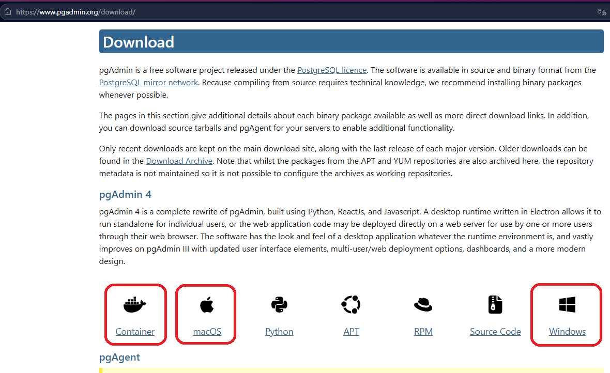

# Практикум SQL по работе с реляционными БД

В данном руководстве описаны шаги для установки ПО СУБД PostgreSQL, созданию схем, наполнению их данными и составлению запросов по обработке данных.

---

### Перед началом узичения курса 

Вам понадобится установить инструмент для работы с СУБД. Это может быть либо pgAdmin либо [dbiever](https://dbeaver.io/download/).
**В этом курсе будет описана работа в pgAdmin на ОС Windows**, 
но вы все тоже самое можете cделать и в dbiever немного изучив его интерфейс

Перед началом работы вам также потребуется дополнительное включение [WSL](https://learn.microsoft.com/ru-ru/windows/wsl/install) 
(если у Вас ОС Windows, которая поддерживает виртуализацию и имеет не менее 8Гб ОЗУ) и установка [Docker Desktop](https://www.docker.com/products/docker-desktop/). 

После установки данных инструментов можно переходить к скачиванию [pgAdmin](https://www.pgadmin.org/download/).
Чтобы установить `pgAdmin` выберите на странице загрузки вариант для вашей ОС 

> Container для установки в Docker - как правило для Linux систем
 

После установки `pgAdmin 4` потребуется перезагрузка и после неё можно переходить к следующему пункту - 
[истории СУБД PostgreSQL](teory/history-postgres.md)  

