# Отчёт по практикуму SQL

## 1. Установка и настройка дистрибутива

- Установлен Docker Desktop (macOS)
- Установлен pgAdmin 4
- Создан файл `docker-compose.yml` в корне проекта
- Запущен контейнер PostgreSQL командой:

```shell
docker compose up -d
```

- Контейнер `pg_sql_study` успешно запущен (образ postgres:17.10)
- В pgAdmin создан сервер с подключением:
  - Host: 127.0.0.1
  - Port: 5454
  - Database: sql_study_db
  - User: my_user

## 2. Теоретическая часть

### 2.1 Создание таблиц и типы данных

Создана таблица `weather` с использованием базовых типов `varchar`, `int`, `real`, `date`.

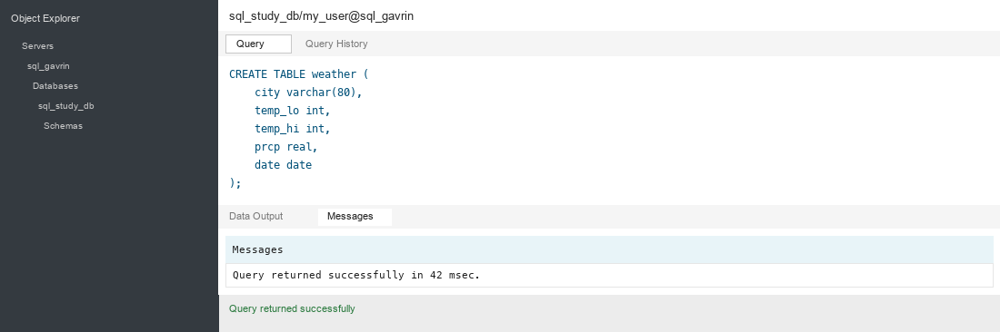

### 2.2 Добавление и выборка данных

Изучены команды `INSERT`, `SELECT`, `WHERE`, `ORDER BY`, `DISTINCT`.

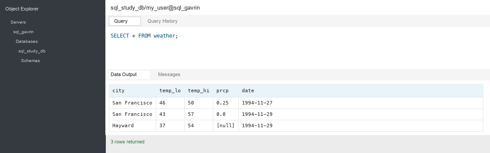

### 2.3 Соединения таблиц (JOIN)

Создана таблица `cities`, изучены `INNER JOIN` и `LEFT OUTER JOIN`.

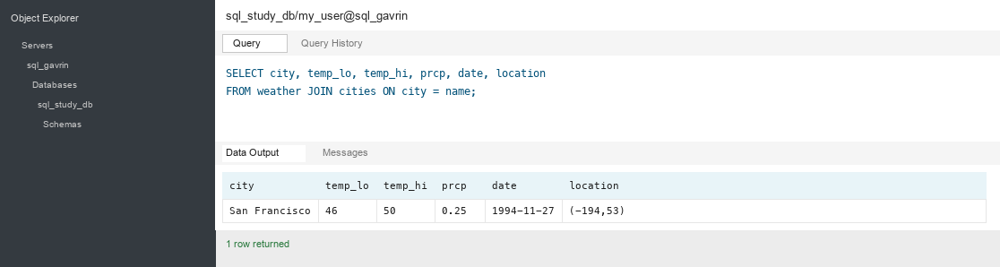

### 2.4 Внешние ключи

Создана связь `weather` → `cities` через `REFERENCES`, проверено срабатывание ошибки при нарушении целостности.

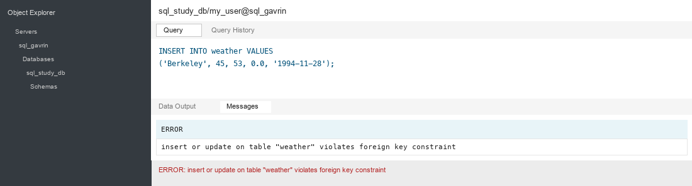

### 2.5 Оконные функции

Создана таблица `empsalary`, изучены `PARTITION BY`, `rank()`, `sum() OVER`.

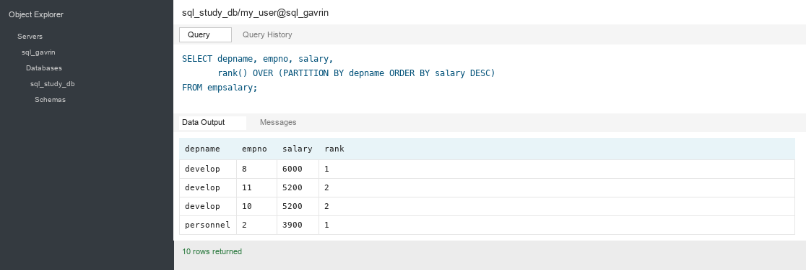

### 2.6 Наследование таблиц

Создана структура `cities` / `capitals` с `INHERITS`, изучена работа `ONLY`.

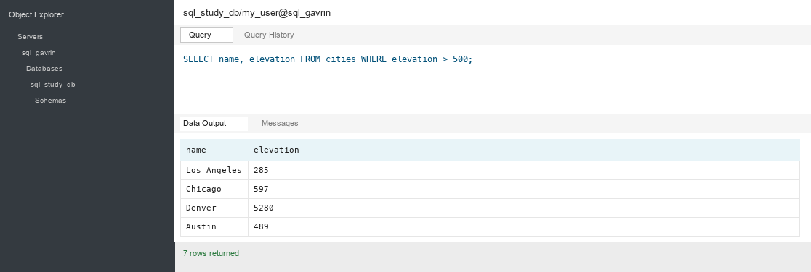

### 2.7 Ограничения (constraints)

Изучены `DEFAULT`, `NOT NULL`, `CHECK`, `UNIQUE`, `PRIMARY KEY` на примере таблицы `products`.

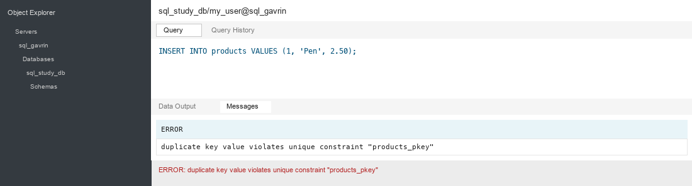

## 3. Практическая часть на схемах платёжного сервиса

### 3.1 Создание сервера

Создан `docker-compose.yml` в директории `practice` (пользователь `admin`, база `payment_db`, контейнер `psql_payments_container`).
Запущена команда `docker compose up -d`, контейнер `psql_payments_container` успешно запущен.

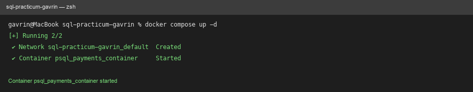

Проверка контейнера через Docker Desktop.

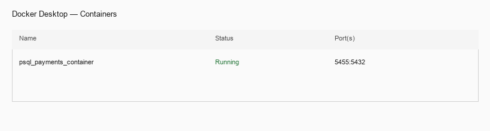

Лог контейнера `psql_payments_container`.

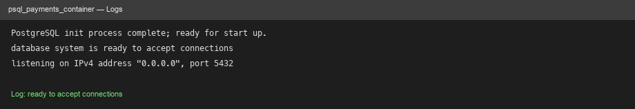

Регистрация нового сервера в pgAdmin под пользователем `admin`.

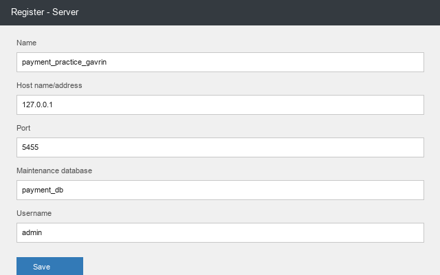

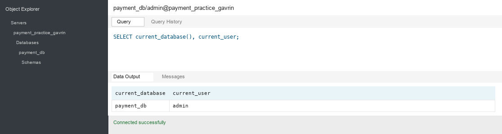

Список баз данных после подключения.

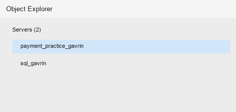

### 3.2 Настройка DCL

Созданы пользователи `tech_payments` и `tech_users`. Созданы схемы `payment_schema` и `user_schema`.
Выданы права каждому пользователю только на свою схему.

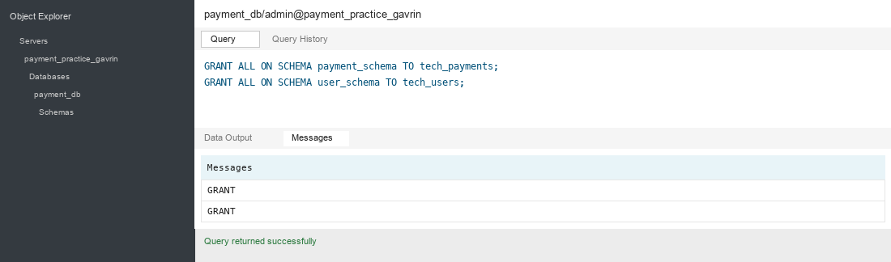

Проверка: подключение под `tech_users` и попытка создать таблицу в `payment_schema` — система выдаёт ошибку доступа.

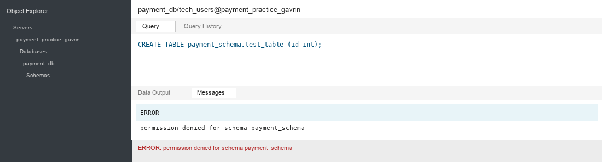

### 3.3 DDL схемы пользователей (user_schema)

Под пользователем `tech_users` создана таблица `users` с полями `id`, `login`, `email`, `phone`, `client_type`, `status`, `created_at`, `updated_at`.

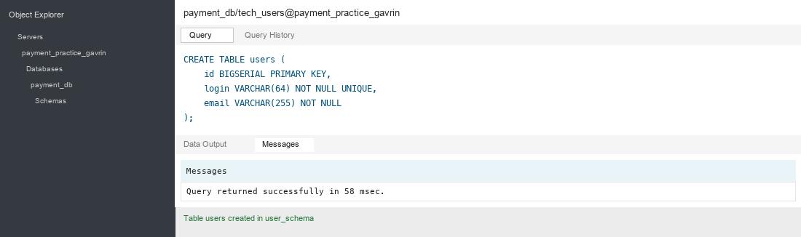

Также созданы таблицы `user_personal_data`, `individual_profiles`, `legal_entity_profiles`, `foreign_resident_profiles` и индексы `idx_users_email`, `idx_users_login`, `idx_users_client_type`.

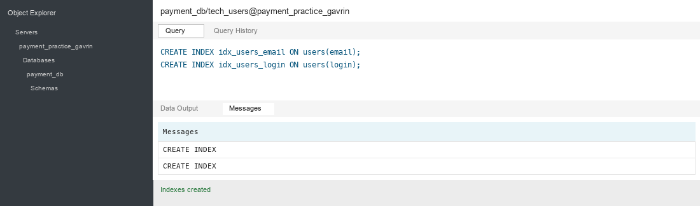

### 3.4 DDL схемы платежей (payment_schema)

Под пользователем `tech_payments` созданы справочник `currencies`, тип `transaction_type`, таблицы `accounts`, `fee_rules`, `transactions` и `exchange_rates`.

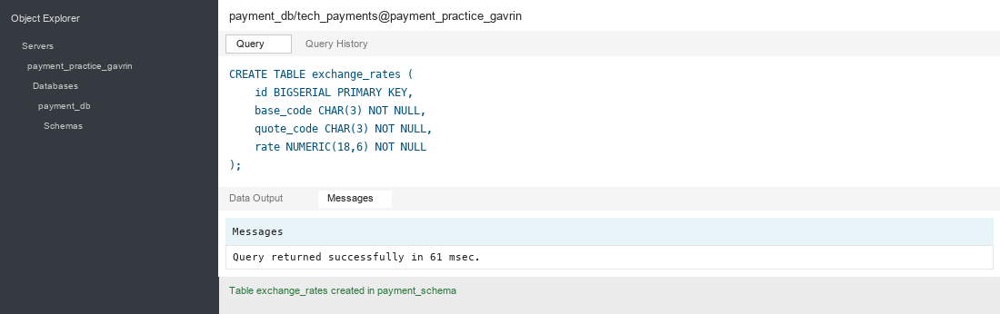

### 3.5 Наполнение схем данными

CSV-файлы скачаны из [хранилища](https://disk.yandex.ru/d/78_ar_43nRQ83Q) и скопированы в контейнер:

```shell
docker cp practice/data/sql-course/user_schema/. psql_payments_container:/var/lib/postgresql/
docker cp practice/data/sql-course/payment_schema/. psql_payments_container:/var/lib/postgresql/
```

Под `admin` выданы права `pg_read_server_files` пользователям `tech_payments` и `tech_users`.
Данные загружены командой `COPY FROM` под соответствующими пользователями.

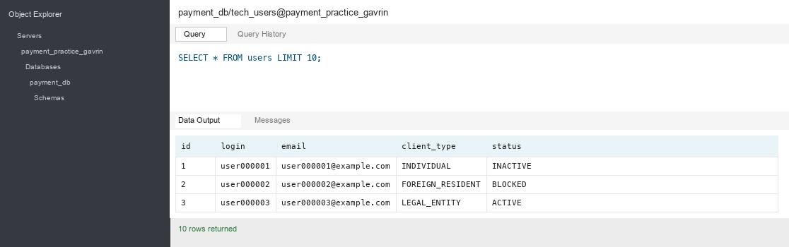

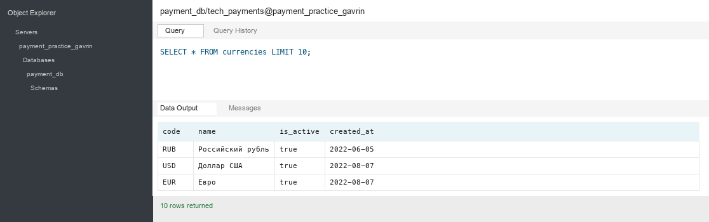

Для таблицы `transactions` замерено время вставки без индексов и с индексами — вставка с индексами выполняется дольше.
