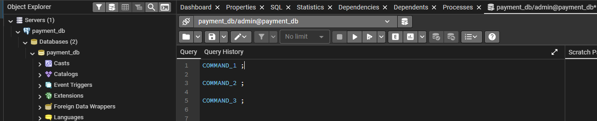

## Практическая часть - создание базы данных платежного сервиса

Если брать платежный сервис, то он из себя представляет сложную архитектуру из множества взаимосвязанных компонентов, 
таких как:
* **Платежный шлюз (Gateway)** - Набор протоколов, которые шифруют и передают данные о картах в процессинговые центры;
* **Процессинговый модуль** - приложение, которое с помощью API может общаться с платежными системами банков
* **Приложение личного кабинета** - UI для выполнения операций пользователями кошелька.
* **Backend сервисы**, такие как:
  - Сервис Регистрации, Авторизации и Аутентификации пользователей
  - Сервис платежных кошельков
  - Сервис выполнения транзакции по переводам средств
  - Интеграционный сервис для CRM 
  - и многие другие, в зависимости от дополнительных функций.
* **Брокеры сообщений** для передачи данных между компонентами
* Распределенная **база данных**, поддерживающая принципы ACID

Последний компонент является самым важным в архитектуре платежного сервиса, так как именно за счет него достигается 
транзакционность операций с денежными средствами. 
И именно PostgreSQL предоставляет все необходимые механизмы чтобы реализовать безотказную архитектуру.

На практике мы попробуем воссоздать небольшую часть базы данных платежного сервиса 
и поработать с наполнением и извлечением данных.

---

**Начиная с текущей части задания все действия обязательно вместе со скринами фиксируйте в отчете `report.md`, 
созданном в текущей директории.**

Написание SQL запросов выполняйте через инструмент Query Tool **_по порядку_**, **не удаляя предыдущие команды** !



После выполнения всей практической части работы выгрузите весь ваш SQL скрипт для каждого пользователя через **Save file**.
Путь сохранения скриптов такой же - в директорию `practice`


---

### Создание сервера

В текущей директории practice, создайте `docker-compose.yml`. 

Наполните его содержимым по аналогии из одноименного файла из корня проекта, 
но замените пользователя на `admin`, имя базы на `payment_db` и имя контейнера на `psql_payments_container`

Запустите скрипт командой
```shell
docker compose up -d
```

Проверьте через **docker decktop**, что контейнер поднят успешно.
Для этого вставьте скрин из лога контейнера `psql_payments_container`

    Примечание: перед запуском нового контейнера, проверьте, что не используются `volumes` от старого сервера БД

Подключитесь с помощью клиента **pgAdmin** к созданной базе данных под пользователем `admin`.

Все дальнейшие действия выполняйте через клиента.

---

### Настройка DCL в payment_db

**Создайте двух новых пользователей:**
+ tech_payments c паролем tech_psw1
+ tech_users c паролем tech_psw2

**Создайте две схемы:**
+ payment_schema
+ user_schema

Удалите схему `public` - она не понадобится для текущей практической работы.

**Выдайте полный перечень прав каждому из пользователей только для одной из схем соответственно:**
- `tech_payments` на `payment_schema`
- `tech_users` на `user_schema`

Важно выдать права только для одной из схем, не выдавайте права на остальные!

в pgAdmin выполните новые соединение с этой же базой данных, но только под новыми пользователями.

Проверьте права на создание тестовой таблицы в схеме, на которую пользователь не имеет прав. Какие сообщения выводятся ?

Зафиксируйте результаты в отчете.

---

Для дальнейшего удобства вы можете добавить каждому пользовотелю **путь поиска** `search_path` для своей схемы.

---

### DDL схемы пользователей

в `user_schema` под пользователем `tech_users` создайте следующие объекты:

1. таблица `users` с полями:
   - id  (первичный ключ), 
   - login (должен быть уникальным), 
   - email, 
   - phone, 
   - client_type(тип клиентов - можно создать отдельный тип, или использовать значения по умолчанию)
     + 'INDIVIDUAL' -- физлицо; 
     + 'LEGAL_ENTITY' -- юрлицо; 
     + 'FOREIGN_RESIDENT' -- иностранный резидент
   - status (должно быть заполнено одним из INACTIVE, ACTIVE, BLOCKED)
   - created_at,
   - updated_at

2. таблица `user_personal_data` (зашифрованные персональные данные) с полями:
   - user_id (первычный ключ который должен быть связан один-к-одному с полем id из таблицы users)
   - encrypted_data (зашифрованная полезная нагрузка, например, JSON с персональными данными, зашифрованный AES-GCM),
   - cipher_algo, (алгоритм шифрования, например, 'AES-256-GCM')
   - iv (Initialization Vector - обязательный атрибут)
   - tag (Authentication Tag (только для алгоритма AEAD))
   - updated_at (когда обновляли в последний раз)
   - updated_by (кто обновлял)

3. таблица `individual_profiles` (Физлица) с полями:
   - user_id (аналогично user_id в user_personal_data)
   - first_name,
   - last_name,
   - middle_name,
   - birth_date,
   - country_code (двух или трех-символьный код страны, например по стандарту ISO 3166-1 alpha-2)
   - residence_country_code (страна резидентства - такой же код что и в country_code)

4. таблица `legal_entity_profiles` (Юрлица) с полями:
   - user_id (аналогично user_id в user_personal_data)
   - company_name (обязательно не пустой атрибут)
   - inn,
   - kpp,
   - ogrn,
   - legal_address,
   - actual_address,
   - bank_account (расчётный счёт)
   - bic (БИК банка)

5. таблица `foreign_resident_profiles`  (Иностранные резиденты) с полями:
   - user_id
   - foreign_identifier (иностранный налоговый номер, аналог ИНН)
   - home_country_code  (как и country_code в individual_profiles)
   - residence_proof_doc_type (текстовое поле неограниченной длины)
   - residence_proof_number (текстовое поле неограниченной длины)
   
Также создайте индексы для быстрого поиска пользователей по почте, логину и типу клиентов:
* idx_users_email 
* idx_users_login 
* idx_users_client_type 

После создания прикрепите ER диаграмму таблиц схемы

---

### ### DDL схемы платежей

в `payment_schema` под пользователем `tech_payments` создайте следующие объекты:

1. Таблица `currencies` (справочник валют) с полями:
   - code (первичный ключ. Трехсимвольное поле, например, 'RUB', 'USD', 'EUR')
   - name  (не пустое)
   - is_active   (логический тип)
   - created_at  (метка времени добавления валюты в таблицу)
   
2. Таблица `accounts` (счета пользователей)
   - id   (первичный ключ)
   - user_id  (ссылка на таблицу users из схемы user_schema)
   - currency_code CHAR(3)   (ссылка на currencies(code))
   - balance_dec (баланс в «десятичных» единицах)
   - version (для оптимистичной блокировки)
   - created_at
   - updated_at
для accounts вторичный ключ должен быть составным из двух полей - (user_id, currency_code)

3. Тип `transaction_type` AS ENUM со значениями:
   - 'DEPOSIT',      - пополнение
   - 'WITHDRAWAL',   - снятие
   - 'TRANSFER',     - перевод между счетами
   - 'FEE',          - комиссия
   - 'EXCHANGE'      - обмен валюты

4. Таблица `fee_rules` (правила расчета комиссии) с полями:
   - id (первичный ключ)
   - transaction_type  (transaction_type, не пустое поле)
   - currency_code  (ссылка на  currencies(code)),
   - percent_fee    (процент комиссии с точностью до сотой доли процента)
   - fixed_fee  (фиксированная комиссия с каждого платежа)
   - min_amount  (минимальная сумма транзакции)
   - max_amount  (максимальная сумма транзакции)
   - is_active   (включено ли правило?)
   - created_at   (метка времени создания правила)

5. Таблица `transactions` (основная таблица по выполнению транзакций) с полями:
   - id (первичный ключ)
   - account_id (ссылка на accounts(id)),
   - type (transaction_type (не пустое значение)),
   - amount (сумма, должна быть неотрицательная),
   - currency_code  (ссылка на currencies(code)),
   - counter_account_id (счет получателя/отправителя - ссылка на accounts(id)),
   - counter_amount (сумма на счету получателя/отправителя)
   - exchange_rate (курс валют, в случае иностранных переводов или обмена валют)
   - fee_amount (комиссия, должна стоять проверка на положительное число),
   - fee_rule_id (ссылка на fee_rules(id)),
   - status (текущий статус транзакции. Один из -  PENDING, CONFIRMED, FAILED, REVERSED)
   - reason (причина отказа/отмены транзакции)
   - created_at
   - processed_at
   - tx_version (Версионность для согласованности при параллельных обновлениях. Начинать счетчик с нуля)


6. Таблица `exchange_rates` (курсы валют) с полями:
   - id  (первичный ключ записи)
   - base_code   (основная валюта - ссылка на currencies(code)),
   - quote_code  (валюта перевода - ссылка на currencies(code),
   - rate        (курс валюты перевода по отношению к основной валюте)
   - started_at  (метка времени начала действия курса)
   - ended_at    (метка времени начала действия курса. NULL означает «действует до отмены»)
   - is_active   (дублирующее поле активности курса)
   - created_at  (метка времени внесения курса в таблицу)

Индексы для данной схемы будут созданы позже на этапе выборки данных.

После создания прикрепите ER диаграмму таблиц схемы

---

## Наполнение схем данными

Чтобы заполнить таблицы массивом данных, мы будем использовать команду COPY FROM, 
где данными для копирования будут служить одноименные таблицам файлы в формате `.csv`.

Данные файлы расположены в отдельном хранилище [по ссылке](https://disk.yandex.ru/d/78_ar_43nRQ83Q).
Скачайте их из хранилища в нужную директорию.

Вспомните, чтобы команда `COPY` сработала необходимо данные файлы скопировать на сервер в директорию, доступную пользователю PostgreSQL:

Так как у нас сервер БД запущен внутри контейнера docker, то копировать файлы необходимо именно в контейнер.
С помощью команды выполните копиросание всех файлов:
```shell
docker cp <относительный_путь_до_файла/имя_файла.csv> <имя_контейнера>:<путь_до_директории_внутри_контейнера_postgres>
```
При успешном копированнии файла выйдет сообщение, например:

`Successfully copied 8.7kB to psql_payments_container:/var/lib/postgresql`

После чего данный файл будет доступен на сервере и в pgAdmin можно выполнять команду копирования 
и затем проверку наполнения таблицы, например:
```shell
COPY currencies(code, name, is_active, created_at)
FROM '/var/lib/postgresql/currencies.csv'
WITH (FORMAT csv, DELIMITER E'\t', NULL '\\N', HEADER false);
SELECT *
FROM currencies
LIMIT 200;
```
Чтобы выборка не занимала много данных, добавляйте в конце `LIMIT`

Проделайте операции со всеми таблицами, в каждой схеме под определенным пользователем (не администратором!)
Но перед этим выдайте права `pg_read_server_files` на чтение файлов каждому пользователю из-под УЗ `admin`

Обратите внимание что в файлах с данными для некоторых таблиц может указываться первичный ключ (id), 
а в некоторых он опускается - за его создание должна отвечать сама таблица в БД. 

Файлы в которых id не указан:
* currencies.csv
* exchange_rates.csv
* transactions.csv

Для схемы `payment_schema` таблицы `transactions` замерьте время вставки записей.
После эгого удалите все записи через операцию `DELETE`. Далее создайте индексы:
```shell
CREATE INDEX idx_transactions_account ON transactions(account_id);
CREATE INDEX idx_transactions_type ON transactions(type);
CREATE INDEX idx_transactions_status ON transactions(status);
```

И затем снова выполните заполнение таблицы операцией COPY. Замерьте время снова. 
На сколько дольше или быстрее выполнялась вставка записей с существующими индексами ? 

Сделайте скрины выдачи прав и результата выборки хотябы одной таблицы (помимо `transactions`) в каждой схеме.


