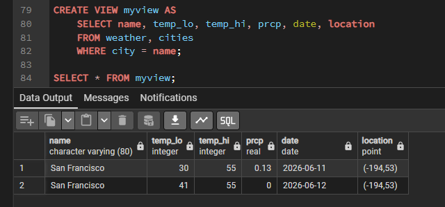
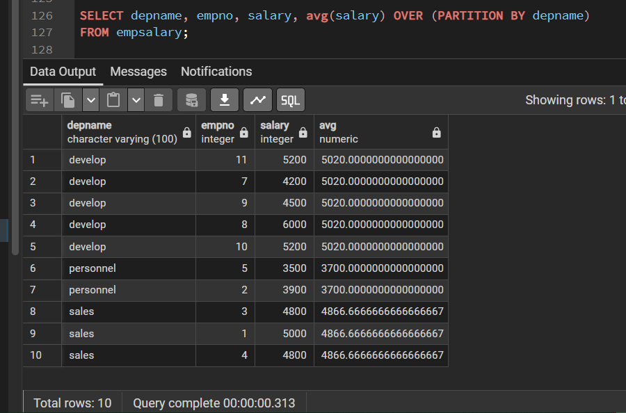
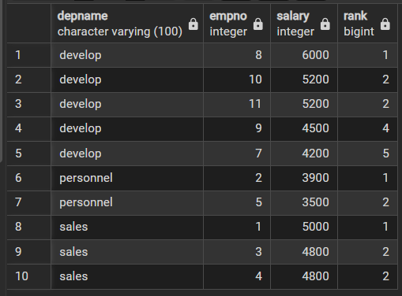

Теперь мы обсудим более сложные возможности SQL, помогающие управлять данными и предотвратить их потерю или порчу. 
В конце главы мы рассмотрим некоторые расширения PostgreSQL.

### Представления

Вспомните запросы, с которыми мы имели дело ранее.
Предположим, что вас интересует составной список из погодных записей и координат городов, 
но вы не хотите каждый раз вводить весь этот запрос. 

Вы можете **_создать представление_** по данному запросу, фактически присвоить имя запросу, 
а затем обращаться к нему как к обычной таблице
```postgres-sql
CREATE VIEW myview AS
    SELECT name, temp_lo, temp_hi, prcp, date, location
    FROM weather, cities
    WHERE city = name;
        
SELECT * FROM myview;
```



Активное использование представлений — это ключевой аспект хорошего проектирования баз данных SQL. 

Представления позволяют вам скрыть внутреннее устройство ваших таблиц, 
которые могут меняться по мере развития приложения, за надёжными интерфейсами.

Представления можно использовать практически везде, где можно использовать обычные таблицы. 
И довольно часто представления создаются на базе других представлений.

---

### Внешние ключи

Давайте рассмотрим следующую задачу: вы хотите добиться, чтобы никто не мог вставить в таблицу `weather` строки, 
для которых не находится соответствующая строка в таблице `cities`. 

Это называется **_обеспечением ссылочной целостности данных_**. 

В простых СУБД это пришлось бы реализовать (если это вообще возможно) так: 
* сначала явно проверить, есть ли соответствующие записи в таблице `cities`, 
* затем отклонить или вставить новые записи в таблицу `weather`. 
 
Этот подход очень проблематичен и неудобен, поэтому всё это PostgreSQL может сделать за вас.
Новое объявление таблицы будет выглядеть так
```postgres-sql
CREATE TABLE cities (
        name     varchar(80) primary key,
        location point
);
CREATE TABLE weather (
        city      varchar(80) references cities(name),
        temp_lo   int,
        temp_hi   int,
        prcp      real,
        date      date
);
```

Но перед созданием новых таблиц с таким же наименованием потребуется удалить старые ( в том числе удалить и вид):
```postgres-sql
DROP VIEW myview;
DROP TABLE cities, weather;
```

Теперь попробуйте вставить недопустимую запись, что получится ?:
```postgres-sql
INSERT INTO weather VALUES ('Berkeley', 45, 53, 0.0, '1994-11-28');
```

Поведение внешних ключей можно подстроить согласно требованиям вашего приложения. 

---

###  Транзакции

**_Транзакции_** — это фундаментальное понятие во всех СУБД. 

>Суть транзакции в том, что она объединяет последовательность действий в одну операцию «**_всё или ничего_**». 

Промежуточные состояния внутри последовательности не видны другим транзакциям, 
и если что-то помешает успешно завершить транзакцию, ни один из результатов этих действий не сохранится в базе данных.

Например, рассмотрим базу данных банка, в которой содержится информация о счетах клиентов,
а также общие суммы по отделениям банка. 
Предположим, что мы хотим перевести 100 долларов со счёта Алисы на счёт Боба. 
Простоты ради, соответствующие SQL-команды можно записать так:
```postgres-sql
UPDATE accounts SET balance = balance - 100.00
    WHERE name = 'Alice';
UPDATE branches SET balance = balance - 100.00
    WHERE name = (SELECT branch_name FROM accounts WHERE name = 'Alice');
UPDATE accounts SET balance = balance + 100.00
    WHERE name = 'Bob';
UPDATE branches SET balance = balance + 100.00
    WHERE name = (SELECT branch_name FROM accounts WHERE name = 'Bob');
```

Точное содержание команд здесь не важно, важно лишь то, 
что для выполнения этой довольно простой операции потребовалось несколько отдельных действий. 
При этом с точки зрения банка _необходимо, чтобы все эти действия выполнились вместе, либо не выполнились совсем_. 

Если Боб получит 100 долларов, но они не будут списаны со счёта Алисы, объяснить это сбоем системы определённо не удастся. 
И наоборот, Алиса вряд ли будет довольна, если она переведёт деньги, а до Боба они не дойдут. 
Нам нужна гарантия, что если что-то помешает выполнить операцию до конца, ни одно из действий не оставит следа в базе данных. 
И мы получаем эту гарантию, объединяя действия в одну транзакцию. 

>Когда говорят, что транзакция атомарна: 
с точки зрения других транзакций она либо выполняется и фиксируется полностью, либо не фиксируется совсем.

Нам также нужна гарантия, что после завершения и подтверждения транзакции системой баз данных, 
её результаты в самом деле сохраняются и не будут потеряны, даже если вскоре произойдёт авария. 

Например, если мы списали сумму и выдали её Бобу, мы должны исключить возможность того, что сумма на его счёте восстановится, 
как только он выйдет за двери банка. 
Транзакционная база данных гарантирует, что все изменения записываются в постоянное хранилище (например, на диск) до того, 
как транзакция будет считаться завершённой.

Другая важная характеристика транзакционных баз данных тесно связана с атомарностью изменений: 
когда одновременно выполняется множество транзакций, каждая из них не видит незавершённые изменения, произведённые другими. 

Например, если одна транзакция подсчитывает баланс по отделениям, будет неправильно, 
если она посчитает расход в отделении Алисы, но не учтёт приход в отделении Боба, или наоборот. 

Поэтому свойство транзакций «всё или ничего» должно определять не только, как изменения сохраняются в базе данных, 
но и как они видны в процессе работы клиентам.

>Изменения, производимые открытой транзакцией, невидимы для других транзакций, пока она не будет завершена, 
а затем они становятся видны все сразу.

---

>В PostgreSQL транзакция определяется набором SQL-команд, окружённым командами BEGIN и COMMIT. 

Таким образом, наша банковская транзакция должна была бы выглядеть так:
```postgres-sql
BEGIN;
    UPDATE accounts SET balance = balance - 100.00
    WHERE name = 'Alice';
    -- ...
COMMIT;
```

Если в процессе выполнения транзакции мы решим, что не хотим фиксировать её изменения 
(например, потому что оказалось, что баланс Алисы стал отрицательным), 
мы можем выполнить команду `ROLLBACK` вместо `COMMIT`, и все наши изменения будут отменены.

>PostgreSQL на самом деле отрабатывает каждый SQL-оператор как транзакцию. 

Если вы не вставите команду `BEGIN`, то каждый отдельный оператор будет неявно окружён командами `BEGIN` и `COMMIT`
(в случае успешного завершения). 
Группу операторов, окружённых командами `BEGIN` и `COMMIT` иногда называют **блоком транзакции**.


Операторами в транзакции можно также управлять на более детальном уровне, используя **точки сохранения**. 

**_Точки сохранения_** позволяют выборочно отменять некоторые части транзакции и фиксировать все остальные. 

Определив точку сохранения с помощью `SAVEPOINT`, при необходимости вы можете вернуться к ней 
с помощью команды `ROLLBACK TO`.
Все изменения в базе данных, произошедшие после точки сохранения и до момента отката, отменяются, 
но изменения, произведённые ранее, сохраняются.

Вернувшись к банковской базе данных, предположим, что мы списываем 100 долларов со счёта
Алисы, добавляем их на счёт Боба, и вдруг оказывается, что деньги нужно было перевести Уолли.
В данном случае мы можем применить точки сохранения:
```postgres-sql
BEGIN;
    UPDATE accounts SET balance = balance - 100.00
    WHERE name = 'Alice';
SAVEPOINT my_savepoint;
    UPDATE accounts SET balance = balance + 100.00
    WHERE name = 'Bob'; -- ошибочное действие... забыть его и использовать счёт Уолли
ROLLBACK TO my_savepoint;
    UPDATE accounts SET balance = balance + 100.00
    WHERE name = 'Wally';
COMMIT;
```

Этот пример, конечно, несколько надуман, но он показывает, как можно управлять выполнением команд в блоке транзакций, 
используя точки сохранения. 

Более того, `ROLLBACK TO` — это единственный способ вернуть контроль над блоком транзакций, 
оказавшимся в прерванном состоянии из-за ошибки системы, не считая возможности полностью отменить её и начать снова.

---

### Оконные функции

**_Оконная функция_** выполняет вычисления для набора строк, некоторым образом связанных с текущей строкой. 

Её действие можно сравнить с вычислением, производимым агрегатной функцией. 
Однако с оконными функциями строки не группируются в одну выходную строку. 
Вместо этого, эти строки остаются отдельными сущностями. 

Внутри же, оконная функция, как и агрегатная, может обращаться не только к текущей строке результата запроса.

Перед демонстрацией оконных функций запустите скрипт создания и наполения данными таблицы `empsalary`
```postgres-sql
CREATE TABLE empsalary (
    depname     varchar(100),
    empno       int,
    salary      int
);

INSERT INTO empsalary(depname, empno, salary)
VALUES 
('develop', 11, 5200), 
('develop', 7, 4200), 
('develop', 9, 4500), 
('develop', 8, 6000), 
('develop', 10, 5200), 
('personnel', 5, 3500), 
('personnel', 2, 3900), 
('sales', 3, 4800), 
('sales', 1, 5000), 
('sales', 4, 4800);
```

Вот пример, показывающий, как сравнить зарплату каждого сотрудника со средней зарплатой его отдела:
```postgres-sql
SELECT depname, empno, salary, avg(salary) OVER (PARTITION BY depname) 
FROM empsalary;
```



Первые три столбца извлекаются непосредственно из таблицы `empsalary`, 
при этом для каждой строки таблицы есть строка результата. 
В четвёртом столбце оказалось среднее значение, вычисленное по всем строкам, 
имеющим то же значение `depname`, что и текущая строка. 

Фактически среднее вычисляет та же обычная, не оконная функция `avg`, но предложение `OVER` превращает её в оконную, 
так что её действие ограничивается рамками окон.

>Вызов оконной функции всегда содержит предложение **_OVER_**, следующее за названием и аргументами оконной функции.
Предложение **_PARTITION BY_**, дополняющее `OVER`, разделяет строки по группам, или разделам,
объединяя одинаковые значения выражений `PARTITION BY`.

Это синтаксически отличает её от обычной, не оконной агрегатной функции. 
Предложение `OVER` определяет, как именно нужно разделить строки запроса для обработки оконной функцией. 

Оконная функция вычисляется по строкам, попадающим в один раздел с текущей строкой.

Вы можете также определять порядок, в котором строки будут обрабатываться оконными функциями, используя `ORDER BY` в `OVER`. 
(Порядок ORDER BY для окна может даже не совпадать с порядком, в котором выводятся строки.) 

Например
```postgres-sql
SELECT depname, empno, salary, 
        rank() OVER (PARTITION BY depname ORDER BY salary DESC)
FROM empsalary;
```



Функция `rank` выдаёт порядковый номер для каждого уникального значения в разделе текущей строки, 
по которому выполняет сортировку предложение `ORDER BY`. 

>У функции `rank` нет параметров, так как её поведение полностью определяется предложением `OVER`.

Строки, обрабатываемые оконной функцией, представляют собой «**_виртуальные таблицы_**», 
созданные из предложения FROM и затем прошедшие через фильтрацию и группировку WHERE и GROUP BY и, возможно, условие HAVING.

Запрос может содержать несколько оконных функций, разделяющих данные по-разному с применением разных предложений `OVER`, 
но все они будут обрабатывать один и тот же набор строк этой виртуальной таблицы.

Есть ещё одно важное понятие, связанное с оконными функциями: 
>для каждой строки существует набор строк в её разделе, называемый рамкой окна. 
Некоторые оконные функции обрабатывают только строки рамки окна, а не всего раздела. 

По умолчанию с указанием `ORDER BY` рамка состоит из всех строк от начала раздела до текущей строки и строк, 
равных текущей по значению выражения `ORDER BY`. 
Без `ORDER BY` рамка по умолчанию состоит из всех строк раздела.

Посмотрите на пример использования `sum`:
```postgres-sql
SELECT salary, sum(salary) OVER () FROM empsalary;
```

Так как в этом примере нет указания ORDER BY в предложении OVER, рамка окна содержит все строки раздела, 
а он, в свою очередь, без предложения PARTITION BY включает все строки таблицы;
другими словами, сумма вычисляется по всей таблице и мы получаем один результат для каждой строки результата. 

Но если мы добавим ORDER BY, мы получим совсем другие результаты:
```postgres-sql
SELECT salary, sum(salary) OVER (ORDER BY salary) FROM empsalary;
```

Здесь в сумме накапливаются зарплаты от первой (самой низкой) до текущей, включая повторяющиеся текущие значения 
(обратите внимание на результат в строках с одинаковой зарплатой).

>Оконные функции разрешается использовать в запросе только в списке `SELECT` и предложении `ORDER BY`. 
Во всех остальных предложениях, включая `GROUP BY`, `HAVING` и `WHERE`, они запрещены.

Это объясняется тем, что логически они выполняются после этих предложений, а также после не оконных агрегатных функций, 
и значит агрегатную функцию можно вызывать в аргументах оконной, но не наоборот.

Если вам нужно отфильтровать или сгруппировать строки после вычисления оконных функций, 
вы можете использовать вложенный запрос. 
Например
```postgres-sql
SELECT depname, empno, salary, enroll_date
FROM
  (SELECT depname, empno, salary, enroll_date,
    rank() OVER (PARTITION BY depname ORDER BY salary DESC, empno) AS pos
   FROM empsalary
  ) AS ss
WHERE pos < 3;
```
Данный запрос покажет только те строки внутреннего запроса, у которых `rank` (порядковый номер по уровню заработной платы) меньше 3.

Когда в запросе вычисляются несколько оконных функций для одинаково определённых окон, 
конечно можно написать для каждой из них отдельное предложение `OVER`, 
но при этом оно будет дублироваться, что неизбежно будет провоцировать ошибки. 

Поэтому лучше определение окна выделить в предложение `WINDOW`, а затем ссылаться на него в `OVER`. 
Например:
```postgres-sql
SELECT depname, sum(salary) OVER w, avg(salary) OVER w
FROM empsalary
WINDOW w AS (PARTITION BY depname ORDER BY salary DESC);
```

---

### Наследование

Наследование — это концепция, взятая из объектно-ориентированных баз данных. 
Она открывает множество интересных возможностей при проектировании баз данных.

Давайте создадим две таблицы: 
cities (города) и capitals (столицы штатов). 

Естественно, столицы штатов также являются городами, поэтому нам нужно явным образом добавлять их в результат, 
когда мы хотим просмотреть все города. Если вы проявите смекалку, вы можете предложить, например, такое решение
```postgres-sql
CREATE TABLE capitals (
  name       text,
  population real,
  elevation  int,    -- (высота в футах)
  state      char(2)
);
CREATE TABLE non_capitals (
  name       text,
  population real,
  elevation  int     -- (высота в футах)
);
CREATE VIEW cities AS
  SELECT name, population, elevation FROM capitals
    UNION
  SELECT name, population, elevation FROM non_capitals;
```

Оно может устраивать, пока мы извлекаем данные, но если нам потребуется изменить несколько строк, это будет выглядеть некрасиво.

Поэтому есть лучшее решение
```postgres-sql
CREATE TABLE cities (
  name       text,
  population real,
  elevation  int     -- (высота в футах)
);
CREATE TABLE capitals (
  state      char(2) UNIQUE NOT NULL
) INHERITS (cities);
```

В данном случае строка таблицы `capitals` наследует все столбцы (`name`, `population` и `elevation`) от родительской таблицы `cities`. 
Столбец `name` имеет тип `text`, собственный тип PostgreSQL для текстовых строк переменной длины. 
А в таблицу `capitals` добавлен дополнительный столбец `state`, в котором будет указан буквенный код штата. 

>В PostgreSQL таблица может наследоваться от ноля или нескольких других таблиц.
> 
Чтобы воспроизвести следующие команды выборки, для начала заполним тестовыми данными таблицы:
```postgres-sql
INSERT INTO cities (name, population, elevation) 
VALUES
('New York', 8335897, 33),
('Los Angeles', 3822238, 285),
('Chicago', 2665039, 597),
('San Francisco', 808437, 52),
('Seattle', 749256, 175);

INSERT INTO capitals (name, population, elevation, state) 
VALUES
('Sacramento', 524943, 30, 'CA'),
('Austin', 961855, 489, 'TX'),
('Denver', 715522, 5280, 'CO'),
('Albany', 99224, 150, 'NY'),
('Olympia', 55605, 112, 'WA');
```

Например, следующий запрос выведет названия всех городов, включая столицы, находящихся выше 500 футов над уровнем моря
```postgres-sql
SELECT name, elevation
  FROM cities
  WHERE elevation > 500;
```

Обратите внимание: несмотря на то что условие `WHERE` указывает только на таблицу `cities`, в тоже время данные выбираются 
и из таблицы наследника - `capitals`!

А следующий запрос находит все города, которые не являются столицами штатов, но также находятся выше 500 футов:
```postgres-sql
SELECT name, elevation
    FROM ONLY cities
    WHERE elevation > 500;
```

>Здесь слово `ONLY` перед названием таблицы `cities` указывает, 
> что запрос следует выполнять только для строк таблицы `cities`, не включая таблицы, унаследованные от `cities`. 

Многие операторы, которые мы уже обсудили — SELECT, UPDATE и DELETE — поддерживают указание ONLY.

>Хотя наследование часто бывает полезно, оно не интегрировано с ограничениями уникальности и внешними ключами, что ограничивает его применимость.
 
---

Изучив самые базовые основы синтаксиса SQL в postgreSQL мы уже можем манипулировать двумя видами языка запросов - DDL и DML.
Всего же их насчитывается 3:
1. Data Definition Language (DDL) - отвечает за определение по созданию, изменению и удалению структур данных (таблицы, схемы, виды, окна и т.д.)
2. Data Manipulation Language (DML) - отвечает за наполнение данными в созданных структурах, выборку данных из таблиц.
3. Date Control Language (DCL) - отвечает за предоставление и изъятие прав доступа

После синтаксиса осталось познакомится детальнее с [Определением данных](data-definition.md), в которые входят:
* Основы таблиц
* Схемы
* Ограничения накладываемые на столбцы
* Ключи (первичные и внешние)
* Права доступа
* Политики защиты строк