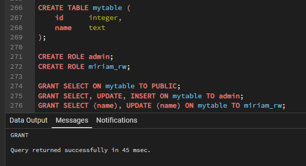
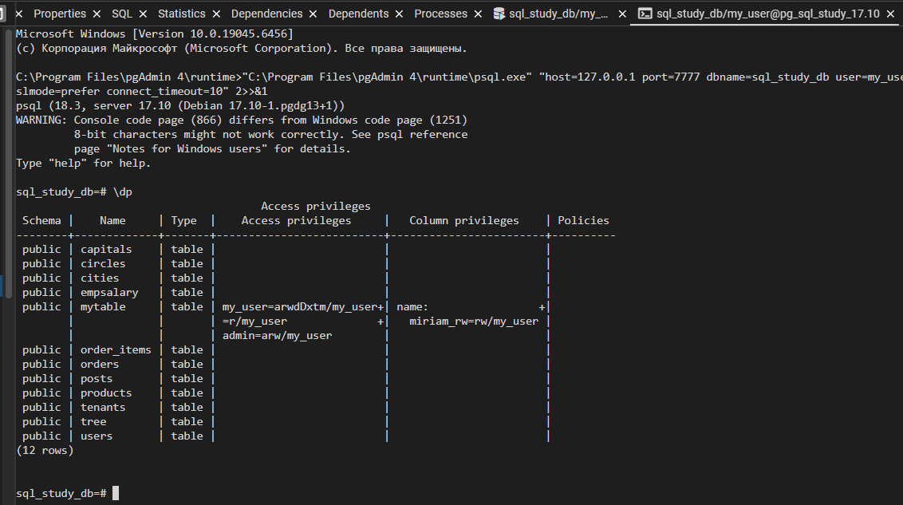

## Права

Когда в базе данных создаётся объект, ему назначается владелец.
Владельцем обычно становится роль, с которой был выполнен оператор создания.

Для большинства типов объектов в исходном состоянии только владелец (или суперпользователь) может делать с объектом всё, что угодно.
Чтобы разрешить использовать его другим ролям, нужно дать им права.

Существует несколько типов прав:
`SELECT, INSERT, UPDATE, DELETE, TRUNCATE, REFERENCES, TRIGGER, CREATE, CONNECT, TEMPORARY, EXECUTE, USAGE, SET и ALTER SYSTEM.`

Набор прав, применимых к определённому объекту, зависит от типа объекта (таблица, функция и т. д.).

Право изменять или удалять объект является неотъемлемым правом владельца объекта, его нельзя лишиться или передать другому.

Объекту можно назначить нового владельца с помощью команды `ALTER` для соответствующего типа объекта, например:
```postgres-sql
ALTER TABLE имя_таблицы OWNER TO новый_владелец;
```

Суперпользователь может делать это без ограничений, а обычный пользователь —
только если он является одновременно текущим владельцем объекта (или наследует права роли владельца) и
может выполнять `SET ROLE` для новой роли владельца.

Для назначения прав применяется команда `GRANT`.

Например, если в базе данных есть роль `joe` и таблица `accounts`, право на изменение таблицы можно дать этой роли так:
```postgres-sql
GRANT UPDATE ON accounts TO joe;
```
Если вместо конкретного права написать `ALL`, роль получит все права, применимые для объекта этого типа.

Для назначения права всем ролям в системе можно использовать специальное имя «роли»: `PUBLIC`.

Также для упрощения управления ролями, когда в базе данных есть множество пользователей, можно настроить «групповые» роли;

Чтобы лишить пользователей ранее данных им прав, используйте команду `REVOKE`:
```postgres-sql
REVOKE ALL ON accounts FROM PUBLIC;
```

Обычно распоряжаться правами может только владелец объекта (или суперпользователь).
Однако возможно дать право доступа к объекту «с правом передачи», что позволит получившему такое право назначать его другим.
Если такое право передачи впоследствии будет отозвано, то все, кто получил данное право доступа (непосредственно или по цепочке передачи), потеряют его.

Подробнее об этом см. справку [GRANT](syntax.md#grant) и [REVOKE](syntax.md#revoke).

Владелец объекта может лишить себя обычных прав, например запретить не только всем остальным,
но и себе, вносить изменения в таблицу. Однако владельцы всегда имеют возможность управлять правами,
так что они могут в любом случае вернуть себе права, которых лишились.

Все существующие права перечислены ниже:
* SELECT -
  Позволяет выполнять `SELECT` для любого столбца или перечисленных столбцов в заданной таблице, представлении,
  матпредставлении или другом объекте табличного вида. Также позволя ет выполнять `COPY TO`.
  Помимо этого, данное право требуется для обращения к существующим значениям столбцов в `UPDATE`, `DELETE` или `MERGE`.
  Для последовательностей это право позволяет пользоваться функцией `currval`.
  Для больших объектов оно позволяет читать содержимое объекта.
* INSERT -
  Позволяет вставлять с помощью `INSERT` строки в заданную таблицу, представление и т. п.
  Может назначаться для отдельных столбцов; в этом случае только этим столбцам можно присваивать значения в команде `INSERT`
  (другие столбцы получат значения по умолчанию). Также позволяет выполнять `COPY FROM`.
* UPDATE -
  Позволяет изменять с помощью `UPDATE` данные во всех, либо только перечисленных, столбцах в заданной таблице,
  представлении и т. п. (На практике для любой нетривиальной команды `UPDATE` потребуется и право `SELECT`,
  так как она должна обратиться к столбцам таблицы, чтобы определить, какие строки подлежат изменению, и/или вычислить новые значения столбцов.)
  Для `SELECT ... FOR UPDATE` и `SELECT ... FOR SHARE` также
  требуется иметь это право как минимум для одного столбца, помимо права `SELECT`.
  Для последовательностей это право позволяет пользоваться функциями `nextval` и `setval`.
  Для больших объектов это право позволяет записывать данные в объект или обрезать его.
* DELETE -
  Позволяет удалять с помощью команды `DELETE` строки из таблицы, представления и т. п.
  (На практике для любой нетривиальной команды `DELETE` потребуется также право `SELECT`,
  так как она должна обратиться к колонкам таблицы, чтобы определить, какие строки подлежат удалению.)
* TRUNCATE -
  Позволяет опустошать таблицу с помощью `TRUNCATE`.
* REFERENCES -
  Позволяет создавать ограничение внешнего ключа, обращающееся к таблице или определённым столбцам таблицы.
* TRIGGER -
  Позволяет создавать триггер для таблицы, представления и т. п.
* CREATE -
    - Для баз данных это право позволяет создавать схемы и публикации, а также устанавливать доверенные расширения в конкретной базе.
    - Для схем это право позволяет создавать новые объекты в заданной схеме.
      Чтобы переименовать существующий объект, необходимо быть его владельцем и иметь это право для схемы, содержащей его.
    - Для табличных пространств это право позволяет создавать таблицы,
      индексы и временные файлы в определённом табличном пространстве, а также создавать базы данных,
      для которых это пространство будет основным.
      Заметьте, что факт лишения пользователя этого права не влияет на существование или размещение существующих объектов.
* CONNECT -
  Позволяет подключаться к базе данных. Это право проверяется при установлении соединения
  (в дополнение к условиям, определённым в конфигурации `pg_hba.conf`).
* TEMPORARY -
  Позволяет создавать временные таблицы в определённой базе данных.
* EXECUTE -
  Позволяет вызывать функцию или процедуру, в том числе использовать любые операторы, реализованные данной функцией.
  Это единственный тип прав, применимый к функциям и процедурам.
* USAGE -
  Для процедурных языков это право позволяет создавать функции на определённом языке.
  Это единственный тип прав, применимый к процедурным языкам.
    - Для схем это право даёт доступ к содержащимся в них объектам
      (предполагается, что при этом имеются права, необходимые для доступа к самим объектам).
      По сути это право позволяет субъекту «просматривать» объекты внутри схемы.
      Без этого разрешения имена объектов всё же можно будет узнать, например, обратившись к системным каталогам.
      Кроме того, если отозвать это право, в существующих сеансах могут оказаться операторы,
      для которых просмотр имён объектов был выполнен ранее, так что это право не позволяет абсолютно надёжно перекрыть доступ к объектам.
    - Для последовательностей это право позволяет использовать функции `currval` и `nextval`.
    - Для типов и доменов это право позволяет использовать заданный тип или домен при создании таблиц,
      функций или других объектов схемы. (Заметьте, что это право не ограничивает общее «использование» типа,
      например обращение к значениям типа в запросах. Без этого права нельзя только создавать объекты,
      зависящие от заданного типа. Основное предназначение этого права в том, чтобы ограничить круг пользователей,
      способных создавать зависимости от типа, которые могут впоследствии помешать владельцу типа изменить его.)
    - Для обёрток сторонних данных это право позволяет создавать использующие их определения сторонних серверов.
    - Для сторонних серверов это право позволяет создавать использующие их сторонние таблицы.
      Наделённые этим правом могут также создавать, модифицировать или удалять собственные сопоставления пользователей, связанные с определённым сервером.
* SET -
  Позволяет задать для параметра конфигурации сервера новое значение в текущем сеансе.
  (Хотя это право может быть предоставлено для любого параметра, оно имеет смысл только для тех параметров,
  для которых обычно требуются права суперпользователя.)
* ALTER SYSTEM -
  Позволяет присваивать значение параметру конфигурации сервера, используя команду `ALTER SYSTEM`.


PostgreSQL по умолчанию назначает роли `PUBLIC` права для некоторых типов объектов, когда эти объекты создаются. 
Для таблиц, столбцов, последовательностей, обёрток сторонних данных, сторонних серверов, больших объектов, 
схем, табличных пространств или параметров конфигурации `PUBLIC` по умолчанию никаких прав не получает. 

Для других типов объектов `PUBLIC` получает следующие права по умолчанию: 
* `CONNECT` и `TEMPORARY` (создание временных таблиц) для баз данных;
* `EXECUTE` — для функций и процедур; 
* `USAGE` — для языков и типов данных (включая домены). 
Владелец объекта, конечно же, может отозвать (посредством `REVOKE`) как явно назначенные права, так и права по умолчанию. 
(Для максимальной безопасности команду `REVOKE` нужно выполнять в транзакции, создающей объект; 
тогда не образуется окно, в котором другой пользователь сможет обратиться к объекту.) 
Кроме того, эти изначально назначаемые права по умолчанию можно переопределить, воспользовавшись командой `ALTER DEFAULT PRIVILEGES`.
 
В Таблице 1 показаны однобуквенные сокращения, которыми обозначаются эти права в списках 
**_ACL_** (**Access Control List**, Список контроля доступа). 
Вы увидите эти сокращения в выводе перечисленных ниже команд `psql` или в столбцах `ACL` в системных каталогах.


**Таблица 1 Сокращённые обозначения прав в ACL**

| **Право**      | **Сокращение**           | **Применимые типы объектов**                                                   |
|----------------|--------------------------|--------------------------------------------------------------------------------|
| `SELECT`       | r («read», чтение)       | LARGE OBJECT, SEQUENCE, TABLE (и объекты, подобным таблицам), столбец таблицы  |
| `INSERT`       | a («append», добавление) | TABLE, столбец таблицы                                                         |
| `UPDATE`       | w («write», запись)      | LARGE OBJECT, SEQUENCE, TABLE, столбец таблицы                                 |
| `DELETE`       | d                        | TABLE                                                                          |
| `TRUNCATE`     | D                        | TABLE                                                                          |
| `REFERENCES`   | x                        | TABLE, столбец таблицы                                                         |
| `TRIGGER`      | t                        | TABLE                                                                          |
| `CREATE`       | C                        | DATABASE, SCHEMA, TABLESPACE                                                   |
| `CONNECT`      | c                        | DATABASE                                                                       |
| `TEMPORARY`    | T                        | DATABASE                                                                       |
| `EXECUTE`      | X                        | FUNCTION, PROCEDURE                                                            |
| `USAGE`        | U                        | DOMAIN, FOREIGN DATA WRAPPER, FOREIGN SERVER, LANGUAGE, SCHEMA, SEQUENCE, TYPE |
| `SET`          | s                        | PARAMETER                                                                      |
| `ALTER SYSTEM` | A                        | PARAMETER                                                                      |
---

В Таблице 2 для каждого типа SQL-объекта показаны относящиеся к нему права, с использова нием приведённых выше сокращений. 
Также в ней для каждого типа приведена команда `psql`, которая позволяет узнать, какие права назначены для объекта этого типа.

**Таблица 2. Сводка прав доступа**

| **Тип объекта**                      | **Все права** | **Права PUBLIC по умолчанию** | **Команда `psql`** |
|--------------------------------------|---------------|-------------------------------|--------------------|
| DATABASE                             | CTc           | Tc                            | \l                 |
| DOMAIN                               | U             | U                             | \dD+               |
| FUNCTION или PROCEDURE               | X             | X                             | \df+               |
| FOREIGN DATA WRAPPER                 | U             | нет                           | \dew+              |
| FOREIGN SERVER                       | U             | нет                           | \des+              |
| LANGUAGE                             | U             | U                             | \dL+               |
| LARGE OBJECT                         | rw            | нет                           | \dl+               |
| PARAMETER                            | sA            | нет                           | \dconfig+          |
| SCHEMA                               | UC            | нет                           | \dn+               |
| SEQUENCE                             | rwU           | нет                           | \dp                |
| TABLE (и объекты, подобные таблицам) | arwdDxt       | нет                           | \dp                |
| Столбец таблицы                      | arwx          | нет                           | \dp                |
| TABLESPACE                           | C             | нет                           | \db+               |
| TYPE                                 | U             | U                             | \dT+               |
---


Права, назначенные для определённого объекта, выводятся в виде списка элементов `aclitem`, 
где каждый `aclitem` имеет такой формат:
```postgres-sql
правообладатель=аббревиатура-права[*].../праводатель
```

Каждый `aclitem` содержит разрешения, которые были предоставлены субъекту определённым праводателем. 
Конкретные права представлены однобуквенными аббревиатурами из таблицы 1 с добавлением `*`, 
если право было выдано с параметром передачи. 

Например, запись `calvin=r*w/hobbes` означает, что роль `calvin` имеет право `SELECT` (r) с возможностью передачи (*),
а также непередаваемое право `UPDATE` (w), и оба эти права даны ему ролью `hobbes`.
Если `calvin` имеет для этого объекта и другие права, предоставленные ему другим праводателем, 
они выводятся в отдельном элементе `aclitem`. 

Пустое поле правообладателя в `aclitem` соответствует роли `PUBLIC`.

Например, предположим, что пользователь miriam создаёт таблицы mytable и выполняет
```postgres-sql
GRANT SELECT ON mytable TO PUBLIC;
GRANT SELECT, UPDATE, INSERT ON mytable TO admin;
GRANT SELECT (name), UPDATE (name) ON mytable TO miriam_rw;
```



Тогда команда `\dp` в `psql` покажет:



Если столбец «Права доступа» (**Access privileges**) для данного объекта пуст, это значит, 
что для объекта действуют стандартные права (то есть запись прав в соответствующем каталоге содержит NULL). 

Права по умолчанию всегда включают все права для владельца и могут также включать некоторые права для `PUBLIC` 
в зависимости от типа объекта, как разъяснялось выше. 

Первая команда `GRANT` или `REVOKE` для объекта приводит к созданию записи прав по умолчанию 
(например, {`my_user=arwdDxt/my_user`}), а затем изменяет эту запись в соответствии с заданным запросом. 

Подобным образом, строки, показанные в столбце «Права доступа к столбцам» (**Column privileges**),
выводятся только для столбцов с нестандартными правами доступа. 
(Заметьте, что в данном контексте под «стандартными правами» всегда подразумевается встроенный набор прав, 
предопределённый для типа объекта. Если с объектом связан набор прав по умолчанию, 
полученный после изменения в результате **ALTER DEFAULT PRIVILEGES**, 
изменённые права будут всегда выводиться явно, показывая эффект команды ALTER.)

Заметьте, что право распоряжения правами, которое имеет владелец, не отмечается в выводимой сводке. 
Знаком `*` отмечаются только те права с правом передачи, которые были явно назначены кому-либо.


---

В данном разделе мы рассмотрели базовые команды и символы прав доступа. 
Более глубокое изучение подразумевает под собой рассмотрение **_Политик защиты строк_**, но в данном курсе оно опущено. 

Теперь вернемся [обратно к изучению DDL](data-definition2.md)

---
    