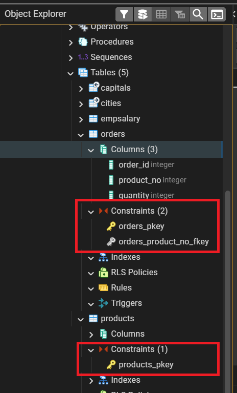
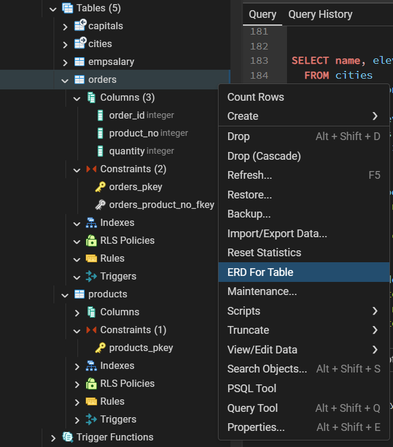
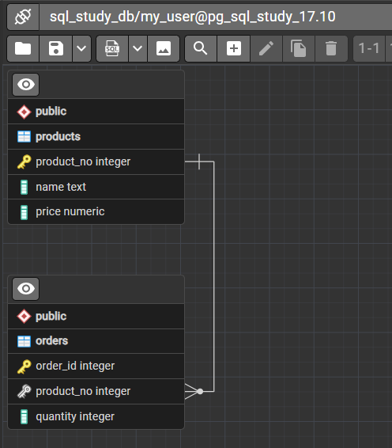
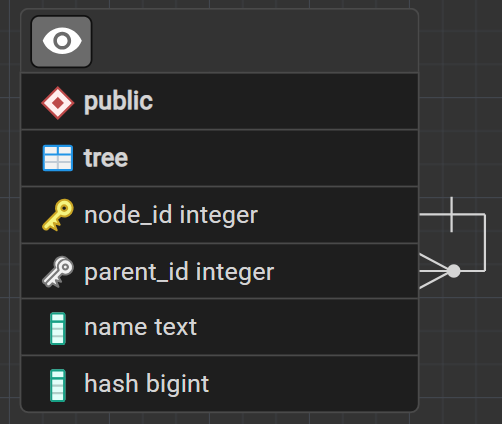
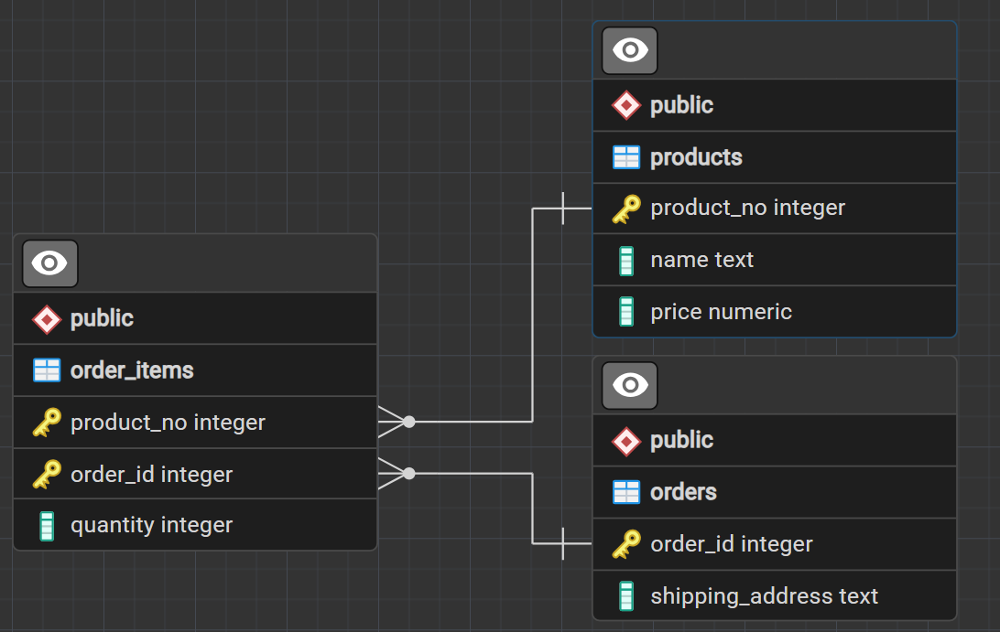
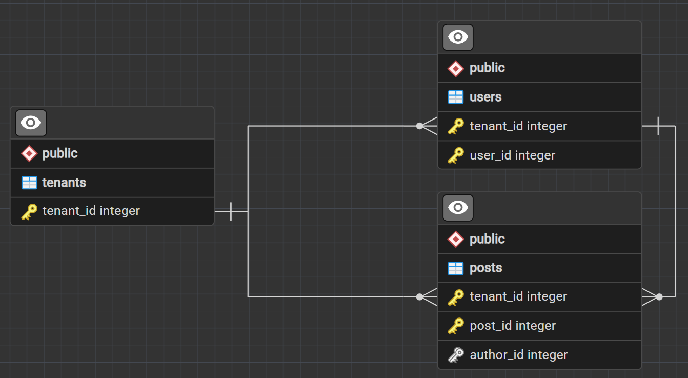

# Определение данных

В реляционной базе данных данные хранятся в таблицах, так что большая часть этой главы будет
посвящена созданию и изменению таблиц, а также средствам управления данными в них. 

Затем мы обсудим, как таблицы можно объединять в схемы и как ограничивать доступ к ним. 

Наконец, мы кратко рассмотрим другие возможности, связанные с хранением данных, в частности наследование, 
секционирование таблиц, представления, функции и триггеры.

---

## Основы таблиц

Таблица в реляционной базе данных похожа на таблицу на бумаге: 
она так же состоит из строк и столбцов. Число и порядок столбцов фиксированы, а каждый столбец имеет имя. 

Число строк переменно — оно отражает текущее количество находящихся в ней данных. 
SQL не даёт никаких гарантий относительно порядка строк таблицы. 
При чтении таблицы строки выводятся в произвольном порядке, если только явно не требуется сортировка. 

Более того, SQL не назначает строкам уникальные идентификаторы, 
так что можно иметь в таблице несколько полностью идентичных строк. 
Это вытекает из математической модели, которую реализует SQL, но обычно такое дублирование нежелательно. 
Позже в этой главе мы увидим, как его избежать.

Каждому столбцу сопоставлен тип данных. 
Тип данных ограничивает набор допустимых значений, которые можно присвоить столбцу, и определяет смысловое значение данных для вычислений.

Например, в столбец числового типа нельзя записать обычные текстовые строки, 
но зато его данные можно использовать в математических вычислениях. 
И наоборот, если столбец имеет тип текстовой строки, для него допустимы практически любые данные, 
но он непригоден для математических действий (хотя другие операции, например конкатенация строк, возможны).

В PostgreSQL есть внушительный набор встроенных типов данных, удовлетворяющий большинство приложений. 
Пользователи также могут определять собственные типы данных. 

Наиболее часто применяются следующие типы данных: 
* `integer` для целых чисел, 
* `numeric` для чисел, которые могут быть дробными, 
* `text` для текстовых строк, 
* `date` для дат, 
* `time` для времени 
* `timestamp` для значений, включающих дату и время

Для создания таблицы используется команда `CREATE TABLE`. В этой команде вы должны указать
как минимум имя новой таблицы и имена и типы данных каждого столбца. 
Например
```postgres-sql
CREATE TABLE products (
    product_no integer,
    name text,
    price numeric
);
```

>Когда вы создаёте много взаимосвязанных таблиц, имеет смысл заранее выбрать единый шаблон именования таблиц и столбцов. 
Например, решить, будут ли в именах таблиц использоваться существительные во множественном или в единственном числе 
(есть соображения в пользу каждого варианта).


Число столбцов в таблице не может быть бесконечным. Это число ограничивается максимумом
в пределах от **250** до **1600**, в зависимости от типов столбцов. Однако создавать таблицы с таким
большим числом столбцов обычно не требуется, а если такая потребность возникает, это скорее признак сомнительного дизайна.

Если таблица вам больше не нужна, вы можете удалить её, выполнив команду `DROP TABLE`.

Попытка удаления несуществующей таблицы считается ошибкой. 
Тем не менее в SQL-скриптах часто применяют безусловное удаление таблиц перед созданием, 
игнорируя все сообщения обошибках, так что они выполняют свою задачу независимо от того, существовали таблицы или нет.

Если вы хотите избежать таких ошибок, можно использовать вариант `DROP TABLE IF EXISTS`, 
но это не будет соответствовать стандарту SQL. 
Аналогично и при создании таблиц можно использовать `CREATE TABLE IF EXISTS`, при такой доработке команды новая таблица 
не будет создана если она уже есть и сообщений об ошибках sql не будет выведено.

---

### Значения по умолчанию

Столбцу можно назначить значение по умолчанию. 
>Когда добавляется новая строка и каким-то её столбцам не присваиваются значения, эти столбцы принимают значения по умолчанию. 

Также команда управления данными может явно указать, что столбцу должно быть присвоено значение по умолчанию, не зная его.
Если значение по умолчанию не объявлено явно, им считается значение `NULL`. 
Обычно это имеет смысл, так как можно считать, что `NULL` представляет неизвестные данные.

В определении таблицы значения по умолчанию указываются после типа данных столбца. 
Например:
```postgres-sql
CREATE TABLE products (
    product_no integer,
    name text,
    price numeric DEFAULT 9.99
);
```

Значение по умолчанию может быть выражением, 
которое в этом случае вычисляется в момент присваивания значения по умолчанию (а не когда создаётся таблица). 

Например, столбцу `timestamp` в качестве значения по умолчания часто присваивается `CURRENT_TIMESTAMP`, 
чтобы в момент добавления строки в нём оказалось текущее время. 

Ещё один распространённый пример — генерация «последовательных номеров» для всех строк. 
В PostgreSQL это обычно делается примерно так:
```postgres-sql
CREATE TABLE products (
    product_no integer DEFAULT nextval('products_product_no_seq'),
    ...
);
```

здесь функция `nextval()` выбирает очередное значение из последовательности
Это употребление настолько распространено, что для него есть специальная короткая запись:
```postgres-sql
CREATE TABLE products (
    product_no SERIAL,
    ...
);
```

---

### Генерируемые столбцы

Генерируемый столбец является столбцом особого рода, который всегда вычисляется из других.
Таким образом, для столбцов он является тем же, чем представление для таблицы. 

Есть два типа генерируемых столбцов: 
* Сохранённые 
* Виртуальные. 
 
Сохранённый генерируемый столбец вычисляется при записи (добавлении или изменении) и занимает место в таблице так же, 
как и обычный столбец. 

Виртуальный генерируемый столбец не занимает места и вычисляется при чтении.

Поэтому можно сказать, что виртуальный генерируемый столбец похож на представление, 
а сохранённый генерируемый столбец — на материализованное представление 
(за исключением того, что он всегда обновляется автоматически). 

>В настоящее время в PostgreSQL реализованы только сохранённые генерируемые столбцы.

Чтобы создать генерируемый столбец, воспользуйтесь предложением `GENERATED ALWAYS AS` команды `CREATE TABLE`, 
например
```postgres-sql
CREATE TABLE people (
    ...,
    height_cm numeric,
    height_in numeric GENERATED ALWAYS AS (height_cm / 2.54) STORED
);
```
Ключевое слово `STORED`, определяющее тип хранения генерируемого столбца, является обязательным. 

>Произвести запись непосредственно в генерируемый столбец нельзя. Поэтому в командах `INSERT`
или `UPDATE` нельзя задать значение для таких столбцов, хотя ключевое слово DEFAULT указать можно 

Примите к сведению следующие отличия генерируемых столбцов от столбцов со значением по умолчанию. 

| Столбцы со значением по умолчанию                                                                             | Генерируемые столбцы                                                         |
|---------------------------------------------------------------------------------------------------------------|------------------------------------------------------------------------------|
| Значение вычисляется один раз, когда в таблицу впервые вставляется строка и никакое другое значение не задано | Значение может меняться при изменении строки и не может быть переопределено. |
| Выражение не может обращаться к другим столбцам таблицы                                                       | Выражение, напротив, обычно обращается к другим столбцам таблицы             |
| Могут вызываться изменчивые функции, например, random() или функции, зависящие от времени                     | Вызов изменчивых функций не допускается                                      |
---

С определением генерируемых столбцов и их содержащими таблицами связан ряд ограничений и особенностей:
* В генерирующем выражении могут использоваться только постоянные функции 
и не могут фигурировать подзапросы или ссылки на какие-либо значения, не относящиеся к данной строке.
* Генерирующее выражение не может обращаться к другому генерируемому столбцу.
* Генерирующее выражение не может обращаться к системным столбцам, за исключением `tableoid`.
* Для генерируемого столбца нельзя задать значение по умолчанию или свойство идентификации
* Генерируемый столбец не может быть частью ключа секционирования.
* Генерируемые столбцы могут содержаться в сторонних таблицах. (`CREATE FOREIGN TABLE`).
* Применительно к наследованию и секционированию:
  * Если родительский столбец является генерируемым, его дочерний столбец также должен быть генерируемым; 
  однако дочерний столбец может генерироваться другим выражением.
  Генерирующее выражение, которое фактически применяется во время вставки или изменения строки, связано с таблицей, 
  в которой физически находится строка. (Это отличается от поведения столбцов со значением по умолчанию: 
  для них применяется значение по умолчанию, которое связано с таблицей, указанной в запросе.)
  * Если родительский столбец не является генерируемым, его дочерний столбец также должен быть негенерируемым.
  * Для унаследованных таблиц, если в определении дочернего столбца нет предложения
  `GENERATED` в `CREATE TABLE ... INHERITS`, то предложение `GENERATED` будет автоматически
  копироваться из родительского столбца. Для команды `ALTER TABLE ... INHERIT` требуется,
  чтобы родительский и дочерний столбцы уже совпадали в отношении состояния генерации,
  но не требуется совпадения их генерирующих выражений.
  * Аналогично для секционированных таблиц, если в определении дочернего столбца нет
  предложения `GENERATED` в `CREATE TABLE ... INHERITS`, то его предложение `GENERATED` 
  будет автоматически копироваться у родительского столбца. 
  Для команды `ALTER TABLE ... ATTACH PARTITION` требуется, чтобы родительский и дочерний столбцы уже совпадали 
  в отношении состояния генерации, но не требует совпадения их генерирующих выражений.
  * В случае множественного наследования, если один родительский столбец является генерируемым, 
  все соответствующие ему столбцы в иерархии наследования также должны быть генерируемыми. 
  Если генерирующее выражение не одинаковое для всех столбцов, 
  то желаемое выражение для дочернего столбца должно быть указано явно.
  
Дополнительные замечания касаются использования генерируемых столбцов.
* Права доступа к генерируемым столбцам существуют отдельно от прав для нижележащих базовых столбцов. 
Поэтому их можно организовать так, чтобы определённый пользователь мог прочитать генерируемый столбец, но не нижележащие базовые столбцы.
* Генерируемые столбцы, в соответствии с концепцией, пересчитываются после выполнения триггеров `BEFORE`. 
Вследствие этого, в генерируемых столбцах будут отражаться изменения, производимые триггером `BEFORE` в базовых столбцах, 
а обращаться в коде такого триггера к генерируемым столбцам, напротив, нельзя.
* Генерируемые столбцы не участвуют в логической репликации и не могут быть указаны в списке столбцов `CREATE PUBLICATION`

---

## Ограничения

Типы данных сами по себе ограничивают множество данных, которые можно сохранить в таблице.
Однако для многих приложений такие ограничения слишком грубые. 

Например, столбец, содержащий цену продукта, должен, вероятно, принимать только положительные значения. 
Но такого стандартного типа данных нет. 
Возможно, вы также захотите ограничить данные столбца по отношению к другим столбцам или строкам. 
Например, в таблице с информацией о товаре должна быть только одна строка с определённым кодом товара.

Для решения подобных задач SQL позволяет вам определять ограничения для столбцов и таблиц. 
Ограничения дают вам возможность управлять данными в таблицах так, как вы захотите. 
Если пользователь попытается сохранить в столбце значение, нарушающее ограничения, возникнет ошибка. 
Ограничения будут действовать, даже если это значение по умолчанию.

---

### Ограничения-проверки

Ограничение-проверка — наиболее общий тип ограничений. В его определении вы можете ука
зать, что значение данного столбца должно удовлетворять логическому выражению (проверке ис
тинности). Например, цену товара можно ограничить положительными значениями так:
```postgres-sql
CREATE TABLE products (
    product_no integer,
    name text,
    price numeric CHECK (price > 0)
);
```

Как вы видите, ограничение определяется после типа данных, как и значение по умолчанию. 

>Значения по умолчанию и ограничения могут указываться в любом порядке. 

Ограничение-проверка состоит из ключевого слова `CHECK`, за которым идёт выражение в скобках. 
**Это выражение должно включать столбец, для которого задаётся ограничение, иначе оно не имеет большого смысла.**

Вы можете также присвоить ограничению отдельное имя. 
Это улучшит сообщения об ошибках и позволит вам ссылаться на это ограничение, когда вам понадобится изменить его. 
Сделать это можно так
```postgres-sql
CREATE TABLE products (
    product_no integer,
    name text,
    price numeric CONSTRAINT positive_price CHECK (price > 0)
);
```

То есть, чтобы создать именованное ограничение, напишите ключевое слово `CONSTRAINT`, 
а за ним идентификатор и собственно определение ограничения. 
(Если вы не определите имя ограничения таким образом, система выберет для него имя за вас.)

Ограничение-проверка может также ссылаться на несколько столбцов. 
Например, если вы храните обычную цену и цену со скидкой, так вы можете гарантировать, 
что цена со скидкой будет всегда меньше обычной:
```postgres-sql
CREATE TABLE products (
    product_no integer,
    name text,
    price numeric CHECK (price > 0),
    discounted_price numeric CHECK (discounted_price > 0),
    CHECK (price > discounted_price)
);
```

Первые два ограничения определяются похожим образом, но для третьего используется новый синтаксис. 
Оно не связано с определённым столбцом, а представлено отдельным элементом в списке. 
Определения столбцов и такие определения ограничений можно переставлять в произвольном порядке.

Про первые два ограничения можно сказать, что это **ограничения столбцов**, тогда как третье является **ограничением таблицы**, 
так как оно написано отдельно от определений столбцов. 

Ограничения столбцов также можно записать в виде ограничений таблицы, тогда как обратное не всегда возможно, 
так как подразумевается, что ограничение столбца ссылается только на связанный столбец. 
(Хотя PostgreSQL этого не требует, но для совместимости с другими СУБД лучше следовать это правилу.) 

Ранее приведённый пример можно переписать и так:
```postgres-sql
CREATE TABLE products (
    product_no integer,
    name text,
    price numeric,
    CHECK (price > 0),
    discounted_price numeric,
    CHECK (discounted_price > 0),
    CHECK (price > discounted_price)
);
```
Или даже так:
```postgres-sql
CREATE TABLE products (
product_no integer,
name text,
price numeric CHECK (price > 0),
discounted_price numeric,
CHECK (discounted_price > 0 AND price > discounted_price)
);
```

Ограничениям таблицы можно присваивать имена так же, как и ограничениям столбцов:
```postgres-sql
CREATE TABLE products (
product_no integer,
name text,
price numeric,
CHECK (price > 0),
discounted_price numeric,
CHECK (discounted_price > 0),
CONSTRAINT valid_discount CHECK (price > discounted_price)
);
```

Следует заметить, что ограничение-проверка удовлетворяется, если выражение принимает значение `true` или `NULL`. 
Так как результатом многих выражений с операндами `NULL` будет значение `NULL`, 
такие ограничения не будут препятствовать записи `NULL` в ограничиваемые столбцы.

>Чтобы гарантировать, что столбец не содержит значения `NULL`, можно использовать ограничение `NOT NULL`

---

###  Ограничения NOT NULL

Ограничение `NOT NULL` просто указывает, что столбцу нельзя присваивать значение `NULL`. 
Пример синтаксиса
```postgres-sql
CREATE TABLE products (
    product_no integer NOT NULL,
    name text NOT NULL,
    price numeric
);
```

Ограничение `NOT NULL` всегда записывается как ограничение столбца и функционально эквивалентно ограничению 
`CHECK (имя_столбца IS NOT NULL)`, но в PostgreSQL явное ограничение `NOT NULL` работает более эффективно. 

Хотя у такой записи есть недостаток — назначить имя таким ограничениям нельзя.

Естественно, для столбца можно определить больше одного ограничения. 
Для этого их нужно просто указать одно за другим:
```postgres-sql
CREATE TABLE products (
    product_no integer NOT NULL,
    name text NOT NULL,
    price numeric NOT NULL CHECK (price > 0)
);
```

>При проектировании баз данных чаще всего большинство столбцов должны быть помечены как `NOT NULL`.

Для ограничения `NOT NULL` есть и обратное: ограничение `NULL`. 

Оно не означает, что столбец должен иметь только значение `NULL`, что конечно было бы бессмысленно. 
Суть же его в простом указании, что столбец может иметь значение `NULL` (_это поведение по умолчанию_). 

Ограничение `NULL` отсутствует в стандарте SQL и использовать его в переносимых приложениях не следует. 
(Оно бы ло добавлено в PostgreSQL только для совместимости с некоторыми другими СУБД.) 

---

###  Ограничения уникальности

Ограничения уникальности гарантируют, что данные в определённом столбце или группе столбцов уникальны среди всех строк таблицы. 

Ограничение записывается в виде ограничения столбца так:
```postgres-sql
CREATE TABLE products (
    product_no integer UNIQUE,
    name text,
    price numeric
);
```

Или так в виде ограничения таблицы. 
```postgres-sql
CREATE TABLE products (
    product_no integer,
    name text,
    price numeric,
UNIQUE (product_no)
);
```

Чтобы определить ограничение уникальности для группы столбцов, запишите его в виде ограничения таблицы, 
перечислив имена столбцов через запятую:
```postgres-sql
CREATE TABLE example (
    a integer,
    b integer,
    c integer,
UNIQUE (a, c)
);
```
Такое ограничение указывает, что сочетание значений перечисленных столбцов должно быть уникально во всей таблице, 
тогда как значения каждого столбца по отдельности не должны быть уникальными.

Вы можете назначить уникальному ограничению имя обычным образом:
```postgres-sql
CREATE TABLE products (
    product_no integer CONSTRAINT must_be_different UNIQUE,
    name text,
    price numeric
);
```

>При добавлении ограничения уникальности будет автоматически создан уникальный **_индекс-B дерево_** для столбца или группы столбцов, 
перечисленных в ограничении. Условие уникальности, распространяющееся только на некоторые строки, 
нельзя записать в виде ограничения уникальности, однако такое условие можно установить, создав уникальный частичный индекс.

Как правило, ограничение уникальности нарушается, если в таблице оказывается несколькострок, 
у которых совпадают значения всех столбцов, включённых в ограничение. 

>По умолчанию два значения `NULL` при таком сравнении не считаются равными.
Это означает, что даже при наличии ограничения уникальности в таблице можно сохранить строки с дублирующимися значениями, 
если они содержат `NULL` в одном или нескольких ограничиваемых столбцах. 

Это поведение можно изменить, добавив предложение `NULLS NOT DISTINCT`, например
```postgres-sql
CREATE TABLE products (
    product_no integer UNIQUE NULLS NOT DISTINCT,
    name text,
    price numeric
);
```
или
```postgres-sql
CREATE TABLE products (
    product_no integer,
    name text,
    price numeric,
    UNIQUE NULLS NOT DISTINCT (product_no)
);
```

### Первичные ключи

Ограничение первичного ключа означает, что образующий его столбец или группа столбцов может быть 
уникальным идентификатором строк в таблице. 
Для этого требуется, чтобы значения были одновременно уникальными и отличными от `NULL`. 

Таким образом, таблицы со следующими двумя определениями будут принимать одинаковые данные
```postgres-sql
CREATE TABLE products (
    product_no integer UNIQUE NOT NULL,
    name text,
    price numeric
);
CREATE TABLE products (
    product_no integer PRIMARY KEY,
    name text,
    price numeric
);
```

Первичные ключи могут включать несколько столбцов; синтаксис похож на запись ограничений уникальности:
```postgres-sql
CREATE TABLE example (
    a integer,
    b integer,
    c integer,
PRIMARY KEY (a, c)
);
```

При добавлении первичного ключа автоматически **_создаётся уникальный индекс-B-дерево для столбца или группы столбцов_**, 
перечисленных в первичном ключе, и данные столбцы помечаются как `NOT NULL`.

>Таблица может иметь максимум один первичный ключ. 
(Ограничений уникальности и ограничений NOT NULL, которые функционально почти равнозначны первичным ключам, 
может быть сколько угодно, но назначить ограничением первичного ключа можно только одно.) 

>Теория реляционных баз данных говорит, что первичный ключ должен быть в каждой таблице. 
В PostgreSQL такого жёсткого требования нет, но обычно лучше ему следовать.

Первичные ключи полезны и для документирования, и для клиентских приложений. 
Например, графическому приложению с возможностями редактирования содержимого таблицы, 
вероятно, потребуется знать первичный ключ таблицы, чтобы однозначно идентифицировать её строки. 

Первичные ключи находят и другое применение в СУБД; 
в частности, первичный ключ в таблице определяет целевые столбцы по умолчанию для сторонних ключей, ссылающихся на эту таблицу.

---

### Внешние ключи

Ограничение внешнего ключа указывает, что значения столбца (или группы столбцов) должны соответствовать значениям 
в некоторой строке другой таблицы. 
Это называется **_ссылочной целостностью двух связанных таблиц_**

Например, создайте таблицу с первичным ключом 
```postgres-psql
CREATE TABLE products (
    product_no integer PRIMARY KEY,
    name text,
    price numeric
);
```

Давайте создадим еще одну таблицу с заказами этих продуктов. 
Мы хотим, чтобы в таблице заказов содержались только заказы действительно существующих продуктов. 
Поэтому мы определим в ней ограничение внешнего ключа, ссылающееся на таблицу продуктов:
```postgres-psql
CREATE TABLE orders (
    order_id integer PRIMARY KEY,
    product_no integer REFERENCES products (product_no),
    quantity integer
);
```

С таким ограничением создать заказ со значением `product_no`, отсутствующим в таблице `products` 
(и не равным NULL), будет невозможно.

>В такой схеме таблицу `orders` называют подчинённой таблицей, а `products` — главной. 

Соответственно, столбцы называют так же подчинённым и главным (или ссылающимся и целевым).

Предыдущую команду можно сократить так
```postgres-psql
CREATE TABLE orders (
    order_id integer PRIMARY KEY,
    product_no integer REFERENCES products,
    quantity integer
);
```
то есть, если опустить список столбцов, внешний ключ будет неявно связан с первичным ключом главной таблицы.

Обозначаться первичные и внешние ключи в клиенте pgAdmin будут в разделе constraints каждой таблицы следующим способом



А посмотреть связь между таблицами можно на ER-диаграмме (Entity Relational Diagram), 
для этого нажимаем ПКМ на любую таблицу и выбираем "**ERD for table**" 



pgAdmin создаст схемы таблицы и включит в неё дополнительно таблицы, которые имеют связь с текущей:



Обратите внимание на то как нарисована связь в ERD между таблицами. 
Такая связь называется "**_Один-ко-многим_**" и подразумевает, 
что для одного значения с `product_no` из `products` может соответствовать 
сколько угодно значений строк с `product_no` из `orders`


Внешний ключ также может ссылаться на группу столбцов. 
В этом случае его нужно записать в виде обычного ограничения таблицы. 

Например:
```postgres-psql
CREATE TABLE t1 (
  a integer PRIMARY KEY,
  b integer,
  c integer,
FOREIGN KEY (b, c) REFERENCES other_table (c1, c2)
);
```

Естественно, **число и типы столбцов в ограничении должны соответствовать числу и типам целевых столбцов**.

Иногда имеет смысл задать в ограничении внешнего ключа в качестве «другой таблицы» ту же таблицу; 
такой **внешний ключ называется ссылающимся на себя**. 

Например, если вы хотите, чтобы строки таблицы представляли узлы древовидной структуры, вы можете написать.
```postgres-psql
CREATE TABLE tree (
    node_id integer PRIMARY KEY,
    parent_id integer REFERENCES tree,
    name text,
    hash bigint
);
```
Для узла верхнего уровня parent_id будет равен NULL, пока записи с отличным от `NULL` `parent_id`
будут ссылаться только на существующие строки таблицы.

В таком случае получим следующую диаграмму таблицы:




Таблица может содержать несколько ограничений внешнего ключа. 
Это полезно для связи таблиц в отношении "**_многие-ко-многим"_**. 

Скажем, у вас есть таблицы продуктов и заказов, но вы хотите, чтобы один заказ мог содержать несколько продуктов 
(что невозможно в предыдущей схеме). 

Для этого вы можете использовать такую схему:
```postgres-psql
CREATE TABLE products (
    product_no integer PRIMARY KEY,
    name text,
    price numeric
);
CREATE TABLE orders (
    order_id integer PRIMARY KEY,
    shipping_address text
);
CREATE TABLE order_items (
    product_no integer REFERENCES products,
    order_id integer REFERENCES orders,
    quantity integer,
    PRIMARY KEY (product_no, order_id)
);
```
Заметьте, что в последней таблице первичный ключ покрывает внешние ключи.

Получаем следующую диаграмму:



---

Мы знаем, что внешние ключи запрещают создание заказов, не относящихся ни к одному продукту. 
_Но что делать, если после создания заказов с определённым продуктом мы захотим удалить его?_ 

SQL справится с этой ситуацией одним из способов:
* Запретить удаление продукта
* Удалить также связанные заказы
* Что-то ещё?
  
Для иллюстрации давайте реализуем следующее поведение в вышеприведённом примере: 

1. при попытке удаления продукта, на который ссылаются заказы (через таблицу `order_items`), мы запрещаем эту операцию. 
2. Если же кто-то попытается удалить заказ, то удалится и его содержимое:
```postgres-psql
CREATE TABLE order_items (
    product_no integer REFERENCES products ON DELETE RESTRICT,
    order_id integer REFERENCES orders ON DELETE CASCADE,
    quantity integer,
    PRIMARY KEY (product_no, order_id)
);
```

**Ограничивающие и каскадные удаления** — два наиболее распространённых варианта. 

* `RESTRICT` - предотвращает удаление связанной строки. 
* `NO ACTION` означает, что если зависимые строки продолжают существовать при проверке ограничения, 
возникает ошибка (это поведение по умолчанию). 
(Главным отличием этих двух вариантов является то, что `NO ACTION` позволяет отложить проверку в процессе транзакции, 
а `RESTRICT` — нет.) 

* `CASCADE` указывает, что при удалении связанных строк зависимые от них будут так же автоматически удалены.

Есть ещё два варианта: 
* `SET NULL` и `SET DEFAULT`. 
При удалении связанных строк они назначают зависимым столбцам в подчинённой таблице значения `NULL` или значения по умолчанию, соответственно.

Заметьте, что это не будет основанием для нарушения ограничений. 

Например, если в качестве действия задано `SET DEFAULT`, 
но значение по умолчанию не удовлетворяет ограничению внешнего ключа, операция закончится ошибкой.

Какой вариант действия `ON DELETE` выбрать — зависит от того, какие типы объектов представляются в связанных таблицах. 
- Когда в подчинённой таблице представляется объект, который является составной частью сущности, 
представленной в главной таблице, и не может существовать независимо, уместно выбрать действие `CASCADE`. 
- Если две таблицы представляют независимые объекты, более подходящим действием будет `RESTRICT` или `NO ACTION`; 
тогда приложению, которому действительно нужно удалить оба объекта, 
потребуется сделать это явно и выполнить две команды удаления. 
 
В приведённом выше примере позиции заказа являются частью заказа, и будет удобно, 
если они удалятся автоматически при удалении заказа. 
Но продукты и заказы — разные вещи, поэтому автоматическое удаление некоторых позиций заказов 
при удалении продуктов может быть неприемлемым. 

- Если же отношение внешнего ключа представляет необязательную информацию, 
подходящим может быть действие `SET NULL` или `SET DEFAULT`. 
Например, если в таблице продуктов содержится ссылка на менеджера продукта, и запись менеджера удаляется, 
может быть полезным установить в поле менеджера продукта значение `NULL` или значение по умолчанию.

Сделайте следующий пример:
```postgres-psql
CREATE TABLE tenants (
    tenant_id integer PRIMARY KEY
);
CREATE TABLE users (
    tenant_id integer REFERENCES tenants ON DELETE CASCADE,
    user_id integer NOT NULL,
    PRIMARY KEY (tenant_id, user_id)
);
CREATE TABLE posts (
    tenant_id integer REFERENCES tenants ON DELETE CASCADE,
    post_id integer NOT NULL,
    author_id integer,
    PRIMARY KEY (tenant_id, post_id),
    FOREIGN KEY (tenant_id, author_id) REFERENCES users ON DELETE SET NULL (author_id)
);
```



Без указания столбца внешний ключ также установил бы значение `NULL` для столбца `tenant_id`,
но этот столбец является частью первичного ключа.

Аналогично указанию `ON DELETE` существует `ON UPDATE`, которое срабатывает при изменении заданного столбца. 
При этом возможные действия те же, за исключением того, 
что для `SET NULL` и `SET DEFAULT` нельзя задать списки столбцов. 

`CASCADE` в данном случае означает, что изменённые значения связанных столбцов будут скопированы в зависимые строки.
Обычно зависимая строка не должна удовлетворять ограничению внешнего ключа, если один из связанных столбцов содержит `NULL`. 

Если в объявление внешнего ключа добавлено `MATCH FULL`, строка будет удовлетворять ограничению, 
только если все связанные столбцы равны `NULL` (то есть при разных значениях (`NULL` и `не NULL`) 
гарантируется невыполнение ограничения `MATCH FULL`). 
Если вы хотите, чтобы зависимые строки не могли избежать и этого ограничения, объявите связанные столбцы как `NOT NULL`.

>Внешний ключ должен ссылаться на столбцы, либо являющиеся первичным ключом, либо образующие ограничение уникальности, 
либо являющиеся столбцами из нечастичного уникального индекса. 

Таким образом, для связанных столбцов всегда будет существовать индекс, 
а значит проверки наличия соответствия для связанной строки будут выполняться эффективно. 

Так как команды `DELETE` для строк главной таблицы или `UPDATE` для зависимых столбцов 
потребуют просканировать подчинённую таблицу и найти строки, ссылающиеся на старые значения, 
полезно будетиметь индекс и для подчинённых столбцов. 
Но это нужно не всегда, и создать соответствующий индекс можно по-разному, 
поэтому объявление внешнего ключа не создаёт автоматически индекс по связанным столбцам.

---

### Ограничения-исключения

Ограничения-исключения гарантируют, что при сравнении любых двух строк по указанным столбцам или 
выражениям с помощью заданных операторов, минимум одно из этих сравнений возвратит `false` или `NULL`. 

Записывается это так
```postgres-psql
CREATE TABLE circles (
    c circle,
    EXCLUDE USING gist (c WITH &&)
);
```

При добавлении ограничения-исключения будет автоматически создан индекс того типа, который
указан в объявлении ограничения.

---

## Системные столбцы

>В каждой таблице есть несколько системных столбцов, неявно определённых системой. 

Как следствие, их имена нельзя использовать в качестве имён пользовательских столбцов. 
(Заметьте, что это не зависит от того, является ли имя ключевым словом или нет; 
заключение имени в кавычки не поможет избежать этого ограничения.) 

Эти столбцы не должны вас беспокоить, вам лишь достаточно знать об их существовании

| Наименование столбца | Описание                                                                                                                                                                                                                                                                                                                                            |
|----------------------|-----------------------------------------------------------------------------------------------------------------------------------------------------------------------------------------------------------------------------------------------------------------------------------------------------------------------------------------------------|
| `tableoid`           | Идентификатор объекта для таблицы, содержащей строку. Этот столбец полезен для запросов с секционированными таблицами или иерархией наследования, так как без него сложно определить, из какой таблицы выбрана строка. Связав `tableoid` со столбцом `oid` в таблице `pg_class`, можно будет получить имя таблицы.                                  |
| `xmin`               | Идентификатор (код) транзакции, добавившей строку этой версии. (Версия строки — это её индивидуальное состояние; при каждом изменении создаётся новая версия одной и той же логической строки.)                                                                                                                                                     |
| `cmin`               | Номер команды (начиная с нуля) внутри транзакции, добавившей строку.                                                                                                                                                                                                                                                                                |
| `xmax`               | Идентификатор транзакции, удалившей строку, или 0 для неудалённой версии строки. Значение этого столбца может быть ненулевым и для видимой версии строки. Это обычно означает, что удаляющая транзакция ещё не была зафиксирована, или удаление было отменено.                                                                                      |
| `cmax`               | Номер команды в удаляющей транзакции или ноль.                                                                                                                                                                                                                                                                                                      |
| `ctid`               | Физическое расположение данной версии строки в таблице. Заметьте, что хотя по `ctid` можно очень быстро найти версию строки, значение `ctid` изменится при выполнении `VACUUM FULL`. Таким образом, `ctid` нельзя применять в качестве долгосрочного идентификатора строки. Для идентификации логических строк следует использовать первичный ключ. |
---

Идентификаторы транзакций также являются 32-битными. 
В долгоживущей базе данных они могут пойти по кругу. 
Это не критично при правильном обслуживании БД; 

Однако полагаться на уникальность кодов транзакций в течение длительного времени (при более чем миллиарде транзакций) не следует.

Идентификаторы команд также 32-битные. 
Это создаёт жёсткий лимит на 2^32 (4 миллиарда) команд SQL в одной транзакции. 
На практике это не проблема — заметьте, что это лимит числа команд SQL, а не количества обрабатываемых строк. 

Кроме того, идентификатор получают только те команды, которые фактически изменяют содержимое базы данных

---

## Изменение таблиц

Если вы создали таблицы, а затем поняли, что допустили ошибку, или изменились требования вашего приложения, 
вы можете удалить её и создать заново. 
Но это будет неудобно, если таблица уже заполнена данными, или если на неё ссылаются другие объекты базы данных 
(например, по внешнему ключу). 

Поэтому PostgreSQL предоставляет набор команд для модификации таблиц.
Заметьте, что это по сути отличается от изменения данных, содержащихся в таблице: 
здесь мы обсуждаем модификацию определения, или структуры, таблицы.

Вы можете:
* Добавлять столбцы
* Удалять столбцы
* Добавлять ограничения
* Удалять ограничения
* Изменять значения по умолчанию
* Изменять типы столбцов
* Переименовывать столбцы
* Переименовывать таблицы

### Синтаксис
```postgres-psql
ALTER TABLE [ IF EXISTS ] [ ONLY ] имя [ * ] действие [, ... ]
```
```postgres-psql
ALTER TABLE [ IF EXISTS ] [ ONLY ] имя [ * ] RENAME [ COLUMN ] имя_столбца TO новое_имя_столбца
```
```postgres-psql
ALTER TABLE [ IF EXISTS ] [ ONLY ] имя [ * ]
RENAME CONSTRAINT имя_ограничения TO имя_нового_ограничения
```
```postgres-psql
ALTER TABLE [ IF EXISTS ] имя RENAME TO новое_имя
```
```postgres-psql
ALTER TABLE [ IF EXISTS ] имя SET SCHEMA новая_схема
```
```postgres-psql
ALTER TABLE ALL IN TABLESPACE имя [ OWNED BY имя_роли [, ... ] ]
SET TABLESPACE новое_табл_пространство [ NOWAIT ]
```

```postgres-psql
ALTER TABLE [ IF EXISTS ] имя
ATTACH PARTITION имя_секции { FOR VALUES указание_границ_секции | DEFAULT }
```
```postgres-psql
ALTER TABLE [ IF EXISTS ] имя
DETACH PARTITION имя_секции [ CONCURRENTLY | FINALIZE ]
```

---

### Добавление столбца

Добавить столбец вы можете так:
```postgres-psql
ALTER TABLE products ADD COLUMN description text;
```

Новый столбец заполняется заданным для него значением по умолчанию 
(или значением NULL, если вы не добавите указание DEFAULT).

При этом вы можете сразу определить ограничения столбца, используя обычный синтаксис:
```postgres-psql
ALTER TABLE products ADD COLUMN description text CHECK (description <> '');
```

На самом деле здесь можно использовать все конструкции, допустимые в определении столбца в команде `CREATE TABLE`. 

Помните однако, что значение по умолчанию должно удовлетворять данным ограничениям, 
чтобы операция ADD выполнилась успешно. Вы также можете сначала заполнить столбец правильно, а затем добавить ограничения 

---

###  Удаление столбца

Удалить столбец можно так:
```postgres-psql
ALTER TABLE products DROP COLUMN description;
```

>Данные, которые были в этом столбце, исчезают. 
Вместе со столбцом удаляются и включающие его ограничения таблицы. 

Однако если на столбец ссылается ограничение внешнего ключа другой таблицы, PostgreSQL не удалит это ограничение неявно. 
Разрешить удаление всех зависящих от этого столбца объектов можно, добавив указание `CASCADE`:
```postgres-psql
ALTER TABLE products DROP COLUMN description CASCADE;
```

---

### Добавление ограничения

Для добавления ограничения используется синтаксис ограничения таблицы. 

Например:
```postgres-psql
ALTER TABLE products ADD CHECK (name <> '');
ALTER TABLE products ADD CONSTRAINT some_name UNIQUE (product_no);
ALTER TABLE products ADD FOREIGN KEY (product_group_id) REFERENCES product_groups;
```

Чтобы добавить ограничение `NOT NULL`, которое нельзя записать в виде ограничения таблицы, используйте такой синтаксис:
```postgres-psql
ALTER TABLE products ALTER COLUMN product_no SET NOT NULL;
```
Ограничение проходит проверку автоматически и будет добавлено, только если ему удовлетворяют данные таблицы

---

###  Удаление ограничения

Для удаления ограничения вы должны знать его имя. 
Если вы не присваивали ему имя, это неявно сделала система, и вы должны выяснить его. 

Здесь может быть полезна команда
```postgres-psql
psql \d имя_таблицы
```
или другие программы, показывающие подробную информацию о таблицах. 

Зная имя, вы можете использовать команду
```postgres-sql
ALTER TABLE products DROP CONSTRAINT some_name;
```

Как и при удалении столбца, если вы хотите удалить ограничение с зависимыми объектами, добавьте указание `CASCADE`. 
Примером такой зависимости может быть ограничение внешнего ключа, связанное со столбцами ограничения первичного ключа.

Так можно удалить ограничения любых типов, кроме `NOT NULL`. 

Чтобы удалить ограничение `NOT NULL`, используйте команду:
```postgres-sql
ALTER TABLE products ALTER COLUMN product_no DROP NOT NULL;
```

---

### Изменение значения по умолчанию

Назначить столбцу новое значение по умолчанию можно так:
```postgres-sql
ALTER TABLE products ALTER COLUMN price SET DEFAULT 7.77;
```
Заметьте, что это никак не влияет на существующие строки таблицы, а просто задаёт значение по умолчанию для последующих команд `INSERT`.

Чтобы удалить значение по умолчанию, выполните:
```postgres-sql
ALTER TABLE products ALTER COLUMN price DROP DEFAULT;
```
При этом по сути значению по умолчанию просто присваивается `NULL`. 
Как следствие, ошибки не будет, если вы попытаетесь удалить значение по умолчанию, не определённое явно, 
так как неявно оно существует и равно `NULL`

---

### Изменение типа данных столбца

Чтобы преобразовать столбец в другой тип данных, используйте команду:
```postgres-sql
ALTER TABLE products ALTER COLUMN price TYPE numeric(10,2);
```

>Она будет успешна, только если все существующие значения в столбце могут быть неявно приведены к новому типу. 
Если требуется более сложное преобразование, вы можете добавить указание `USING`, 
определяющее, как получить новые значения из старых.

PostgreSQL попытается также преобразовать к новому типу значение столбца по умолчанию 
(если оно определено) и все связанные с этим столбцом ограничения. 
Но преобразование может оказаться неправильным, и тогда вы получите неожиданные результаты. 

Поэтому обычно лучше удалить все ограничения столбца, перед тем как менять его тип, 
а затем воссоздать модифицированные должным образом ограничения.

---

### Переименование столбца

Чтобы переименовать столбец, выполните:
```postgres-sql
ALTER TABLE products RENAME COLUMN product_no TO product_number;
```

---

### Переименование таблицы

Таблицу можно переименовать так:
```postgres-sql
ALTER TABLE products RENAME TO items;
```

---

Следующий раздел о правах доступа концептуально отделен от определения данных, и имеет отдельное определение языка - 
Data Control Language. Поэтому он вынесен в отдельный файл. 
После ознакомления с [Правами доступа](data-control.md), будет рассмотрена вторая часть раздела описания DDL

---

