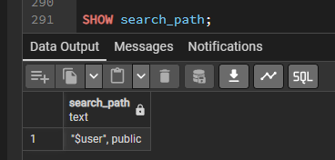
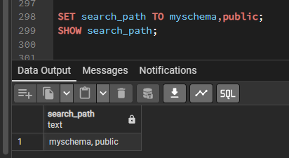
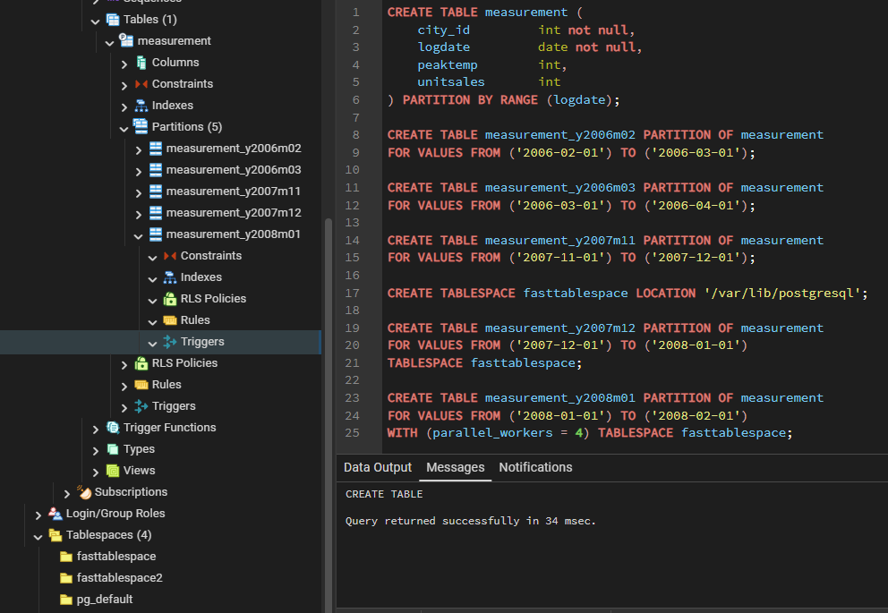
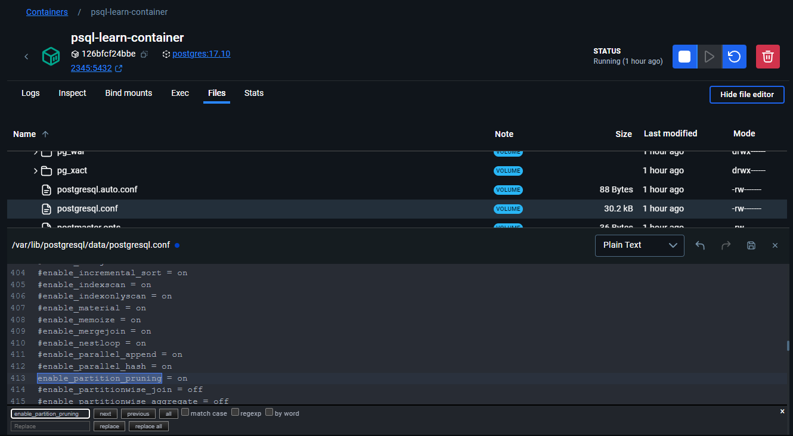
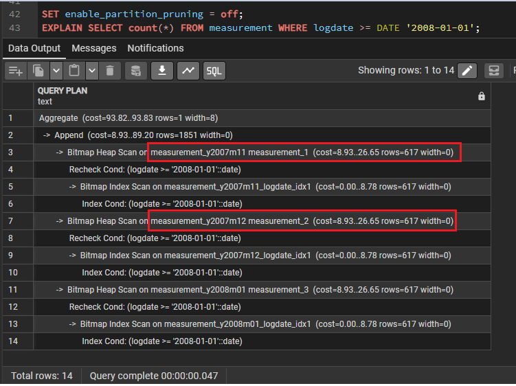
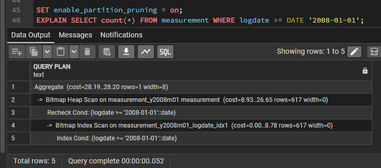

## Схемы

Кластер баз данных PostgreSQL содержит один или несколько именованных экземпляров баз. 
На уровне кластера создаются роли и некоторые другие объекты. 
При этом в рамках одного подключения к серверу можно обращаться к данным только одной базы — 
той, что была выбрана при установлении соединения.

>Пользователи кластера не обязательно будут иметь доступ ко всем базам данных этого кластера. 
> Тот факт, что роли создаются на уровне кластера, означает только то, что в кластере не может быть двух ролей `joe` 
в разных базах данных, хотя система позволяет ограничить доступ `joe` только некоторыми базами данных.

База данных содержит одну или несколько именованных схем, которые в свою очередь содержат таблицы. 
Схемы также содержат именованные объекты других видов, включая типы данных, функции и операторы. 

Одно и то же имя объекта можно свободно использовать в разных схемах, 
например и `schema1`, и `myschema` могут содержать таблицы с именем `mytable`. 

В отличие от баз данных, схемы не ограничивают доступ к данным: 
пользователи могут обращаться к объектам в любой схеме текущей базы данных, если им назначены соответствующие права.

Есть несколько возможных объяснений, для чего стоит применять схемы:
* Чтобы одну базу данных могли использовать несколько пользователей, независимо друг от друга.
* Чтобы объединить объекты базы данных в логические группы для облегчения управления ими.
* Чтобы в одной базе сосуществовали разные приложения, и при этом не возникало конфликтов имён.

Схемы в некотором смысле подобны каталогам в операционной системе, но они не могут быть вложенными.

---

### Создание схемы

Для создания схемы используется команда `CREATE SCHEMA`. 
При этом вы определяете имя схемы по своему выбору, например так:
```postgres-sql
CREATE SCHEMA myschema;
```

Чтобы создать объекты в схеме или обратиться к ним, указывайте полное имя, 
состоящее из имён схемы и объекта, разделённых точкой:
```postgres-sql
схема.таблица
```

Этот синтаксис работает везде, где ожидается имя таблицы, включая команды модификации таблицы и команды обработки данных. 
(Для краткости мы будем говорить только о таблицах, 
но всё это распространяется и на другие типы именованных объектов, например, типы и функции.)

Есть ещё более общий синтаксис
```postgres-sql
база_данных.схема.таблица
```
но в настоящее время он поддерживается только для формального соответствия стандарту SQL.
Если вы указываете базу данных, это может быть только база данных, к которой вы подключены.

Таким образом, создать таблицу в новой схеме можно так:
```postgres-sql
CREATE TABLE myschema.mytable (
...
);
```

Чтобы удалить пустую схему (не содержащую объектов), выполните:
```postgres-sql
DROP SCHEMA myschema;
```

Удалить схему со всеми содержащимися в ней объектами можно так:
```postgres-sql
DROP SCHEMA myschema CASCADE;
```

Часто бывает нужно создать схему, владельцем которой будет другой пользователь 
(это один из способов ограничения пользователей пространствами имён). 
Сделать это можно так:
```postgres-sql
CREATE SCHEMA имя_схемы AUTHORIZATION имя_пользователя;
```
Вы даже можете опустить имя схемы, в этом случае именем схемы станет имя пользователя.

>Схемы с именами, начинающимися с `pg_`, являются системными; пользователям не разрешено использовать такие имена

---

### Схема public

До этого мы создавали таблицы, не указывая никакие имена схем. 
По умолчанию такие таблицы (и другие объекты) автоматически помещаются в схему «`public`». 
Она содержится во всех создаваемых базах данных. 

Таким образом, команда:
```postgres-sql
CREATE TABLE products ( ... );
```
эквивалентна:
```postgres-sql
CREATE TABLE public.products ( ... );
```

---

### Путь поиска схемы

Везде писать полные имена утомительно, и часто всё равно лучше не привязывать приложения к конкретной схеме. 
Поэтому к таблицам обычно обращаются по неполному имени, состоящему просто из имени таблицы. 

>PostgreSQL определяет, какая именно таблица подразумевается, используя **_путь поиска_** (`search_path`), 
который представляет собой список просматриваемых схем. 

Подразумеваемой таблицей считается первая подходящая таблица, найденная в схемах пути. 
Если подходящая таблица не найдена, возникает ошибка, даже если таблица с таким именем есть в других схемах базы данных.

Возможность создавать одноимённые объекты в разных схемах усложняет написание запросов, 
которые должны всегда обращаться к конкретным объектам. 
Это также потенциально позволяет пользователям влиять на поведение запросов других пользователей, злонамеренно или случайно.
Ввиду преобладания неполных имён в запросах и их использования внутри PostgreSQL, 
добавить схему в `search_path` — по сути значит доверять всем пользователям, имеющим право CREATE в этой схеме. 

Когда вы выполняете обычный запрос, злонамеренный пользователь может создать объекты в схеме, 
включённой в ваш путь поиска, и таким образом перехватывать управление и выполнять произвольные функции SQL как если бы их выполняли вы.

Первая схема в пути поиска называется текущей. 
Эта схема будет использоваться не только при поиске, но и при создании объектов — она будет включать таблицы, 
созданные командой `CREATE TABLE` без указания схемы.

Чтобы узнать текущий тип поиска, выполните следующую команду:
```postgres-sql
SHOW search_path;
```



1. Первый элемент ссылается на схему с именем текущего пользователя. 
Если такой схемы не существует, ссылка на неё игнорируется. 
2. Второй элемент ссылается на схему `public`, которую мы уже видели.

>Первая существующая схема в пути поиска также считается схемой по умолчанию для новых объектов. 

Именно поэтому по умолчанию объекты создаются в схеме `public`, если другая схема не создана. 

При указании неполной ссылки на объект в любом контексте (при модификации таблиц, изменении данных или в запросах)
система просматривает путь поиска, пока не найдёт соответствующий объект. 
Таким образом, в конфигурации по умолчанию неполные имена могут относиться только к объектам в схеме `public`.

Чтобы добавить в путь нашу новую схему, мы выполняем:
```postgres-sql
SET search_path TO myschema,public;
```



И так как `myschema` — первый элемент в пути, новые объекты будут по умолчанию создаваться в этой схеме.

Мы можем также написать:
```postgres-sql
SET search_path TO myschema;
```

Тогда мы больше не сможем обращаться к схеме `public`, не написав полное имя объекта. 
Единственное, что отличает схему `public` от других, это то, что она существует по умолчанию, хотя её так же можно удалить.

Как и для имён таблиц, путь поиска аналогично работает для имён типов данных, имён функций
и имён операторов.

---

###  Схема системного каталога

В дополнение к схеме `public` и схемам, создаваемым пользователями, любая база данных содержит схему `pg_catalog`, 
в которой находятся системные таблицы и все встроенные типы данных, функции и операторы. 

`pg_catalog` фактически всегда является частью пути поиска. 
Если даже эта схема не добавлена в путь явно, она неявно просматривается до всех схем, указанных в пути. 
Так обеспечивается доступность встроенных имён при любых условиях. 

Однако вы можете явным образом поместить `pg_catalog` в конец пути поиска, если вам нужно, чтобы пользовательские имена
переопределяли встроенные.

>Так как имена системных таблиц начинаются с **_pg__**, такие имена лучше не использовать во избежание конфликта имён, 
возможного при появлении в будущем системной таблицы с тем же именем, что и ваша. 
(С путём поиска по умолчанию неполная ссылка будет воспринята как обращение к системной таблице.) 

Системные таблицы будут и дальше содержать в имени приставку **_pg__**, 
так что они не будут конфликтовать с неполными именами пользовательских таблиц, 
если пользователи со своей стороны не будут использовать приставку `pg_`

---

### Шаблоны использования

Схемам можно найти множество применений. 
Для защиты от влияния недоверенных пользователей на поведение запросов других пользователей 
предлагается шаблон безопасного использования схем, но если этот шаблон не применяется в базе данных, 
пользователи, желающие безопасно выполнять в ней запросы, должны будут принимать защитные меры в начале каждого сеанса.

В частности, они должны начинать каждый сеанс с присваивания пустого значения переменной `search_path` 
или каким-либо другим образом удалять из `search_path` схемы, доступные для записи обычным пользователям. 

С конфигурацией по умолчанию легко реализуются следующие шаблоны использования:
* Ограничить обычных пользователей личными схемами. 
Для реализации этого подхода сначала убедитесь, что ни у одной схемы нет права `CREATE`. 
Затем для каждого пользователя, который будет создавать не временные объекты, 
создайте схему с его именем, например 
```postgres-sql
CREATE SCHEMA alice AUTHORIZATION alice. 
```
(Как вы знаете, путь поиска по умолчанию начинается с имени $user, вместо которого подставляется имя пользователя.
Таким образом, если у всех пользователей будет отдельная схема, они по умолчанию будут обращаться к собственным схемам.) 

Этот шаблон позволяет безопасно использовать схемы, 
только если никакой недоверенный пользователь не является владельцем базы данных и не получал право **_ADMIN OPTION_**
для соответствующей роли. 
В противном случае безопасное использование схем невозможно.
В версиях до Postgres 15, необходимо удалить право **CREATE** из схемы `public` 
(выполнить `REVOKE CREATE ON SCHEMA public FROM PUBLIC`). 
Затем проверьте, нет ли в схеме `public` объектов с такими же именами, как у объектов в схеме `pg_catalog`.

* Удалить схему `public` из пути поиска по умолчанию, изменив `postgresql.conf` или выполнив команду 
```postgres-sql
ALTER ROLE ALL SET search_path = "$user";
```
Затем следует предоставить права на создание объектов в схеме `public`. 
Выбираться объекты в этой схеме будут только по полному имени. 
Тогда как обращаться к таблицам по полному имени вполне допустимо, 
обращения к функциям в общей схеме всё же будут небезопасными или ненадёжными. 
Поэтому если вы создаёте функции или расширения в схеме `public`, применяйте первый шаблон. 
Если же нет, этот шаблон, как и первый, безопасен при условии, 
что никакой недоверенный пользователь не является владельцем базы данных 
и не получал право `ADMIN OPTION` для соответствующей роли.

* Сохранить путь поиска по умолчанию и предоставить права создания объектов в схеме `public`.
Все пользователи неявно обращаются к схеме `public`. 
Тем самым имитируется ситуация с полным отсутствием схем, что позволяет осуществить плавный переход из среды без схем.
Однако данный шаблон ни в коем случае нельзя считать безопасным. 
Он подходит, только если в базе данных имеется всего один либо несколько доверяющих друг другу пользователей. 
В базах данных, обновлённых с версии PostgreSQL 14 или более ранней, этот шаблон применяется по умолчанию


При любом подходе, устанавливая совместно используемые приложения (таблицы, которые нужны всем, 
дополнительные функции сторонних разработчиков и т. д.), помещайте их в отдельные схемы.
Не забудьте дать другим пользователям права для доступа к этим схемам. 
Тогда пользователи смогут обращаться к этим дополнительным объектам по полному имени или при желании добавят эти схемы в свои пути поиска

---

### Переносимость

**Стандарт SQL не поддерживает обращение в одной схеме к разным объектам**, принадлежащим разным пользователям. 

Более того, в ряде реализаций СУБД нельзя создавать схемы с именем, отличным от имени владельца. 
На практике, в СУБД, реализующих только базовую поддержку схем согласно стандарту, 
концепции пользователя и схемы очень близки. 

Таким образом, многие пользователи полагают, что полное имя на самом деле образуется как 

`имя_пользователя.имя_таблицы`

И именно так будет вести себя PostgreSQL, если вы создадите схемы для каждого пользователя.

В стандарте SQL нет и понятия схемы `public`. 

>Для максимального соответствия стандарту использовать схему `public` не следует.

Конечно, есть СУБД, в которых вообще не реализованы схемы или пространства имён поддерживают 
(возможно, с ограничениями) обращения к другим базам данных. 
Если вам потребуется работать с этими системами, максимальной переносимости вы достигнете, вообще не используя схемы.

---

## Секционирование таблиц

PostgreSQL поддерживает простое секционирование таблиц. 
В этом разделе описывается, как и почему бывает полезно применять секционирование при проектировании баз данных.

---

### Обзор

>Секционированием называется разбиение данных, логически являющихся одной большой таблицей, 
на более мелкие физические части (секции). 

Секционирование может принести следующую пользу:
* В определённых ситуациях оно кардинально увеличивает быстродействие, 
особенно когда большой процент часто запрашиваемых строк таблицы относится к одной или лишь нескольким секциям. 
Секционирование по сути заменяет верхние уровни деревьев индексов, 
что увеличивает вероятность нахождения наиболее востребованных частей индексов в памяти.
* Когда в выборке или изменении данных задействована большая часть одной секции, производительность может возрасти, 
если будет выполняться последовательное сканирование этой секции, а не поиск по индексу, 
сопровождаемый произвольным чтением данных, разбросанных по всей таблице.
* Массовую загрузку и удаление данных можно осуществлять, добавляя и удаляя секции, 
если такой вариант использования был предусмотрен при проектировании секций. 
Удаление отдельной секции командой `DROP TABLE` и действие `ALTER TABLE DETACH PARTITION` выполняются гораздо быстрее, 
чем аналогичная массовая операция. 
Эти команды полностью исключают накладные расходы, связанные с выполнением **VACUUM** после массовой операции `DELETE`.
* Редко используемые данные можно перенести на более дешёвые и медленные носители.

>Всё это обычно полезно только для очень больших таблиц. 

Какие именно таблицы выиграют от секционирования, зависит от конкретного приложения, хотя, как правило, 
это **следует применять для таблиц, размер которых превышает объём ОЗУ сервера.**

PostgreSQL предлагает поддержку следующих видов секционирования:

* **Секционирование по диапазонам**
  - Таблица секционируется по «**диапазонам**», определённым по ключевому столбцу или набору столбцов, 
  и не пересекающимся друг с другом. 
  Например, можно секционировать данные по диапазонам дат или по диапазонам идентификаторов определённых бизнес-объектов. 
  Границы каждого диапазона считаются включающими нижнее значение и исключающими верхнее. 
  Например, если для первой секции задан диапазон значений от 1 до 10, а для второй — от 10 до 20, 
  значение 10 относится ко второй секции, а не к первой.
* **Секционирование по списку**
  - Таблица секционируется с помощью списка, явно указывающего, какие значения ключа должны относиться к каждой секции.
* **Секционирование по хешу**
  - Таблица секционируется по определённым модулям и остаткам, которые указываются для каждой секции. 
  Каждая секция содержит строки, для которых хеш-значение ключа секционирования, делённое на модуль, равняется заданному остатку

Если вашему приложению требуются другие формы секционирования, можно также прибегнуть к альтернативным реализациям, 
с использованием наследования и представлений с **UNION ALL**.
Такие подходы дают гибкость, но не дают такого выигрыша в производительности, как встроенное декларативное секционирование

---

### Декларативное секционирование

PostgreSQL позволяет декларировать, что некоторая таблица разделяется на секции. 

Разделённая на секции таблица называется **секционированной таблицей**. 

Декларация секционирования состоит из описанного выше определения метода секционирования 
и списка столбцов или выражений, образующих ключ секционирования.

Сама секционированная таблица является «виртуальной» и как таковая не хранится. 
Хранилище используется её секциями, которые являются обычными таблицами, связанными с секционированной. 

В каждой секции хранится подмножество данных таблицы, определяемое её границами секции. 
Все строки, вставляемые в секционированную таблицу, перенаправляются в соответствующие секции 
в зависимости от значений столбцов ключа секционирования. 

Если при изменении значений ключа секционирования в строке она перестаёт удовлетворять ограничениям исходной секции, 
эта строка перемещается в другую секцию.

Сами секции могут представлять собой секционированные таблицы, таким образом реализуется вложенное секционирование. 
Хотя все секции должны иметь те же столбцы, что и секционированная родительская таблица, 
в каждой секции независимо от других могут быть определены свои индексы, ограничения и значения по умолчанию. 

Подробнее о создании секционированных таблиц и секций рассказывается в описании [CREATE TABLE](syntax.md#create-table).

>Преобразовать обычную таблицу в секционированную и наоборот нельзя. 
Однако в секционированную таблицу можно добавить в качестве секции существующую обычную или секционированную таблицу, 
а также можно удалить секцию из секционированной таблицы и превратить её в отдельную таблицу; 

это может ускорить многие процессы обслуживания. 

Обратитесь к описанию [ALTER TABLE](syntax.md#alter-table), чтобы узнать больше о подкомандах 
`ATTACH PARTITION` и `DETACH PARTITION`.

Секции также могут быть сторонними таблицами, но учтите, что именно пользователь ответственен за соответствие 
содержимого сторонней таблицы правилу секционирования, это не контролируется автоматически. 

Также существуют и некоторые другие ограничения. 
За подробностями обратитесь к описанию `CREATE FOREIGN TABLE`

---

#### Пример

Предположим, что мы создаём базу данных для большой компании, торгующей мороженым. 
Компания учитывает максимальную температуру и продажи мороженого каждый день в разрезе регионов. 

По сути нам нужна следующая таблица:
```postgres-sql
CREATE TABLE measurement (
    city_id         int not null,
    logdate         date not null,
    peaktemp        int,
    unitsales       int
);
```

Мы знаем, что большинство запросов будут работать только с данными за последнюю неделю, месяц или квартал, 
так как в основном эта таблица нужна для формирования текущих отчётов для руководства. 

Чтобы сократить объём хранящихся старых данных, мы решили оставлять данные только за 3 последних года. 
Ненужные данные мы будем удалять в начале каждого месяца. 

В этой ситуации мы можем использовать секционирование для удовлетворения всех наших требований к таблице показателей.
Чтобы использовать декларативное секционирование в этом случае, выполните следующее:

1. **Создайте таблицу** `measurement` как секционированную таблицу с предложением **_PARTITION BY_**,
   указав метод секционирования (в нашем случае **RANGE**) и список столбцов, которые будут образовывать ключ секционирования
```postgres-sql
CREATE TABLE measurement (
    city_id         int not null,
    logdate         date not null,
    peaktemp        int,
    unitsales       int
) PARTITION BY RANGE (logdate);
```
2. **Создайте секции.** В определении каждой секции должны задаваться границы, 
соответствующие методу и ключу секционирования родительской таблицы. 
Заметьте, что указание границ, при котором множество значений новой секции пересекается со множеством значений 
в одной или нескольких существующих секциях, будет ошибочным.
Секции, создаваемые таким образом, во всех отношениях являются обычными таблицами PostgreSQL. 
В частности, для каждой секции можно независимо задать табличное пространство и параметры хранения.
В нашем примере каждая секция должна содержать данные за один месяц, 
чтобы данные можно было удалять по месяцам согласно требованиям. 

Таким образом, нужные команды будут выглядеть так:
```postgres-sql
CREATE TABLE measurement_y2006m02 PARTITION OF measurement 
FOR VALUES FROM ('2006-02-01') TO ('2006-03-01');

CREATE TABLE measurement_y2006m03 PARTITION OF measurement 
FOR VALUES FROM ('2006-03-01') TO ('2006-04-01');
...
CREATE TABLE measurement_y2007m11 PARTITION OF measurement 
FOR VALUES FROM ('2007-11-01') TO ('2007-12-01');

CREATE TABLESPACE fasttablespace LOCATION '/var/lib/postgresql';

CREATE TABLE measurement_y2007m12 PARTITION OF measurement 
FOR VALUES FROM ('2007-12-01') TO ('2008-01-01')
TABLESPACE fasttablespace;
    
CREATE TABLE measurement_y2008m01 PARTITION OF measurement 
FOR VALUES FROM ('2008-01-01') TO ('2008-02-01')
WITH (parallel_workers = 4) TABLESPACE fasttablespace;
```
Обратите внимание, что перед созданием секционной таблицы в табличном пространстве, 
сначала создается само табличное пространство



3. Создайте в секционируемой таблице индекс по ключевому столбцу (или столбцам), 
а также любые другие индексы, которые могут понадобиться. 
(Индекс по ключу, строго говоря, создавать не обязательно, но в большинстве случаев он будет полезен.) 
При этом автоматически будет создан соответствующий индекс в каждой секции и все секции, 
которые вы будете создавать или присоединять позднее, тоже будут содержать такой индекс. 
 
Индексы или ограничения уникальности, созданные в секционированной таблице, являются «виртуальными», 
как и сама секционированная таблица: фактически данные находятся в дочерних индексах отдельных таблиц-секций.
```postgres-sql
CREATE INDEX ON measurement (logdate);
```
4. Убедитесь в том, что параметр конфигурации `enable_partition_pruning` не выключен в `postgresql.conf`. 
Иначе запросы не будут оптимизироваться должным образом.



В данном примере нам потребуется создавать секцию каждый месяц, так что было бы разумно написать скрипт, 
который бы формировал требуемый код DDL автоматически.

---

### Обслуживание секций

Обычно набор секций, образованный изначально при создании таблиц, не предполагается сохранять неизменным. 
Чаще наоборот, планируется удалять секции со старыми данными и периодически добавлять секции с новыми. 

Одно из наиболее важных преимуществ секционирования состоит именно в том, 
что оно позволяет практически моментально выполнять трудоёмкие операции, изменяя структуру секций, 
а не физически перемещая большие объёмы данных.

Самый лёгкий способ удалить старые данные — просто удалить секцию, ставшую ненужной:
```postgres-sql
DROP TABLE measurement_y2006m02;
```
Так можно удалить миллионы записей гораздо быстрее, чем удалять их по одной. 
Заметьте, однако, что приведённая выше команда требует установления блокировки **_ACCESS EXCLUSIVE_**.

Ещё один часто более предпочтительный вариант — убрать секцию из главной таблицы, 
но сохранить возможность обращаться к ней как к самостоятельной таблице:
```postgres-sql
ALTER TABLE measurement DETACH PARTITION measurement_y2006m03;
ALTER TABLE measurement DETACH PARTITION measurement_y2006m03 CONCURRENTLY;
```
При этом можно будет продолжать работать с данными, пока таблица не будет удалена. 

Например, в этом состоянии очень кстати будет сделать резервную копию данных, используя `COPY`, 
`pg_dump` или подобные средства. 

Возможно, эти данные также можно будет агрегировать, перевести в компактный формат, 
выполнить другую обработку или построить отчёты.

Первая форма команды требует блокировки `ACCESS EXCLUSIVE` родительской таблицы. 
Благодаря указанию `CONCURRENTLY`, как во второй форме, для операции отсоединения будет требоваться только блокировка 
`SHARE UPDATE EXCLUSIVE` родительской таблицы, но при этом действуют ограничения, описанные в `ALTER TABLE ... DETACH PARTITION`.

Аналогичным образом можно добавлять новую секцию с данными. 
Мы можем создать пустую секцию в главной таблице так же, как мы создавали секции в исходном состоянии до этого:
```postgres-sql
CREATE TABLE measurement_y2008m02 PARTITION OF measurement
    FOR VALUES FROM ('2008-02-01') TO ('2008-03-01')
    TABLESPACE fasttablespace;
```

А иногда удобнее создать новую таблицу вне структуры секций и присоединить её в виде секции позже. 
При таком подходе новые данные можно будет загрузить, проверить и преобразовать до того, 
как они появятся в секционированной таблице. 

Кроме того, операция `ATTACH PARTITION` требует для секционированной таблицы только блокировки `SHARE UPDATE EXCLUSIVE`, 
в отличие от операции `CREATE TABLE ... PARTITION OF`, требующей блокировки `ACCESS EXCLUSIVE`, 
поэтому её удобнее использовать для выполнения параллельных операций с секционированной таблицей.

Обойтись без кропотливого воспроизведения определения родительской таблицы можно, 
воспользовавшись функциональностью `CREATE TABLE ... LIKE`:
```postgres-sql
CREATE TABLE measurement_y2008m02
(LIKE measurement INCLUDING DEFAULTS INCLUDING CONSTRAINTS)
TABLESPACE fasttablespace;

ALTER TABLE measurement_y2008m02 ADD CONSTRAINT y2008m02
CHECK ( logdate >= DATE '2008-02-01' AND logdate < DATE '2008-03-01' );

\copy measurement_y2008m02 from 'measurement_y2008m02'    -- possibly some other data preparation work
ALTER TABLE measurement ATTACH PARTITION measurement_y2008m02
FOR VALUES FROM ('2008-02-01') TO ('2008-03-01' );
```

Прежде чем выполнять команду `ATTACH PARTITION`, рекомендуется создать ограничение `CHECK` в присоединяемой таблице, 
соответствующее ожидаемому ограничению секции, как показано выше.

Благодаря этому система сможет обойтись без сканирования, необходимого для проверки неявного ограничения секции. 
Без этого ограничения `CHECK` нужно будет просканировать и убедиться в выполнении ограничения секции, 
удерживая блокировку `ACCESS EXCLUSIVE` в этой секции.
После выполнения команды `ATTACH PARTITION` рекомендуется удалить ограничение `CHECK`, поскольку оно больше не нужно. 

Если присоединяемая таблица также является секционированной таблицей, 
то каждая из её секций будет рекурсивно блокироваться и сканироваться до тех пор, 
пока не встретится подходящее ограничение `CHECK` или не будут достигнуты конечные разделы.

Точно так же, если в секционированной таблице есть секция `DEFAULT`, рекомендуется создать ограничение `CHECK`, 
которое исключает ограничение секции, подлежащей присоединению. 
Если этого не сделать, то секция `DEFAULT` будет просканирована, чтобы убедиться, что она не содержит записей, 
которые должны быть расположены в присоединяемой секции. 
Эта операция будет выполняться при удержании блокировки `ACCESS EXCLUSIVE` на секции `DEFAULT`. 

Если секция `DEFAULT` сама является секционированной таблицей, то каждая из её секций будет рекурсивно проверяться
таким же образом, как и присоединяемая таблица, как упоминалось выше.

Как говорилось выше, в секционированных таблицах можно создавать индексы так, чтобы они применялись автоматически ко всей иерархии. 
Это очень удобно, так как индексироваться будут не только все существующие секции, но и любые секции, создаваемые в будущем. 

Но есть одно ограничение — такой **секционированный индекс нельзя создать в неблокирующем режиме** 
(с указанием `CONCURRENTLY`). 

Чтобы избежать блокировки на долгое время, для создания индекса в самой секционированной таблице 
можно использовать команду `CREATE INDEX ON ONLY;` 
такой индекс будет помечен как нерабочий, и он не будет автоматически применён к секциям. 

Индексы собственно в секциях можно создать в индивидуальном порядке с указанием `CONCURRENTLY`, 
а затем присоединить их к индексу-родителю, используя команду `ALTER INDEX .. ATTACH PARTITION`.
После того как индексы всех секций будут присоединены к родительскому, последний автоматически перейдёт в рабочее состояние. 

Например:
```postgres-sql
CREATE INDEX measurement_usls_idx ON ONLY measurement (unitsales);

CREATE INDEX CONCURRENTLY measurement_usls_200711_idx ON measurement_y2007m11 (unitsales);

ALTER INDEX measurement_usls_idx ATTACH PARTITION measurement_usls_200711_idx;
...
```

Этот приём можно применять и с ограничениями `UNIQUE` и `PRIMARY KEY`; 
для них индексы создаются неявно при создании ограничения. 

Например:
```postgres-sql
ALTER TABLE ONLY measurement ADD UNIQUE (city_id, logdate);

ALTER TABLE measurement_y2006m02 ADD UNIQUE (city_id, logdate);

ALTER INDEX measurement_city_id_logdate_key ATTACH PARTITION measurement_y2006m02_city_id_logdate_key;
...
```

---

#### Ограничения

С секционированными таблицами связаны следующие ограничения:
* Создать ограничение уникальности или первичного ключа для секционированной таблицы можно, 
только если ключи секций не включают никакие выражения или вызовы функций 
и в ограничение входят все столбцы ключа секционирования.
* Создать ограничение-исключение, охватывающее всю секционированную таблицу, нельзя;
можно только поместить такое ограничение в каждую отдельную секцию с данными. 
И это также является следствием того, что установить ограничения, действующие между секциями, невозможно.
* Триггеры `BEFORE ROW` для `INSERT` не могут менять секцию, в которую в итоге попадёт новая строка.
* Смешивание временных и постоянных отношений в одном дереве секционирования не допускается. 
Таким образом, если секционированная таблица постоянная, такими же должны быть её секции; 
с временными таблицами аналогично. 
В случае с временными отношениями все таблицы дерева секционирования должны быть из одного сеанса.


Так как иерархия секционирования, образованная секционированной таблицей и её секциями, 
является одновременно и иерархией наследования, 
она содержит `tableoid` и на неё распространяются все обычные правила наследования, с некоторыми исключениями:
* В секциях не может быть столбцов, отсутствующих в родительской таблице. 
Такие столбцы невозможно определить ни при создании секций командой `CREATE TABLE`, 
ни путём последующего добавления в секции командой `ALTER TABLE`. 
Таблицы могут быть подключены в качестве секций командой `ALTER TABLE ... ATTACH PARTITION`, 
только если их столбцы в точности соответствуют родительской таблице.
* Ограничения `CHECK` вместе с `NOT NULL`, определённые в секционированной таблице, 
всегда наследуются всеми её секциями. 
* Ограничения `CHECK` с характеристикой `NO INHERIT` в секционированных таблицах создавать нельзя. 
Также нельзя удалить ограничение `NOT NULL`, заданное для столбца секции, 
если такое же ограничение существует в родительской таблице.
* Использование указания `ONLY` при добавлении или удалении ограничения только в секционированной таблице поддерживается, 
лишь когда в ней нет секций. При наличии секций попытка использования `ONLY` вызовет ошибку для любых ограничений, 
кроме `UNIQUE` и `PRIMARY KEY`.
* Так как секционированная таблица сама по себе не содержит данные, 
использование `TRUNCATE ONLY` для секционированной таблицы всегда будет считаться ошибкой.

---

### Отсечение секций

Отсечение секций — это приём оптимизации запросов, который ускоряет работу с декларативно секционированными таблицами. 

Например
```postgres-sql
SET enable_partition_pruning = on;                 -- по умолчанию
SELECT count(*) FROM measurement WHERE logdate >= DATE '2008-01-01';
```

Без отсечения секций показанный запрос должен будет просканировать все секции таблицы `measurement`. 
Когда отсечение секций включено, планировщик рассматривает определение каждой секции и может заключить, 
что какую-либо секцию сканировать не нужно, так как в ней не может быть строк, удовлетворяющих предложению `WHERE` в запросе. 

Когда планировщик может сделать такой вывод, он исключает (отсекает) секцию из плана запроса.

Используя команду `EXPLAIN` и параметр конфигурации `enable_partition_pruning`, можно увидеть отличие плана, 
в котором были отсечены секции, от плана без отсечения. 

Типичный неоптимизированный план для такой конфигурации таблицы будет выглядеть так:
```postgres-sql
SET enable_partition_pruning = off;
EXPLAIN SELECT count(*) FROM measurement WHERE logdate >= DATE '2008-01-01';
```



В некоторых или всех секциях может применяться не полное последовательное сканирование, а сканирование по индексу,
но основная идея примера в том, что для удовлетворения запроса не нужно сканировать старые секции.

И когда мы включаем отсечение секций, мы получаем значительно более эффективный план, дающий тот же результат:
```postgres-sql
SET enable_partition_pruning = on;
EXPLAIN SELECT count(*) FROM measurement WHERE logdate >= DATE '2008-01-01';
```



Заметьте, что механизм отсечения секций учитывает только ограничения, 
определённые неявно ключами секционирования, но не наличие индексов. 
Поэтому определять индексы для столбцов ключа не обязательно. 

Нужно ли создавать индекс для определённой секции, зависит от того, какую часть секции (меньшую или большую), 
по вашим представлениям, будут сканировать запросы, обращающиеся к этой секции. 
Индекс будет полезен в первом случае, но не во втором.

---

### Рекомендации по декларативному секционированию

К секционированию таблицы следует подходить продуманно, 
так как неудачное решение может отрицательно повлиять на скорость планирования и выполнения запросов.

Одним из самых важных факторов является выбор столбца или столбцов, по которым будут секционироваться ваши данные. 

>Часто оптимальным будет секционирование по столбцу или набору столбцов, 
которые практически всегда присутствуют в предложении `WHERE` в запросах, обращающихся к секционируемой таблице. 

Предложения `WHERE`, совместимые с ограничениями границ секции, 
могут применяться для устранения ненужных для выполнения запроса секций. 
Однако наличие ограничений `PRIMARY KEY` или `UNIQUE` может подтолкнуть к выбору и других столбцов в качестве секционирующих. 

Также при планировании секционирования следует продумать, как будут удаляться данные. 
Секцию целиком можно отсоединить очень быстро, поэтому может иметь смысл разработать стратегию секционирования так, 
чтобы массово удаляемые данные оказывались в одной секции.

Также важно правильно выбрать число секций, на которые будет разбиваться таблица.
Если их будет недостаточно много, индексы останутся большими, не улучшится и локальность данных,
вследствие чего процент попаданий в кеш окажется низким.
Однако и при слишком большом количестве секций возможны проблемы. 
С большим количеством секций увеличивается время планирования и потребление памяти как при планировании, 
так и при выполнении запросов. 

Выбирая стратегию секционирования таблицы, также важно учитывать, какие изменения могут произойти в будущем. 
Например если вы решите создавать отдельные секции для каждого клиента, 
и в данный момент у вас всего несколько больших клиентов, подумайте, что будет, 
если через несколько лет у вас будет много мелких клиентов. 

В этом случае может быть лучше произвести секционирование по хешу (HASH) и выбрать разумное количество секций, 
но не создавать секции по списку (LIST) в надежде, что количество клиентов не увеличится до такой степени, 
что секционирование данных окажется непрактичным.

Вложенное секционирование позволяет дополнительно разделить те секции, которые предположительно окажутся больше других. 

Также можно использовать секционирование по диапазонам с ключом, состоящим из нескольких столбцов. 
Но при любом из подходов легко может получиться слишком много секций, 
так что рекомендуется использовать их осмотрительно.

Важно учитывать издержки секционирования, которые отражаются на планировании и выполнении запросов. 
Планировщик запросов обычно довольно неплохо справляется с иерархиями, включающими **до нескольких тысяч секций**, 
если при выполнении типичных запросов ему удаётся отсечь почти все секции. 
Однако когда после отсечения остаётся большое количество секций, 
возрастает и время планирования запросов, и объём потребляемой памяти. 

Наличие большого количества секций нежелательно ещё и потому, 
что потребление памяти сервером может значительно возрастать со временем, 
особенно когда множество сеансов обращаются ко множеству секций.
Это объясняется тем, что в локальную память каждого сеанса, который обращается к секциям,
должны быть загружены метаданные всех этих секций.

С нагрузкой, присущей информационным хранилищам, может иметь смысл создавать больше секций, чем с нагрузкой OLTP. 
Как правило, в информационных хранилищах время планирования запроса второстепенно, 
так как гораздо больше времени тратится на выполнение запроса. 

Однако при любом типе нагрузки важно принимать правильные решения на ранней стадии реализации, 
так как процесс пересекционирования таблиц большого объёма может оказаться чрезвычайно длительным. 
Для оптимизации стратегии секционирования часто бывает полезно предварительно эмулировать ожидаемую нагрузку. 
Но ни в коем случае нельзя полагать, что чем больше секций, тем лучше, равно как и наоборот

---

В данной главе мы кратко посмотрели Data definition language - язык объявления данных в PostgreSQL.

Заключительным уровнем остается изучить [Data Modification Language](data-modification.md) (DML), 
после чего переходить к практической части работы.

---
