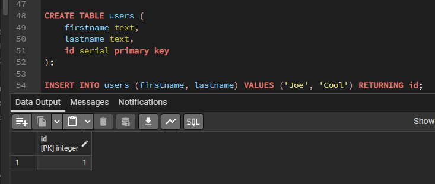
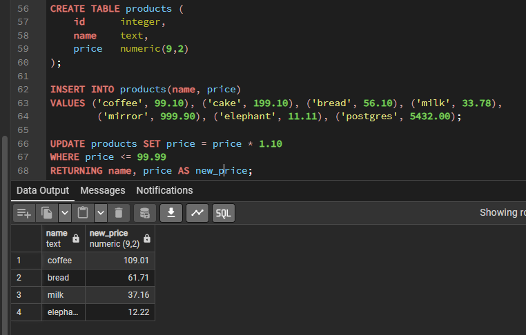

# Модификация данных

В предыдущей главе мы обсуждали, как создавать таблицы и другие структуры для хранения данных.
Теперь пришло время заполнить таблицы данными.

В этой главе мы расскажем, как добавлять, изменять и удалять данные из таблиц.

---

## Добавление данных

Сразу после создания таблицы она не содержит никаких данных.
Поэтому, чтобы она была полезна, в неё прежде всего нужно добавить данные.

По сути данные добавляются в таблицу по одной строке.
И хотя вы конечно можете добавить в таблицу несколько строк, добавить в неё меньше, чем строку, невозможно.
Даже если вы указываете значения только некоторых столбцов, создаётся полная строка.

Чтобы создать строку, вы будете использовать команду `INSERT`.

В этой команде необходимо указать имя таблицы и значения столбцов.
Например, рассмотрим таблицу товаров
```postgres-sql
CREATE TABLE products (
    product_no integer,
    name text,
    price numeric
);
```
Добавить в неё строку можно было бы так:
```postgres-sql
INSERT INTO products VALUES (1, 'Cheese', 9.99);
```

Значения данных перечисляются в порядке столбцов в таблице и разделяются запятыми.
Обычно в качестве значений указываются константы, но это могут быть и скалярные выражения.

Одна команда может вставить сразу несколько строк:
```postgres-sql
INSERT INTO products (product_no, name, price) VALUES
    (1, 'Cheese', 9.99),
    (2, 'Bread', 1.99),
    (3, 'Milk', 2.99);
```

Также возможно вставить результат запроса
(который может не содержать строк либо содержать одну или несколько):
```postgres-sql
INSERT INTO products (product_no, name, price)
  SELECT product_no, name, price FROM new_products
    WHERE release_date = 'today';
```

---

### Рекомендации по загрузке больших объемов данных

1. **Отключите автофиксацию транзакций**

Выполняя серию команд INSERT, выключите автофиксацию транзакций и зафиксируйте транзакцию только один раз в самом конце.
(В обычном SQL это означает, что нужно выполнить `BEGIN` до, и `COMMIT` после этой серии.
Некоторые клиентские библиотеки могут делать это автоматически, в таких случаях нужно убедиться, что это так.)

Если вы будете фиксировать каждое добавление по отдельности,
PostgreSQL придётся проделать много действий для каждой добавляемой строки.

Выполнять все операции в одной транзакции хорошо ещё и потому,
что в случае ошибки добавления одной из строк произойдёт откат к исходному состоянию
и вы не окажетесь в сложной ситуации с частично загруженными данными

2. **Используйте COPY**

Используйте [COPY](syntax.md#copy), чтобы загрузить все строки одной командой вместо серии `INSERT`.
Команда `COPY` оптимизирована для загрузки большого количества строк;
хотя она не так гибка, как `INSERT`, но при загрузке больших объёмов данных она влечёт гораздо меньше накладных расходов.
Так как `COPY` — это одна команда, **применяя её, нет необходимости отключать автофиксацию транзакций**.

3. **Удалите индексы**

Если вы загружаете данные в только что созданную таблицу, быстрее всего будет загрузить данные с помощью `COPY`,
а затем создать все необходимые для неё индексы.

На создание индекса для уже существующих данных уйдёт меньше времени,
чем на последовательное его обновление при добавлении каждой строки.

Если вы добавляете данные в существующую таблицу, может иметь смысл удалить индексы, загрузить таблицу, а затем пересоздать индексы.
>Конечно, при этом надо учитывать, что временное отсутствие индексов может отрицательно повлиять на скорость работы других пользователей.

Кроме того, следует дважды подумать, прежде чем удалять уникальные индексы,
так как без них соответствующие проверки ключей не будут выполняться.

4. **Удалите ограничения внешних ключей**

Как и с индексами, проверки, связанные с ограничениями внешних ключей, выгоднее выполнять «массово»,
а не для каждой строки в отдельности.
Поэтому может быть полезно удалить ограничения внешних ключей, загрузить данные, а затем восстановить прежние ограничения.

И в этом случае тоже приходится выбирать между скоростью загрузки данных и риском допустить ошибки в отсутствие ограничений.

5. **Увеличьте `maintenance_work_mem`**

Ускорить загрузку больших объёмов данных можно, увеличив параметр конфигурации `maintenance_work_mem` на время загрузки.
Это приведёт к увеличению быстродействия `CREATE INDEX` и `ALTER TABLE ADD FOREIGN KEY`.

На скорость самой команды `COPY` это не повлияет, так что этот совет будет полезен,
только если вы применяете какой-либо из двух вышеописанных приёмов.

6. **Увеличьте `max_wal_size`**

Также массовую загрузку данных можно ускорить, изменив на время загрузки параметр конфигурации `max_wal_size`.
Загружая большие объёмы данных, PostgreSQL вынужден увеличивать частоту контрольных точек по сравнению с обычной
(которая задаётся параметром `checkpoint_timeout`), а значит и чаще сбрасывать «грязные» страницы на диск.

Временно увеличив `max_wal_size`, можно уменьшить частоту контрольных точек и связанных с ними операций ввода-вывода.

7. **Отключите архивацию WAL и потоковую репликацию**

Для загрузки больших объёмов данных в среде, где используется архивация **WAL** или потоковая репликация,
быстрее будет сделать копию базы данных после загрузки данных, чем обрабатывать множество операций изменений в `WAL`.

Чтобы отключить передачу изменений через WAL в процессе загрузки, отключите архивацию и потоковую репликацию,
назначьте параметру `wal_level` значение `minimal`, `archive_mode` — off, а `max_wal_senders` — 0.

Но имейте в виду, что изменённые параметры вступят в силу только после перезапуска сервера,
а все ранее созданные резервные копии не будут пригодны для резервного сервера и восстановления архива,
что может привести к потере данных.

Это не только поможет сэкономить время архивации и передачи WAL, но и непосредственно ускорит некоторые команды,
потому что они не записывают в WAL ничего, если в `wal_level` установлен уровень `minimal` и текущая подтранзакция
(или транзакция верхнего уровня) создала и опустошила таблицу или индекс, куда затем вносятся изменения.
Они могут гарантировать безопасность данных при сбое, не записывая их в WAL, а только выполнив `fsync` в конце, что будет гораздо дешевле.


8. **Выполните в конце ANALYZE**

Всякий раз, когда распределение данных в таблице значительно меняется, настоятельно рекомендуется выполнять `ANALYZE`.
Эта рекомендация касается и загрузки в таблицу большого объёма данных.

Выполнив `ANALYZE` (или `VACUUM ANALYZE`), вы тем самым обновите статистику по данной таблице для планировщика.
Когда планировщик не имеет статистики или она не соответствует действительности,
он не сможет правильно планировать запросы, что приведёт к снижению быстродействия при работе с соответствующими таблицами.

Заметьте, что если включён демон автоочистки, он может запускать `ANALYZE` автоматически;

---

## Изменение данных

Модификация данных, уже сохранённых в БД, называется изменением. 

Изменить можно все строки таблицы, либо подмножество всех строк, либо только избранные строки. 
Каждый столбец при этом можно изменять независимо от других.

Для изменения данных в существующих строках используется команда `UPDATE`. Ей требуется следующая информация:
1. **Имя таблицы и изменяемого столбца**
2. **Новое значение столбца**
3. **Критерий отбора изменяемых строк**
   
В SQL в принципе нет уникального идентификатора строк.
Таким образом, не всегда возможно явно указать на строку, которую требуется изменить.
Поэтому необходимо указать условия, каким должны соответствовать требуемая строка. 

>Только если в таблице есть первичный ключ (вне зависимости от того, объявляли вы его или нет), 
можно однозначно адресовать отдельные строки, определив условие по первичному ключу. 

Этим пользуются графические инструменты для работы с базой данных, дающие возможность редактировать данные по строкам.

Например, следующая команда увеличивает цену всех товаров, имевших до этого цену 5, до 10:
```postgres-sql
UPDATE products SET price = 10 WHERE price = 5;
```
В результате может измениться ноль, одна или множество строк. 
И если этому запросу не будет удовлетворять ни одна строка, это не будет ошибкой.

Давайте рассмотрим эту команду подробнее. 
1. Она начинается с ключевого слова `UPDATE`, за которым идёт имя таблицы. 
Как обычно, имя таблицы может быть записано в полной форме, в противном случае она будет найдена по пути поиска. 
2. Затем идёт ключевое слово `SET`, за которым следует имя столбца, знак равенства и новое значение столбца. 
Этим значением может быть любое скалярное выражение, а не только константа. 
 
Например, если вы захотите поднять цену всех товаров на 10%, это можно сделать так:
```postgres-sql
UPDATE products SET price = price * 1.10;
```

Как видно из этого примера, выражение нового значения может ссылаться на существующие значения столбцов в строке. 
3. Мы также опустили в нём предложение `WHERE`. 
**Это означает, что будут изменены все строки в таблице**. 
Если же это предложение присутствует, изменяются только строки, которые соответствуют условию `WHERE`. 

Заметьте, что хотя знак равенства в предложении `SET` обозначает операцию присваивания, 
а такой же знак в предложении `WHERE` используется для сравнения, это не приводит к неоднозначности. 

И конечно, в условии `WHERE` не обязательно должна быть проверка равенства, а могут применяться и другие операторы.
Необходимо только, чтобы это выражение возвращало логический результат.

В команде `UPDATE` можно изменить значения сразу нескольких столбцов, перечислив их в предложении `SET`. 
Например:
```postgres-sql
UPDATE mytable SET a = 5, b = 3, c = 1 WHERE a > 0;
```

---

## Удаление данных

Так же, как добавлять данные можно только целыми строками, удалять их можно только по строкам. 

В предыдущем разделе мы отметили, что в SQL нет возможности напрямую адресовать отдельные строки, 
так что удалить избранные строки можно, только сформулировав для них подходящие условия. 

Но если в таблице есть первичный ключ, с его помощью можно однозначно выделить определённую строку. 
При этом можно так же удалить группы строк, соответствующие условию, либо сразу все строки таблицы.

Для удаления строк используется команда `DELETE`; 
её синтаксис очень похож на синтаксис команды [UPDATE](#изменение-данных). 

Например, удалить все строки из таблицы с товарами, имеющими цену 10, можно так:
```postgres-sql
DELETE FROM products WHERE price = 10;
```

Если вы напишете просто:
```postgres-sql
DELETE FROM products;
```
**будут удалены все строки таблицы! Будьте осторожны!**

---

## Возврат данных из изменённых строк

Иногда бывает полезно получать данные из модифицируемых строк в процессе их обработки. 
Это возможно с использованием предложения `RETURNING`, которое можно задать для команд `INSERT`, `UPDATE` и `DELETE`. 

Применение `RETURNING` позволяет обойтись без дополнительного запроса к базе для сбора данных и это особенно ценно, 
когда как-то иначе трудно получить изменённые строки надёжным образом.

В предложении `RETURNING` допускается то же содержимое, что и в выходном списке команды [SELECT](syntax.md#select). 

Оно может содержать имена столбцов целевой таблицы команды или значения выражений с этими столбцами. 
Также часто применяется краткая запись `RETURNING *`, выбирающая все столбцы целевой таблицы по порядку.

В команде `INSERT` данные, выдаваемые в `RETURNING`, образуются из строки в том виде, в каком она была вставлена. 
Это не очень полезно при простом добавлении, так как в результате будут получены те же данные, что были переданы клиентом. 
Но это может быть очень удобно при исполь зовании вычисляемых значений по умолчанию. 

Например, если в таблице есть столбец `serial`, в котором генерируются уникальные идентификаторы, 
команда `RETURNING` может возвратить идентификатор, назначенный новой строке
```postgres-sql
CREATE TABLE users (
    firstname text, 
    lastname text, 
    id serial primary key
);

INSERT INTO users (firstname, lastname) VALUES ('Joe', 'Cool') RETURNING id;
```



Предложение `RETURNING` также очень полезно с `INSERT ... SELECT`.

В команде `UPDATE` данные, выдаваемые в `RETURNING`, образуются новым содержимым изменённой строки. 

Например:
```postgres-sql
UPDATE products SET price = price * 1.10
WHERE price <= 99.99
RETURNING name, price AS new_price;
```



В команде `DELETE` данные, выдаваемые в RETURNING, образуются содержимым удалённой строки.

Если для целевой таблицы заданы триггеры, в `RETURNING` выдаются данные из строки, изменённой триггерами. 
Таким образом, `RETURNING` часто применяется и для того, чтобы проверить содержимое столбцов, изменяемых триггерами.

---

Последняя теоретическая информация в данном курсе остается за тем, как извлекать нужные вам данные из базы данных
с помощью [Запросов](select.md).

---