# Введение


## Основные понятия

**PostgreSQL** — это реляционная система управления базами данных (РСУБД). 
Это означает, что это система управления данными, представленными в виде отношений (_relation_).

**Отношение** — это математически точное обозначение таблицы. 
Хранение данных в таблицах так распространено сегодня, что это кажется самым очевидным вариантом, 
хотя есть множество других способов организации баз данных. 
Например, файлы и каталоги в Unix-подобных операционных системах образуют иерархическую базу данных,
а сегодня активно развиваются объектно-ориентированные базы данных.

Любая таблица представляет собой именованный набор строк - **Кортежей**. 
Все строки таблицы имеют одинаковый набор именованных столбцов - **Полей**, 
при этом каждому столбцу (полю) назначается определённый тип данных. 

Хотя порядок столбцов во всех строках фиксирован, важно помнить, 
что SQL не гарантирует какой-либо порядок строк в таблице (хотя их можно явно отсортировать при выводе).

Таблицы объединяются в базы данных, а набор баз данных, управляемый одним экземпляром сервера PostgreSQL, образует кластер баз данных.

---

### Создание таблицы

Вы можете создать таблицу, указав её имя и перечислив все имена столбцов и их типы.

для этого в pgAdmin есть два способа написать запрос/скрипт в БД.
1. Выделить БД `sql_study_db` и нажать Query tool (**Alt+Shift+Q**), после этого как показано на картинке ниже
написать скрипт создания таблицы и нажать на панеле сверху **_Execute query_**

Попробуйте проделать данную операцию, переписав скрипт создания таблицы и выполнив его.

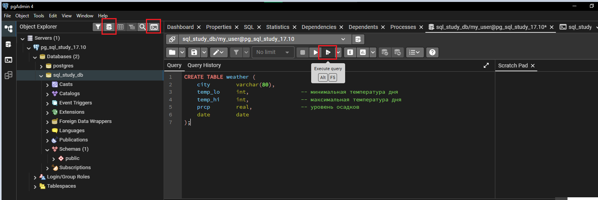

После выполнения скрипта должно выйти сообщение об успешном выполнении запроса и в БД внутри схемы `public`
создастся таблица weater. Если таблицы нет, то попробуйте обновить схему.
При этом второй раз данный скрипт уже не полкчится выполнить. Подумайте почему и как это можно исправить? 

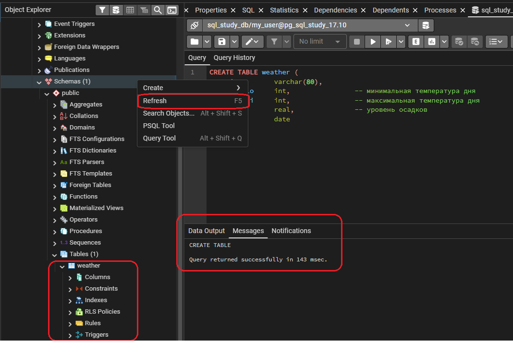

2. Нажать на **_psql Tool_**. 
В таком случае вы перейдете в консоль postgres и можете непосредственно выполнять команды из утилиты psql.
В данном курсе мы не будем использовать этот метод (или будем его использовать минимально)

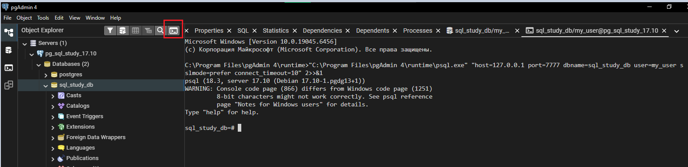

В командах SQL можно свободно использовать пробельные символы (пробелы, табуляции и переводы строк). 
Это значит, что вы можете ввести команду, выровняв её по-другому или даже уместив в одной строке. 

Два минуса («--») обозначают начало комментария. Всё, что идёт за ними до конца строки, игнорируется. 

SQL не чувствителен к регистру в ключевых словах и идентификаторах, заисключением идентификаторов, взятых в кавычки (в данном случае это не так).

* `varchar(80)` определяет тип данных, допускающий хранение произвольных символьных строк длиной до 80 символов. 
* `int` — обычный целочисленный тип. 
* `real` — тип для хранения чисел с плавающей точкой одинарной точности. 
* `date` — тип даты. (Да, столбец типа date также называется date. Это может быть удобно или вводить в заблуждение — как посмотреть.)

PostgreSQL поддерживает стандартные типы SQL: 
`int, smallint, real, double precision, char(N), varchar(N), date, time, timestamp и interval`, 
а также другие универсальные типы и богатый набор геометрических типов. 
Кроме того, PostgreSQL можно расширять, создавая набор собственных типов данных. 

Как следствие, имена типов не являются ключевыми словами в данной записи, кроме тех случаев, 
когда это требуется для реализации особых конструкций стандарта SQL.

Во втором примере мы сохраним в таблице города и их географическое положение:

```postgres-sql
CREATE TABLE cities (
	name 		varchar(80),
	location	point
);
```
Здесь `point` — пример специфического типа данных PostgreSQL.

Наконец, следует сказать, что если вам больше не нужна какая-либо таблица, или вы хотите пересоздать её по-другому, 
вы можете удалить её, используя следующую команду:

```postgres-sql
DROP TABLE имя_таблицы;
```
Естественно, вместе с таблицей будут удалены и все данные которая она содержала!

---

### Добавление строк в таблицу

Для добавления строк в таблицу используется оператор `INSERT` с оператором `INTO` :
```postgres-sql
INSERT INTO weather VALUES ('San Francisco', 46, 50, 0.25, '1994-11-27');
```
Заметьте, что для всех типов данных применяются довольно очевидные форматы. 
Константы, за исключением простых числовых значений, обычно заключаются в апострофы ('), как в данном примере. 

Тип `date` на самом деле очень гибок и принимает разные форматы, но в данном введении мы будем придерживаться простого и однозначного.

Тип `point` требует ввода пары координат, например таким образом:
```postgres-sql
INSERT INTO cities VALUES ('San Francisco', '(-194.0, 53.0)');
```
Показанный здесь синтаксис требует, чтобы вы запомнили порядок столбцов. 
Можно также применить альтернативную запись, перечислив столбцы явно:
```postgres-sql
INSERT INTO weather (city, temp_lo, temp_hi, prcp, date)
VALUES ('San Francisco', 43, 57, 0.0, '1994-11-29');
```

Можно перечислить столбцы в другом порядке, если желаете опустить некоторые из них, например, 
если уровень осадков (столбец prcp) неизвестен:
```postgres-sql
INSERT INTO weather (date, city, temp_hi, temp_lo)
VALUES ('1994-11-29', 'Hayward', 54, 37);
```

>Как правило разработчики предпочитают явно перечислять столбцы, а не полагаться на их порядок в таблице

Также можно загружать данные из файла, но при этом файл должен располагаться на сервере.
например команда скопирует в таблицу weather содержимое всего файла weather.txt если бы он располагался по пути
/home/user/weather.txt внутри контейнера docker.
```postgres-sql
COPY weather FROM '/home/user/weather.txt';
```

Если интерстно воссоздать копирование из файла, то потребуется выполнить в unix терминале вход в docker контейнер `pg_sql_study`
там создать файл с содержимым и повторить команду.

содержимое следующее (значения разделены символом табуляции):
```text
San Francisco    46    50    0.25    1994-11-27
San Francisco    43    57    0.0    1994-11-29
Hayward    37    54    \N    1994-11-29
```

---

### Выполнение запроса

Чтобы получить данные из таблицы, нужно выполнить запрос. 
Для этого предназначен SQL-оператор **_SELECT_**. 

Он состоит из нескольких частей: 
* **Выборки** (в которой перечисляются столбцы, которые должны быть получены), 
* **Списка таблиц** (в нём перечисляются таблицы, из которых будут получены данные) 
* и необязательного **условия** (определяющего ограничения). 

За выборку отвечает оператор `SELECT`, который пишется в связке с оператором `FROM`

Например, чтобы получить все строки таблицы weather, введите:
```postgres-sql
SELECT *
FROM weather;
```

>Здесь `*` — это краткое обозначение «всех столбцов».
Хотя запросы `SELECT *` часто пишут экспромтом, это считается плохим стилем в производственном коде, 
так как результат таких запросов будет меняться при добавлении новых столбцов.

Таким образом, это равносильно записи:
```postgres-sql
SELECT city, temp_lo, temp_hi, prcp, date 
FROM weather;
```

В результате должно получиться:

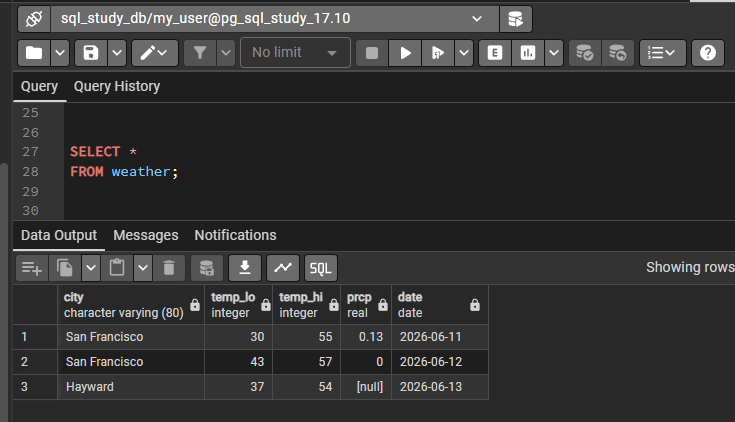

В списке выборки вы можете писать не только ссылки на столбцы, но и выражения. 
Например, вы можете написать:
```postgres-sql
SELECT city, (temp_hi+temp_lo)/2 AS temp_avg, date 
FROM weather;
```
Обратите внимание, как предложение `AS` позволяет переименовать выходной столбец. 
(Само слово `AS` можно опускать, но для полноты понимания скрипта разработчиками, лучше его не убирать)

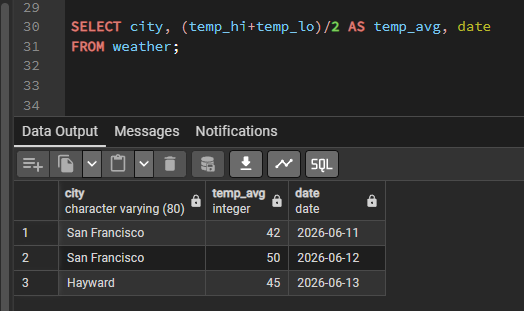

Запрос можно дополнить «**условием**», добавив предложение **_WHERE_**, ограничивающее множество возвращаемых строк. 

В предложении **WHERE** указывается логическое выражение (проверка истинности), которое служит фильтром строк: 
в результате оказываются только те строки, для которых это выражение истинно. 
В этом выражении могут присутствовать обычные логические операторы (**AND, OR и NOT**). 

Например, следующий запрос покажет, какая погода была в Сан-Франциско в дождливые дни:
```postgres-sql
SELECT * 
FROM weather
WHERE city = 'San Francisco' AND prcp > 0.0;
```

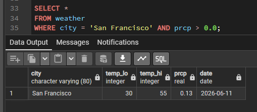

Также можно получить результаты запроса в определённом порядке добавив оператор `ORDER BY`

```postgres-sql
SELECT * 
FROM weather
ORDER BY city;
```

В этом примере порядок сортировки определён не полностью, поэтому вы можете получить строки Сан-Франциско в любом порядке. 
Но вы всегда получите результат, показанный выше, если напишете:
```postgres-sql
SELECT *
FROM weather
ORDER BY city, temp_lo;
```

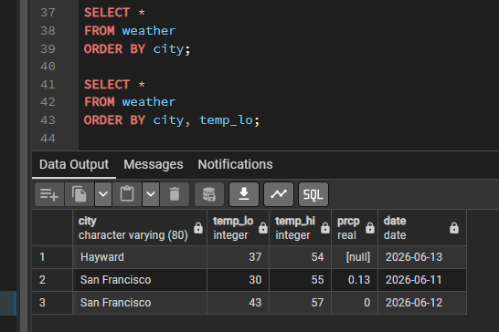

Если требуется, вы можете убрать дублирующиеся строки из результата запроса, добавив в выборке оператор `DISTINCT`:
```postgres-sql
SELECT DISTINCT city
FROM weather;
```

И здесь порядок строк также может варьироваться. 
Чтобы получать неизменные результаты, соедините предложения `DISTINCT` и `ORDER BY`: 
```postgres-sql
SELECT DISTINCT city
FROM weather
ORDER BY city ASC;
```

Оператор `ASC` после `ORDER BY` означает что сортировка при выводе результата производится от меньшего к большему.
Если нужно изменить порядок сортировки, то вместо `ASC` нужно писать `DESC`

>Сортировка ORDER BY и так действует по возрастанию поэтому оператор ASC можно опустить.

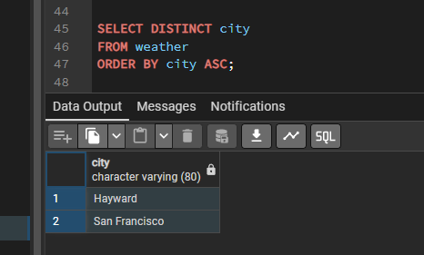

---


### Соединения таблиц

До этого все наши запросы обращались только к одной таблице. 
Однако запросы могут также обращаться сразу к нескольким таблицам или обращаться к той же таблице так, 
что одновременно будут обрабатываться разные наборы её строк. 

>Запросы, обращающиеся к разным таблицам (или нескольким экземплярам одной таблицы), называются соединениями (JOIN). 
Такие запросы содержат выражение, указывающее, какие строки одной таблицы нужно объединить со строками другой таблицы. 

Например, чтобы вернуть все погодные события вместе с координатами соответствующих городов, 
база данных должна сравнить столбец `city` каждой строки таблицы `weather` со столбцом `name` 
всех строк таблицы `cities` и выбрать пары строк, для которых эти значения совпадают.

Это можно сделать с помощью следующего запроса:
```postgres-sql
SELECT * 
FROM weather 
JOIN cities ON city = name;
```

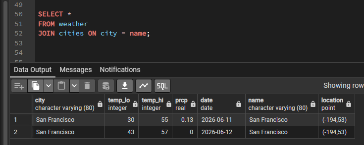

Обратите внимание на две особенности полученных данных:
* В результате нет строки с городом Хейуорд (Hayward). 
Так получилось потому, что в таблице `cities` нет строки для данного города, а при соединении все строки таблицы `weather`, 
для которых не нашлось соответствие, опускаются.
* Название города оказалось в двух столбцах. Это правильно и объясняется тем, что столбцы таблиц `weather` и `cities` были объединены. 
Хотя на практике это нежелательно, поэтому лучше перечислить нужные столбцы явно, а не использовать `*`
```postgres-sql
SELECT city, temp_lo, temp_hi, prcp, date, location
FROM weather 
JOIN cities ON city = name;
```

>Так как все столбцы имеют разные имена, анализатор запроса автоматически понимает, к какой таблице они относятся. 

Если бы имена столбцов в двух таблицах повторялись, вам пришлось бы дополнить имена столбцов 
обращением к таблице через точку к определенному столбцу, конкретизируя, что именно вы имели в виду:
```postgres-sql
SELECT weather.city, weather.temp_lo, weather.temp_hi,
       weather.prcp, weather.date, cities.location
FROM weather
JOIN cities ON weather.city = cities.name;
```

Такой формат записи считается более правильным, т.к. не оставляет сомнений к какому столбцу какой таблице мы обращаемся.
Вообще хорошим стилем считается указывать полные имена столбцов в запросе соединения, чтобы запрос не поломался, 
если позже в таблицы будут добавлены столбцы с повторяющимися именами.

Запросы соединения, которые вы видели до этого, можно также записать в другом виде:
```postgres-sql
SELECT *
FROM weather, cities
WHERE city = name;
```

Этот синтаксис появился до синтаксиса `JOIN/ON`, принятого в SQL-92. 
Таблицы просто перечисляются в предложении `FROM`, а выражение сравнения добавляется в предложение `WHERE`. 
Результаты, получаемые с использованием старого неявного синтаксиса и нового явного синтаксиса JOIN/ON, будут одинаковыми. 
Однако, читая запрос, понять явный синтаксис проще: условие соединения вводится с помощью специального ключевого слова, 
а раньше это условие включалось в предложение WHERE наряду с другими условиями.

Далее посмотрим, как вернуть записи о погоде в городе Хейуорд. 
Мы хотим, чтобы запрос просканировал таблицу `weather` и для каждой её строки нашёл соответствующую строку в таблице `cities`.
Если же такая строка не будет найдена, мы хотим, чтобы вместо значений столбцов из таблицы `cities` были подставлены «пустые значения». 

Запросы такого типа называются **_внешними соединениями_**. 
(Соединения, которые мы видели до этого, **_называются внутренними_**.) 
Эта команда будет выглядеть так:
```postgres-sql
SELECT *
FROM weather 
LEFT OUTER JOIN cities ON weather.city = cities.name;
```

Этот запрос называется **_левым внешним соединением_**, 
потому что из таблицы в левой части оператора будут выбраны все строки, 
а из таблицы справа только те, которые удалось сопоставить каким-нибудь строкам из левой. 

>При выводе строк левой таблицы, для которых не удалось найти соответствия в правой, 
вместо столбцов правой таблицы подставляются пустые значения (**NULL**).
> Существуют также правые внешние соединения и полные внешние соединения.

В соединении мы также можем замкнуть таблицу на себя. 
Это называется **_замкнутым соединением_**. 

Например, представьте, что мы хотим найти все записи погоды, в которых температура лежит в диапазоне температур других записей. 
Для этого мы должны сравнить столбцы `temp_lo` и `temp_hi` каждой строки таблицы `weather` 
со столбцами `temp_lo` и `temp_hi` другого набора строк `weather`.
Это можно сделать с помощью следующего запроса:
```postgres-sql
SELECT w1.city AS city1, w1.temp_lo AS low1, w1.temp_hi AS high1,
       w2.city AS city2, w2.temp_lo AS low2, w2.temp_hi AS high2
FROM weather AS w1 
JOIN weather AS w2 ON w1.temp_lo < w2.temp_lo AND w1.temp_hi > w2.temp_hi;
```

Здесь мы ввели новые обозначения таблицы `weather`: `w1` и `w2`, чтобы можно было различить левую и правую стороны соединения. 

Вы можете использовать подобные псевдонимы и в других запросах для сокращения, даже без оператора **AS**:
```postgres-sql
SELECT *
FROM weather w 
JOIN cities c ON w.city = c.name;
```

Обычно вы будете встречать сокращения такого рода довольно часто.

---

### Агрегатные функции

Как большинство других серверов реляционных баз данных, PostgreSQL поддерживает агрегатные функции. 

>**_Агрегатная функция_** вычисляет единственное значение, обрабатывая множество строк.

Например, есть агрегатные функции для набора строк, вычисляющие: 
* count (количество), 
* sum (сумму), 
* avg (среднее), 
* max (максимум), 
* min (минимум).

К примеру, мы можем найти самую высокую из всех минимальных дневных температур:
```postgres-sql
SELECT max(temp_lo) 
FROM weather;
```

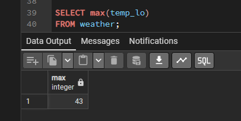

Попробуйте узнать, в каком городе (или городах) наблюдалась эта температура:
```postgres-sql
SELECT city 
FROM weather 
WHERE temp_lo = max(temp_lo);
```

Не уверен что это сработает, т.к. агрегатные функции нельзя использовать в предложении **WHERE**. 
(Это ограничение объясняется тем, что предложение WHERE должно определить, для каких строк вычислять агрегатную функцию, 
так что оно, очевидно, должно вычисляться до агрегатных функций.) 

Однако как часто бывает, запрос можно переписать и получить желаемый результат, применив **_подзапрос_**:
```postgres-sql
SELECT city 
FROM weather
WHERE temp_lo = 
    (
    SELECT max(temp_lo) 
    FROM weather
    );
```

Теперь всё в порядке — **подзапрос** выполняется отдельно и результат агрегатной функции вычисляется 
вне зависимости от того, что происходит во внешнем запросе.

**Агрегатные функции** также очень полезны в сочетании с предложением `GROUP BY`. 
Например, мы можем получить количество замеров и максимум минимальной дневной температуры в разрезе городов:
```postgres-sql
SELECT city, count(*), max(temp_lo)
FROM weather
GROUP BY city;
```

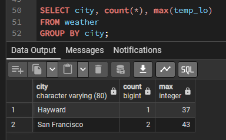

Здесь мы получаем по одной строке для каждого города. 
Каждый агрегатный результат вычисляется по строкам таблицы, соответствующим отдельному городу. 

Мы можем отфильтровать сгруппированные строки с помощью предложения `HAVING`:
```postgres-sql
SELECT city, count(*), max(temp_lo)
FROM weather
GROUP BY city
HAVING max(temp_lo) < 40;
```

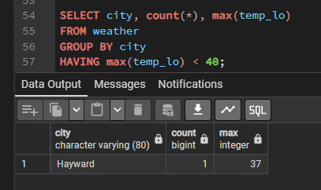

Мы получаем те же результаты, но только для тех городов, где все значения `temp_lo` меньше 40.

>Оператор HAVING работает точно также как и WHERE, но только применительно к сгрупированным строкам, 
> т.о. отдельно от GROUP BY оператор HAVING не работает, а оператор WHERE наоборот - должен идти всегда перед GROUP BY!

И наконец, если нас интересуют только города, названия которых начинаются с «S», мы можем сделать:
```postgres-sql
SELECT city, count(*), max(temp_lo)
FROM weather
WHERE city LIKE 'S%'            -- сравнение по маске 
GROUP BY city;
```

тут оператор `LIKE` выполняет сравнение по шаблону. Полный перечень шаблонов для сравнения будет рассмотрен в след. главах.

---

Важно понимать, как соотносятся агрегатные функции и SQL-предложения `WHERE` и `HAVING`. 
Основное отличие `WHERE` от `HAVING` заключается в том, что `WHERE` сначала выбирает строки, 
а затем группирует их и вычисляет агрегатные функции (таким образом, она отбирает строки для вычисления агрегатов), 
тогда как `HAVING` отбирает строки групп после группировки и вычисления агрегатных функций. 

Как следствие, предложение `WHERE` не должно содержать агрегатных функций; 
не имеет смысла использовать агрегатные функции для определения строк для вычисления агрегатных функций. 

Предложение `HAVING`, напротив, всегда содержит агрегатные функции. 
(Строго говоря, вы можете написать предложение `HAVING`, не используя агрегаты, но это редко бывает полезно. 
Тоже самое условие может работать более эффективно на стадии `WHERE`.)

В предыдущем примере мы смогли применить фильтр по названию города в предложении `WHERE`, так как названия не нужно агрегировать. 
Такой фильтр эффективнее, чем дополнительное ограничение `HAVING`, 
потому что с ним не приходится группировать и вычислять агрегаты для всех строк, не удовлетворяющих условию `WHERE`.

Ещё один способ выбрать строки, которые входят в составные вычисления, — это использовать предложение `FILTER`, 
которое указывается для каждой агрегатной функции:
```postgres-sql
SELECT city, count(*) FILTER (WHERE temp_lo < 42), max(temp_lo)
FROM weather
GROUP BY city;
```

Предложение **FILTER** очень похоже на **WHERE**, за исключением того, 
что отбрасываются входные строки только конкретной агрегатной функции, с которой оно используется. 

Здесь агрегатная функция `count` подсчитывает только строки с `temp_lo` ниже 42; 
но агрегатная функция `max` по прежнему применяется ко всем строкам, поэтому находит значение 43.

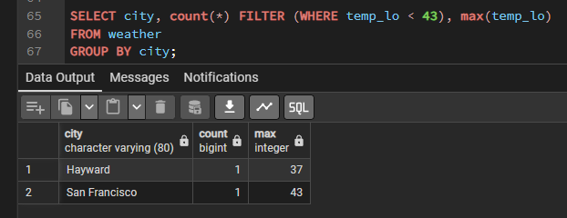

---

###  Изменение данных

Данные в существующих строках можно изменять, используя команду `UPDATE`. 

Например, предположим, что вы обнаружили, что все значения температуры после 11 июня завышены на два градуса. 

Вы можете поправить ваши данные следующим образом
```postgres-sql
UPDATE weather
SET temp_hi = temp_hi - 2,  temp_lo = temp_lo - 2
WHERE date > '2026-06-11';
```

После выполнение проверьте новое состояние данных
```postgres-sql
SELECT * FROM weather;
```

---

### Удаление данных

Строки также можно удалить из таблицы, используя команду `DELETE`. 

Предположим, что вас больше не интересует погода в Хейуорде. 
В этом случае вы можете удалить ненужные строки из таблицы:
```postgres-sql
DELETE FROM weather 
WHERE city = 'Hayward';
```

Записи всех наблюдений, относящиеся к Хейуорду, удалены
```postgres-sql
SELECT * FROM weather;
```

**ВАЖНО! Остерегайтесь операторов вида**
```postgres-sql
DELETE FROM имя_таблицы;
```

>Без указания условия `DELETE` удалит все строки данной таблицы, полностью очистит её. При этом
система не попросит вас подтвердить операцию!

---

После ознакомления только с частью базовых команд синтаксиса SQL перейдем к рассмотрению [расширенных возможностей psql](additional-psql.md)

