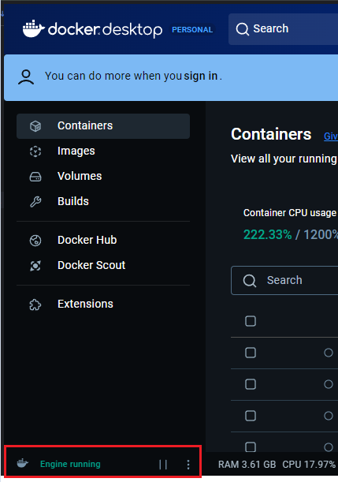
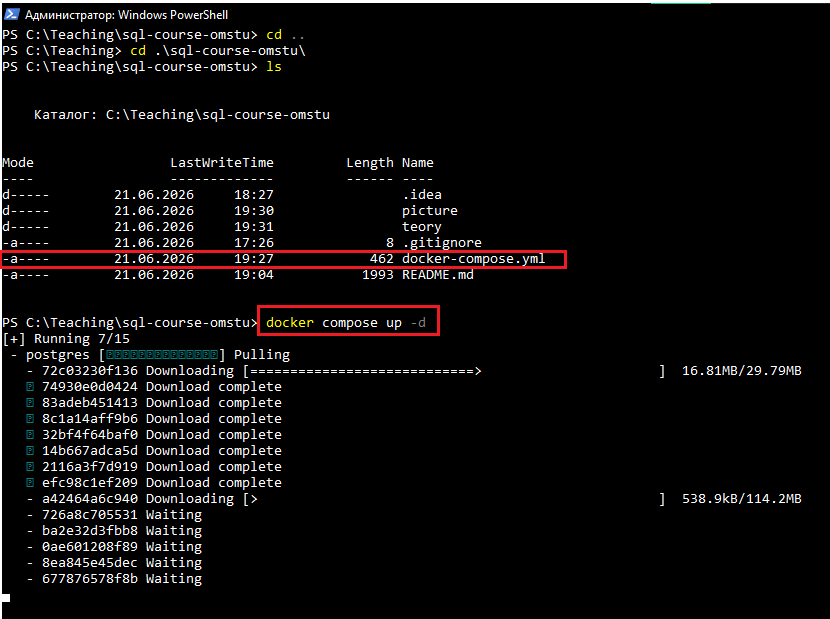
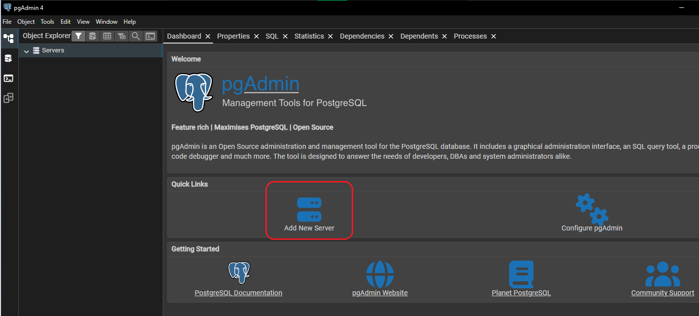
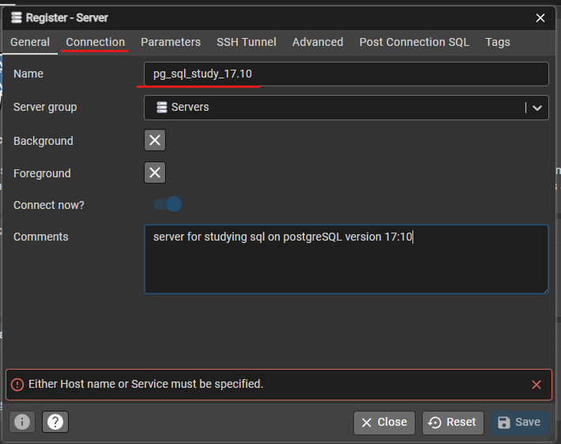
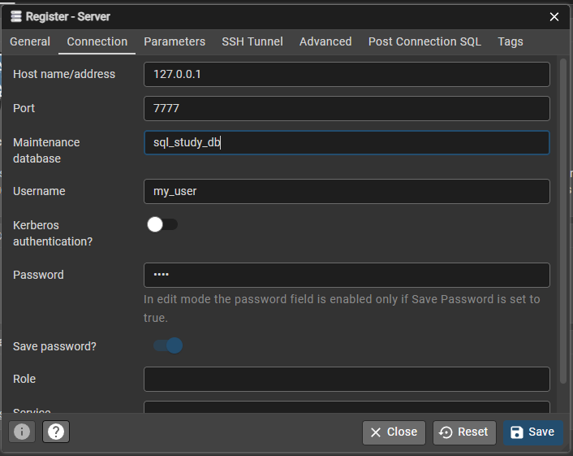
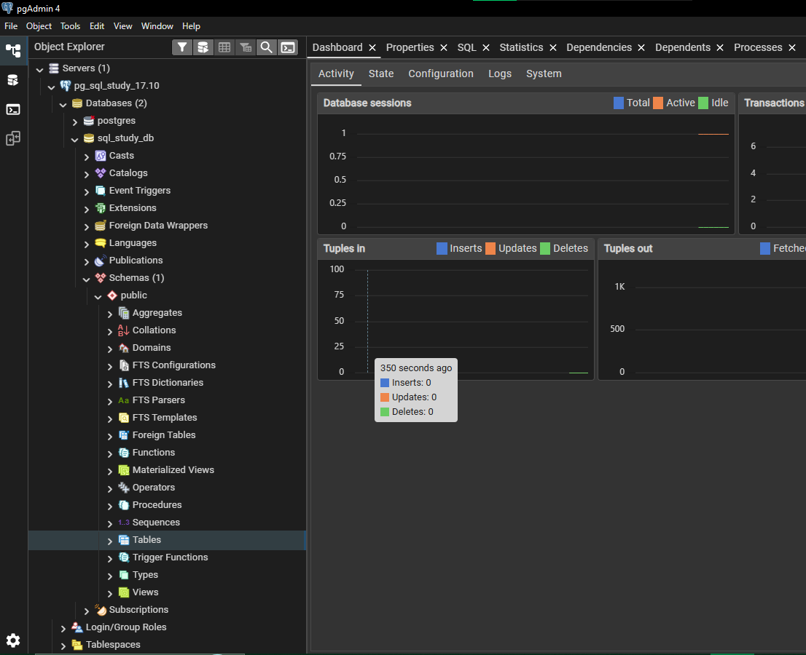

## Перед изучением синтаксиса

Вам потребуется запустить установленный Docker Desktop и выполнить [скрипт](../docker-compose.yml),
расположенный в корневой директории данного курса. 

Сначала запускаем Docker Desktop и проверяем в левом нижнем углу, что daemon работает 



Далее через терминал windows powershell, перейдя в директорию с данным скриптом, запускаем команду компоузника:
```shell
docker compose up -d
```



#### Что произошло после запуска команды ?

- Скачивание 17.10 версии сервера _postrges_ с созданием БД `sql_study_db` на этом сервере
- Данный сервер запустился во внутреннем изолированном окружении docker локально на хосте `127.0.0.1` или `localhost`
- Доступ клиентам открыт на портах `7777` или `5454`
- Внутренний порт `5432` является зарезирвированным по умолчанию для доступа к серверу postrges внутри контейнера docker
- Для подключения клиентам при создании предоставлен пользователь `my_user` с паролем `1234`
- в директории откуда был запущен скрипт создастся файл `volumes` который будет хранить данные сервера БД на диске.

---

### Подключение к серверу через клиент pgAdmin 4

Теперь осталось выполнить подключение к созданному серверу и начать изучение базового синтаксиса. 
Для этого открываем скачанный pgAdmin 4 и в нем нажимаем "_**Add new server**_"



Далее регистрируем сервер - даем ему название, которое будет видно только у клиента и при необходимости описание.
После переходим на вкладку **_Connection_**



На вкладке Connection заполняем хост, один из открытых docker'ом портов, имя БД, имя пользователя, пароль и нажимаем **_save_**



После проделанных действий в дереве объектов pgAdmin появится две базы данных 
(первая по умолчанию - postgres и вторая наша, созданная через компоузник - sql_study_db)



---

Далее можно переходить к [знакомству с SQL](entered-sql.md) 


