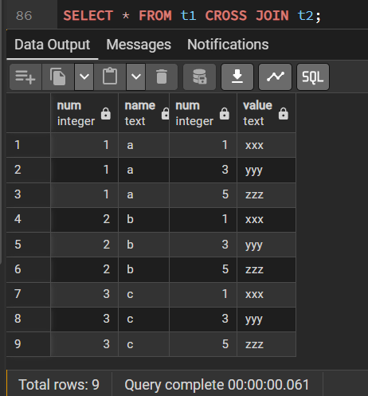
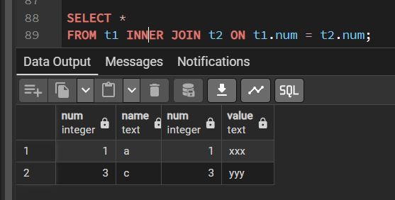
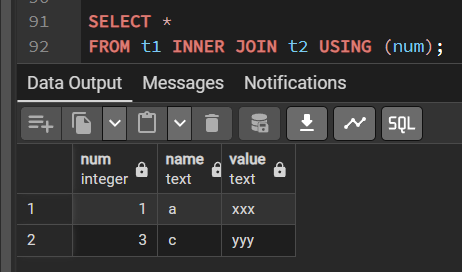
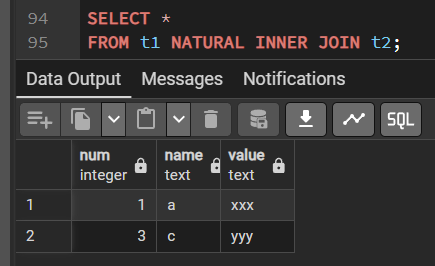
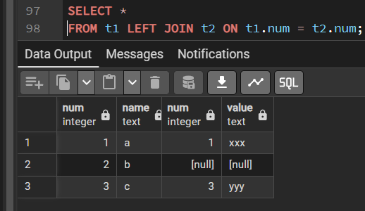
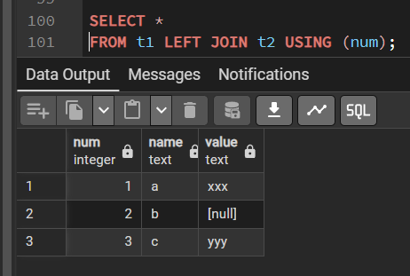
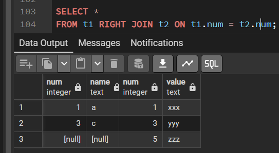
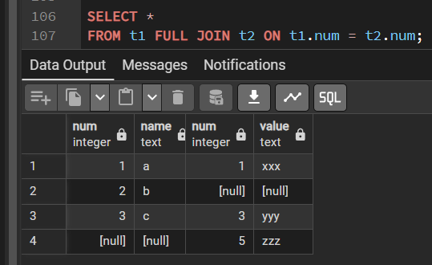
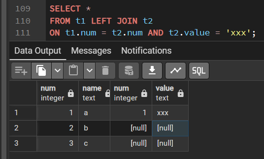

# Запросы

В предыдущих главах рассказывалось, как создать таблицы, как заполнить их данными и как изменить эти данные. 
Теперь мы наконец обсудим, как получить данные из базы данных.

---

## Обзор

**Процесс или команда получения данных из базы данных называется запросом.** 

В SQL запросы формулируются с помощью команды [SELECT](syntax.md#select). 

В общем виде команда `SELECT` записывается так:
```postgres-sql
[WITH запросы_with] 
SELECT список_выборки 
FROM табличное_выражение
[определение_сортировки]
```

Запросы `WITH` являются расширенной возможностью PostgreSQL и будут рассмотрены в последнюю очередь.

Простой запрос выглядит так:
```postgres-sql
SELECT * FROM table1;
```

Если предположить, что в базе данных есть таблица `table1`, 
эта команда получит все строки с содержимым всех столбцов из `table1`. 
(Метод выдачи результата определяет клиентское приложение. 
Например, программа `psql` выведет на экране ASCII-таблицу, 
хотя клиентские библиотеки позволяют извлекать отдельные значения из результата запроса.) 

Здесь список выборки задан как `*`, это означает, что запрос должен вернуть все столбцы табличного выражения. 

В списке выборки можно также указать подмножество доступных столбцов или составить выражения с этими столбцами. 
Например, если в `table1` есть столбцы `a`, `b` и `c` (и возможно, другие), вы можете выполнить следующий запрос:
```postgres-sql
SELECT a, b + c 
FROM table1;
```
(в предположении, что столбцы `b` и `c` имеют числовой тип данных). 

`FROM table1` — это простейший тип табличного выражения, в котором просто читается одна таблица. 
Вообще табличные выражения могут быть сложными конструкциями из базовых таблиц, соединений и подзапросов. 

А можно и вовсе опустить табличное выражение и использовать команду
```postgres-sql
SELECT как калькулятор:
SELECT 3 * 4;
```
В этом может быть больше смысла, когда выражения в списке выборки возвращают меняющиеся результаты. 

Например, можно вызвать функцию так:
```postgres-sql
SELECT random();
```

---

## Табличные выражения

**Табличное выражение** вычисляет таблицу. 
Это выражение содержит предложение `FROM`, за которым могут следовать предложения `WHERE`, `GROUP BY` и `HAVING`. 

Тривиальные табличные выражения просто ссылаются на **физическую таблицу, её называют также _базовой_**, 
но в более сложных выражениях такие таблицы можно преобразовывать и комбинировать самыми разными способами.

Необязательные предложения `WHERE`, `GROUP BY` и `HAVING` в табличном выражении определяют последовательность преобразований, 
осуществляемых с данными таблицы, полученной в предложении `FROM`. 
В результате этих преобразований образуется виртуальная таблица, 
строки которой передаются списку выборки, вычисляющему выходные строки запроса.

---

### Предложение FROM

Предложение `FROM` образует таблицу из одной или нескольких ссылок на таблицы, разделённых запятыми.
```postgres-sql
FROM табличная_ссылка [, табличная_ссылка [, ...]]
```

Здесь `табличной_ссылкой` может быть имя таблицы (возможно, с именем схемы), 
производная таблица, например подзапрос, соединение таблиц или сложная комбинация этих вариантов. 

Если в предложении `FROM` перечисляются несколько ссылок, для них применяется перекрёстное соединение 
(то есть декартово произведение их строк;). 
Список `FROM` преобразуется в промежуточную виртуальную таблицу, которая может пройти через преобразования 
`WHERE`, `GROUP BY` и `HAVING`, и в итоге определит результат табличного выражения.

Когда в табличной ссылке указывается таблица, являющаяся родительской в иерархии наследования, 
в результате будут получены строки не только этой таблицы, но и всех её дочерних таблиц.
**Чтобы выбрать строки только одной родительской таблицы, перед её именем нужно добавить ключевое слово `ONLY`**. 
Учтите, что при этом будут получены только столбцы указанной таблицы — 
дополнительные столбцы дочерних таблиц не попадут в результат.

Если же вы не добавляете `ONLY` перед именем таблицы, вы можете дописать после него `*`, 
тем самым указав, что должны обрабатываться и все дочерние таблицы. 
Практических причин использовать этот синтаксис больше нет, так как поиск в дочерних таблицах теперь производится по умолчанию. 
Однако эта запись поддерживается для совместимости со старыми версиями.

---

### Соединённые таблицы

**Соединённая таблица** — это таблица, полученная из двух других (реальных или производных от них) таблиц 
в соответствии с правилами соединения конкретного типа. 

Общий синтаксис описания соединённой таблицы:
```postgres-sql
T1 тип_соединения T2 [ условие_соединения ]
```

Соединения любых типов могут вкладываться друг в друга или объединяться: 
и `T1`, и `T2` могут быть результатами соединения. 

Для однозначного определения порядка соединений предложения `JOIN` можно заключать в скобки. 
Если скобки отсутствуют, предложения `JOIN` обрабатываются слева направо:

#### Типы соединений

* **Перекрёстное соединение**

```T1 CROSS JOIN T2```

Соединённую таблицу образуют все возможные сочетания строк из `T1` и `T2` (т. е. их декартово произведение), 
а набор её столбцов объединяет в себе столбцы `T1` со следующими за ними столбцами `T2`. 

Если таблицы содержат `N` и `M` строк, соединённая таблица будет содержать `N * M` строк.

`FROM T1 CROSS JOIN T2` равнозначно `FROM T1 INNER JOIN T2 ON TRUE`.

Эта запись также равнозначна `FROM T1, T2`.

* **Соединения с сопоставлениями строк** 

```postgres-sql
T1 { [INNER] | { LEFT | RIGHT | FULL } [OUTER] } JOIN T2 ON логическое_выражение

T1 { [INNER] | { LEFT | RIGHT | FULL } [OUTER] } JOIN T2 USING ( список столбцов соединения )

T1 NATURAL { [INNER] | { LEFT | RIGHT | FULL } [OUTER] } JOIN T2
```

Слова `INNER` и `OUTER` необязательны во всех формах. 
По умолчанию подразумевается `INNER` (внутреннее соединение), а при указании `LEFT`, `RIGHT` и `FULL` — внешнее соединение.

Условие соединения указывается в предложении `ON` или `USING`, либо неявно задаётся ключевым словом `NATURAL`. 

Это условие определяет, какие строки двух исходных таблиц считаются «соответствующими» друг другу.

Возможные типы соединений с сопоставлениями строк:

+ `INNER JOIN` -
Для каждой строки `R1` из `T1` в результирующей таблице содержится строка для каждой строки в `T2`, 
удовлетворяющей условию соединения с `R1`.

+ `LEFT OUTER JOIN` -
Сначала выполняется внутреннее соединение (`INNER JOIN`). Затем в результат добавляются все строки из `T1`, 
которым не соответствуют никакие строки в `T2`, а вместо значений столбцов `T2` вставляются `NULL`. 
Таким образом, в результирующей таблице всегда будет минимум одна строка для каждой строки из `T1`.

+ `RIGHT OUTER JOIN` -
Сначала выполняется внутреннее соединение (`INNER JOIN`). Затем в результат добавляются все строки из `T2`, 
которым не соответствуют никакие строки в `T1`, а вместо значений столбцов `T1` вставляются `NULL`. 
Это соединение является обратным к левому (`LEFT JOIN`):
в результирующей таблице всегда будет минимум одна строка для каждой строки из `T2`.

+ `FULL OUTER JOIN` -
Сначала выполняется внутреннее соединение. Затем в результат добавляются все строки из `T1`, 
которым не соответствуют никакие строки в `T2`, а вместо значений столбцов `T2` вставляются `NULL`. 
И наконец, в результат включаются все строки из `T2`, которым не соответствуют никакие строки в `T1`, 
а вместо значений столбцов `T1` вставляются `NULL`


Предложение `ON` определяет наиболее общую форму условия соединения: 
в нём указываются выражения логического типа, подобные тем, что используются в предложении `WHERE`. 
Пара строк из `T1` и `T2` соответствуют друг другу, если выражение `ON` возвращает для них `true`.

`USING` — это сокращённая запись условия, полезная в ситуации, 
когда с обеих сторон соединения столбцы имеют одинаковые имена. 
Она принимает список общих имён столбцов через запятую и формирует условие соединения с равенством этих столбцов. 

Например, запись соединения `T1` и `T2` с `USING (a, b)` формирует условие `ON T1.a = T2.a AND T1.b = T2.b`.

Наконец, `NATURAL` — сокращённая форма `USING`: 
она образует список `USING` из всех имён столбцов, существующих в обеих входных таблицах. 
Как и с `USING`, эти столбцы оказываются в выходной таблице в единственном экземпляре. 
Если столбцов с одинаковыми именами не находится, `NATURAL JOIN` действует как `JOIN ... ON TRUE` 
и выдаёт декартово произведение строк.

---

Для наглядности предположим, что у нас есть таблицы `t1`:

| num | name |
|-----|------|
| 1   | a    |
| 2   | b    |
| 3   | c    |
---
и `t2`:

| num | value |
|-----|-------|
| 1   | xxx   |   
| 3   | yyy   | 
| 5   | zzz   | 
---

С ними для разных типов соединений мы получим следующие результаты:
```postgres-sql
SELECT * FROM t1 CROSS JOIN t2;
```



---

```postgres-sql
SELECT * FROM t1 INNER JOIN t2 ON t1.num = t2.num;
```



---

```postgres-sql
SELECT * FROM t1 INNER JOIN t2 USING (num);
```



---

```postgres-sql
SELECT * FROM t1 NATURAL INNER JOIN t2;
```



---

```postgres-sql
SELECT * FROM t1 LEFT JOIN t2 ON t1.num = t2.num;
```



---

```postgres-sql
SELECT * FROM t1 LEFT JOIN t2 USING (num);
```



---

```postgres-sql
SELECT * 
FROM t1 RIGHT JOIN t2 ON t1.num = t2.num;
```



---

```postgres-sql
SELECT * 
FROM t1 FULL JOIN t2 ON t1.num = t2.num;
```



---

Условие соединения в предложении ON может также содержать выражения, не связанные непосредственно с соединением. 
Это может быть полезно в некоторых запросах, но не следует использовать это необдуманно. 

Рассмотрите следующий запрос:
```postgres-sql
SELECT * 
FROM t1 LEFT JOIN t2 
ON t1.num = t2.num AND t2.value = 'xxx';
```



Заметьте, что если поместить ограничение в предложение WHERE, вы получите другой результат:
```postgres-sql
SELECT * FROM t1 LEFT JOIN t2 ON t1.num = t2.num WHERE t2.value = 'xxx';
```

Это связано с тем, что ограничение, помещённое в предложение ON, обрабатывается до операциисоединения, 
тогда как ограничение в `WHERE` — после. 
Это не имеет значения при внутренних соединениях, но важно при внешних.

---

### Подзапросы

>Подзапросы, образующие таблицы, должны заключаться в скобки. 

Им могут назначаться псевдонимы таблиц и, если необходимо, псевдонимы столбцов. 

Например:
```postgres-sql
FROM (SELECT * FROM table1) AS псевдоним
```

Этот пример равносилен записи `FROM table1 AS псевдоним`. 

Более интересные ситуации, которые нельзя свести к простому соединению, возникают, 
когда в подзапросе используются агрегирующие функции или группировка.

Подзапросом может также быть список `VALUES`:
```postgres-sql
FROM (VALUES ('anne', 'smith'), ('bob', 'jones'), ('joe', 'blow'))
     AS names(first, last)
```
Такому подзапросу может быть назначен псевдоним. 

Назначать псевдонимы столбцам списка `VALUES` не требуется, но вообще это хороший приём.

Согласно стандарту SQL подзапросу должен назначаться псевдоним таблицы. 
PostgreSQL позволяет опускать `AS` и псевдоним, тем не менее **хорошей практикой считается указывать псевдоним в коде SQL**, 
который может быть портирован в другую систему.

---

### Табличные функции

**Табличные функции** — это функции, выдающие набор строк, содержащих либо базовые типы данных (скалярных типов), 
либо составные типы (табличные строки). 

Они применяются в запросах как таблицы, представления или подзапросы в предложении `FROM`. 
Столбцы, возвращённые табличными функциями, можно включить в выражения `SELECT`, `JOIN` или `WHERE` так же, 
как столбцы таблиц, представлений или подзапросов.

Табличные функции можно также скомбинировать, используя запись `ROWS FROM`. 
Результаты функций будут возвращены в параллельных столбцах;
число строк в этом случае будет наибольшим из результатов всех функций, 
а результаты функций с меньшим количеством строк будут дополнены значениями `NULL`.

```postgres-sql
вызов_функции [WITH ORDINALITY] [[AS] псевдоним_таблицы [(псевдоним_столбца [, ...])]]
ROWS FROM( вызов_функции [, ...] ) [WITH ORDINALITY] [[AS] псевдоним_таблицы [(псевдоним_столбца [, ...])]]
```

Если указано предложение `WITH ORDINALITY`, к столбцам результатов функций будет добавлен ещё один, с типом `bigint`. 
В этом столбце нумеруются строки результирующего набора, начиная с 1.
(Это обобщение стандартного SQL-синтаксиса `UNNEST ... WITH ORDINALITY`.) 
По умолчанию, этот столбец называется `ordinality`, но ему можно присвоить и другое имя с помощью указания `AS`.


---

После вводного изучения всех уровней языка psql можно приступать к выполнению [практического задания](../practice/task.md). 